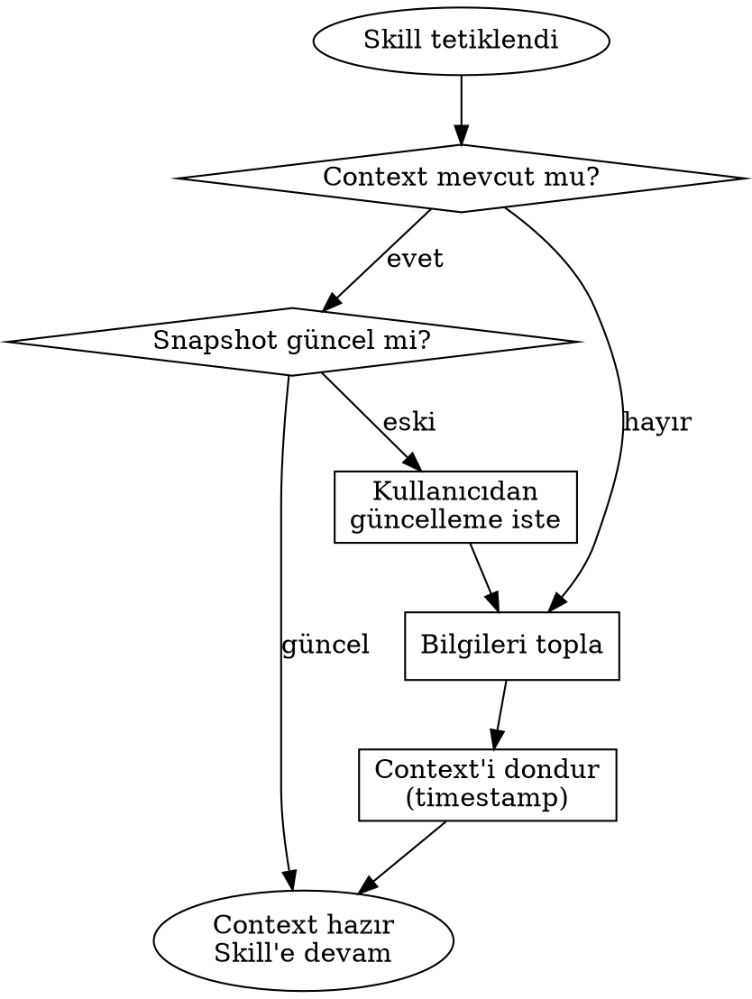
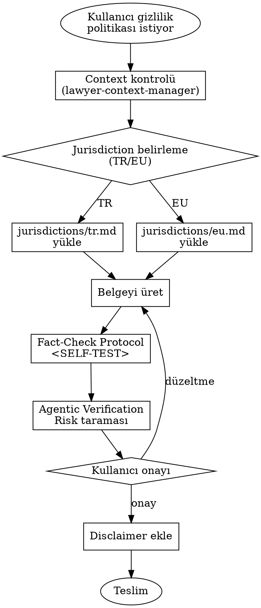
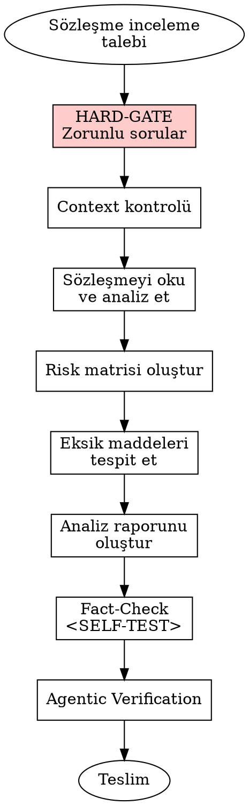
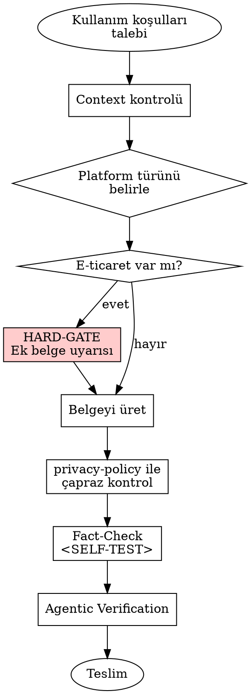
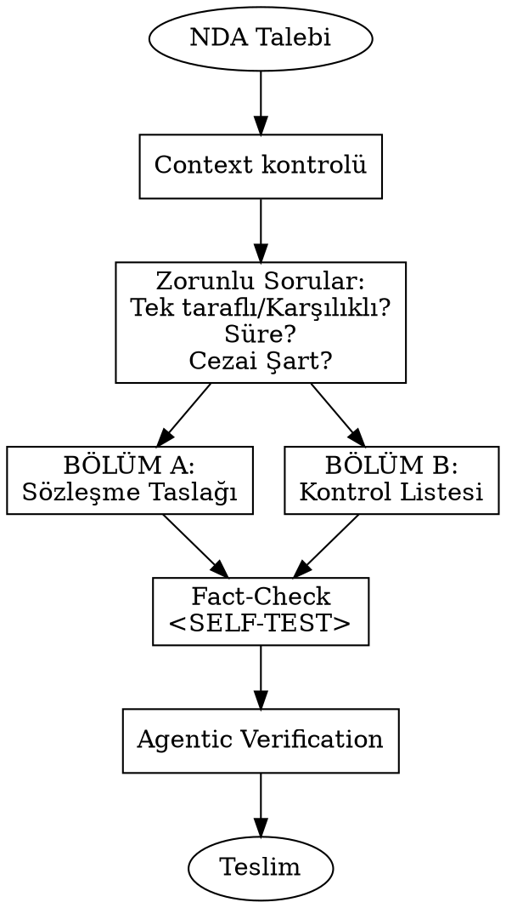
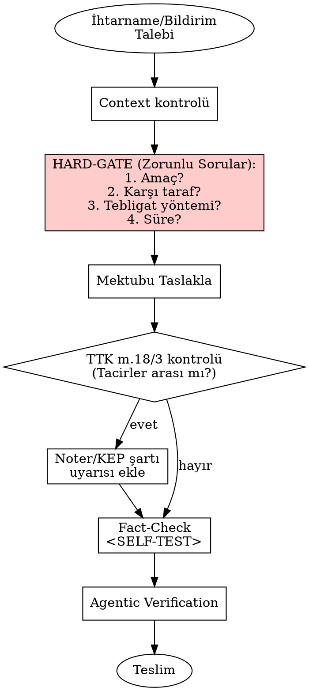

# Lex-Skill Implementation Plan

> **For agentic workers:** REQUIRED SUB-SKILL: Use superpowers:subagent-driven-development (recommended) or superpowers:executing-plans to implement this plan task-by-task. Steps use checkbox (`- [ ]`) syntax for tracking.

**Goal:** AI kodlama asistanlarının hukuki belge üretme kalitesini profesyonel standartlara taşıyan, açık kaynaklı bir beceri (skill) kütüphanesi inşa etmek.

**Architecture:** Katmanlı yapı — `core/` paylaşılan güvenlik bileşenleri (Disclaimer, Risk Framework, Agentic Verification, Skill Anatomy), `skills/` hukuki beceriler. Her skill standart YAML frontmatter ve zorunlu bölümler içerir. Üç katmanlı güvenlik: Otomatik Disclaimer → Risk Etiketleme → Agentic Verification.

**Tech Stack:** Pure Markdown skill files, YAML frontmatter, Graphviz dot diagrams for process flows.

**Spec:** `docs/superpowers/specs/2026-04-23-lex-skill-design.md`

---

### Task 1: Repository Infrastructure

**Files:**
- Create: `.gitignore`
- Create: `LICENSE`
- Create: `README.md`
- Create: `CONTRIBUTING.md`
- Modify: `GEMINI.md`

- [ ] **Step 1: Create `.gitignore`**

```gitignore
.superpowers/
.taste-skill/
```

- [ ] **Step 2: Create `LICENSE` (MIT)**

```
MIT License

Copyright (c) 2026 Lex-Skill Contributors

Permission is hereby granted, free of charge, to any person obtaining a copy
of this software and associated documentation files (the "Software"), to deal
in the Software without restriction, including without limitation the rights
to use, copy, modify, merge, publish, distribute, sublicense, and/or sell
copies of the Software, and to permit persons to whom the Software is
furnished to do so, subject to the following conditions:

The above copyright notice and this permission notice shall be included in all
copies or substantial portions of the Software.

THE SOFTWARE IS PROVIDED "AS IS", WITHOUT WARRANTY OF ANY KIND, EXPRESS OR
IMPLIED, INCLUDING BUT NOT LIMITED TO THE WARRANTIES OF MERCHANTABILITY,
FITNESS FOR A PARTICULAR PURPOSE AND NONINFRINGEMENT. IN NO EVENT SHALL THE
AUTHORS OR COPYRIGHT HOLDERS BE LIABLE FOR ANY CLAIM, DAMAGES OR OTHER
LIABILITY, WHETHER IN AN ACTION OF CONTRACT, TORT OR OTHERWISE, ARISING FROM,
OUT OF OR IN CONNECTION WITH THE SOFTWARE OR THE USE OR OTHER DEALINGS IN THE
SOFTWARE.
```

- [ ] **Step 3: Create `README.md`**

```markdown
# ⚖️ Lex-Skill

AI kodlama asistanlarının hukuki belge üretme kalitesini
profesyonel standartlara taşıyan beceri kütüphanesi.

## Felsefe
- 🏛️ Önce Türk Hukuku, genişletilebilir mimari
- 🛡️ Üç katmanlı güvenlik: Disclaimer → Risk → Agentic Verification
- 🧠 Context Manager ile kişiselleştirilmiş çıktı
- ⚠️ Agent sadece teşhis değil, tedavi de sunar

## Kurulum
\`\`\`
npx skills add https://github.com/[kullanıcı]/lex-skill
\`\`\`

## Beceriler
| Skill | Çıktı Tipi | Risk | Açıklama |
|-------|-----------|------|----------|
| lawyer-context-manager | context | 🟢 | Meta-skill: Bağlam yönetimi |
| privacy-policy | document | 🟡 | KVKK/GDPR uyumlu gizlilik politikası |
| contract-review | analysis | 🔴 | Sözleşme risk analizi |
| terms-of-use | document | 🟡 | Kullanım koşulları |
| nda-generator | draft+checklist | 🟡 | Gizlilik sözleşmesi |
| legal-letter | document | 🔴 | İhtarname / bildirim |

## Mimari

\`\`\`
lawyer-skills/
├── README.md
├── LICENSE                                # MIT
├── CONTRIBUTING.md
├── CHANGELOG.md
├── GEMINI.md
├── .gitignore                             # .superpowers/ ve .taste-skill/ hariç tutar
│
├── core/                                  # Paylaşılan çekirdek bileşenler
│   ├── DISCLAIMER.md                      # Standart feragatname şablonu
│   ├── RISK-FRAMEWORK.md                  # 🟢🟡🔴 risk sistemi tanımı
│   ├── AGENTIC-VERIFICATION.md            # Post-generation doğrulama protokolü
│   └── SKILL-ANATOMY.md                   # Skill yapı standardı (şablon)
│
├── skills/                                # Hukuki beceriler
│   ├── lawyer-context-manager/
│   │   └── SKILL.md
│   ├── privacy-policy/
│   │   ├── SKILL.md
│   │   └── jurisdictions/
│   │       ├── tr.md                      # KVKK referansları
│   │       └── eu.md                      # GDPR referansları
│   ├── contract-review/
│   │   ├── SKILL.md
│   │   └── jurisdictions/
│   │       └── tr.md
│   ├── terms-of-use/
│   │   ├── SKILL.md
│   │   └── jurisdictions/
│   │       └── tr.md
│   ├── nda-generator/
│   │   ├── SKILL.md
│   │   └── jurisdictions/
│   │       └── tr.md
│   └── legal-letter/
│       ├── SKILL.md
│       └── jurisdictions/
│           └── tr.md
│
├── .superpowers/                          # (gitignore — yayınlanmaz)
└── .taste-skill/                          # (gitignore — yayınlanmaz)
```
\`\`\`

## Güvenlik Katmanları

1. **Disclaimer** — Her çıktıya otomatik eklenen feragatname
2. **Risk Framework** — 🟢🟡🔴 seviye sistemi ile agent davranışı kontrolü
3. **Agentic Verification** — Post-generation doğrulama ve kullanıcı onayı

## Katkıda Bulunma

Detaylar için [CONTRIBUTING.md](CONTRIBUTING.md) dosyasına bakın.

## Lisans

MIT — Detaylar için [LICENSE](LICENSE) dosyasına bakın.
```

- [ ] **Step 4: Create `CONTRIBUTING.md`**

```markdown
# Katkıda Bulunma Rehberi

## Yeni Jurisdiction Ekleme

1. İlgili skill dizininde `jurisdictions/[ülke-kodu].md` dosyası oluşturun
2. Mevcut `tr.md` dosyasını referans alın
3. Ülke hukukuna özgü kanun maddeleri, yönetmelikler ve referanslar ekleyin
4. PR açarken hangi skill'e, hangi ülke hukuku eklendiğini belirtin

## Yeni Skill Ekleme

1. `core/SKILL-ANATOMY.md` şablonunu okuyun
2. `skills/[skill-adı]/SKILL.md` dosyası oluşturun
3. Tüm zorunlu bölümleri doldurun (Overview, When to Use, Process Flow, vb.)
4. YAML frontmatter'da `jurisdiction`, `output_type`, `risk_level` belirtin
5. İlgili `jurisdictions/tr.md` dosyasını oluşturun

## Kalite Standartları

- ❌ Uydurma kanun maddesi yasağı — tüm referanslar doğrulanabilir olmalı
- ✅ Anti-Patterns bölümü zorunlu
- ✅ Fact-Check Protocol (`<SELF-TEST>` bloğu) zorunlu
- ✅ Agentic Verification Gate (`<HARD-GATE>` bloğu) zorunlu (🔴 High risk skill'ler için)
```

- [ ] **Step 5: Update `GEMINI.md` — add Lex-Skill section**

Append the following section after the existing content in `GEMINI.md`:

```markdown

## Lex-Skill

Hukuki beceriler `skills/` dizininde bulunur.
Herhangi bir hukuki belge üretimi veya analiz isteğinde,
önce `skills/lawyer-context-manager/SKILL.md` okunmalıdır.

### Mevcut Hukuki Beceriler
- privacy-policy
- contract-review
- terms-of-use
- nda-generator
- legal-letter
```

- [ ] **Step 6: Create `CHANGELOG.md`**

```markdown
# Changelog

## [0.1.0] - 2026-04-23

### Added
- Initial release
- Core framework: DISCLAIMER, RISK-FRAMEWORK, AGENTIC-VERIFICATION, SKILL-ANATOMY
- lawyer-context-manager meta-skill
- privacy-policy skill (TR + EU jurisdictions)
- contract-review skill (TR jurisdiction)
- terms-of-use skill (TR jurisdiction)
- nda-generator skill (TR jurisdiction)
- legal-letter skill (TR jurisdiction)
```

- [ ] **Step 7: Verify directory structure exists**

Run: `ls -la .gitignore LICENSE README.md CONTRIBUTING.md CHANGELOG.md GEMINI.md`
Expected: All 6 files listed

- [ ] **Step 8: Commit**

```bash
git add .gitignore LICENSE README.md CONTRIBUTING.md CHANGELOG.md GEMINI.md
git commit -m "chore: initialize repo infrastructure"
```

---

### Task 2: Core — DISCLAIMER.md

**Files:**
- Create: `core/DISCLAIMER.md`

- [ ] **Step 1: Create `core/DISCLAIMER.md`**

```markdown
# Standart Feragatname (Disclaimer)

## Amaç

Bu dosya, Lex-Skill ile üretilen her hukuki çıktının sonuna otomatik olarak eklenmesi ZORUNLU olan standart feragatname şablonunu tanımlar.

## Kullanım Kuralı

Her skill, çıktısının en sonuna bu feragatname metnini ekler. Agent bu adımı atlayamaz.

## Feragatname Metni

```
⚖️ YASAL UYARI: Bu belge yapay zeka destekli olarak üretilmiştir.
Hukuki bağlayıcılığı bulunmamaktadır. Kullanılmadan önce mutlaka
yetkili bir avukat tarafından gözden geçirilmelidir. [Tarih] itibarıyla
yürürlükteki mevzuata göre hazırlanmış olup, mevzuat değişiklikleri
takip edilmelidir.
```

## Placeholder Kuralları

| Placeholder | Açıklama | Nasıl Doldurulur |
|-------------|----------|------------------|
| `[Tarih]` | Belgenin üretim tarihi | Agent, belge üretim tarihini otomatik ekler (GG.AA.YYYY formatında) |

## Agent Talimatı

1. Belge üretimini tamamla
2. Agentic Verification Gate'i geç
3. Kullanıcı onayını al
4. Bu feragatnameyi belgenin EN SONUNA ekle
5. `[Tarih]` placeholder'ını üretim tarihiyle değiştir
```

- [ ] **Step 2: Verify file exists and content is correct**

Run: `cat core/DISCLAIMER.md`
Expected: File contains disclaimer template with `⚖️ YASAL UYARI` text

- [ ] **Step 3: Commit**

```bash
git add core/DISCLAIMER.md
git commit -m "feat(core): add standard disclaimer template"
```

---

### Task 3: Core — RISK-FRAMEWORK.md

**Files:**
- Create: `core/RISK-FRAMEWORK.md`

- [ ] **Step 1: Create `core/RISK-FRAMEWORK.md`**

```markdown
# Risk Seviyesi Çerçevesi (Risk Framework)

## Amaç

Lex-Skill'deki her becerinin risk seviyesini tanımlar ve agent'ın her seviyede nasıl davranması gerektiğini belirler.

## Risk Seviyeleri

### 🟢 Low Risk

**Agent Davranışı:** Özgür hareket eder, bilgilendirme yapar ama durmaz.

**Karakteristikler:**
- Belge hukuki bağlayıcılık taşımaz
- Hatalı üretim doğrudan hak kaybına yol açmaz
- Genel bilgilendirme niteliğindedir

**Örnek Skill'ler:** cookie-policy

**Agent Talimatı:**
1. Context bilgilerini kontrol et
2. Belgeyi üret
3. Fact-Check Protocol'ü çalıştır
4. Disclaimer ekle
5. Teslim et

---

### 🟡 Medium Risk

**Agent Davranışı:** Her kritik noktada açıklama ve alternatif sunar.

**Karakteristikler:**
- Belge hukuki sonuçlar doğurabilir
- Hatalı üretim düzeltilebilir ama maliyetli olabilir
- Sektöre/duruma özgü özelleştirme kritik

**Örnek Skill'ler:** privacy-policy, nda-generator, terms-of-use

**Agent Talimatı:**
1. Context bilgilerini kontrol et (eksikse `lawyer-context-manager`'ı tetikle)
2. Belgeyi üret
3. Kritik noktalarda açıklama ve alternatif sun
4. Fact-Check Protocol'ü çalıştır
5. Agentic Verification — risk taraması yap, kullanıcıya sun
6. Kullanıcı onayı al
7. Disclaimer ekle
8. Teslim et

---

### 🔴 High Risk

**Agent Davranışı:** HARD-GATE — durur, zorunlu bilgileri sorar, onay almadan devam etmez.

**Karakteristikler:**
- Belge doğrudan hukuki süreç başlatabilir
- Yasal süreleri tetikleyebilir
- Mahkemede delil olarak kullanılabilir
- Hatalı üretim geri dönüşü zor veya imkansız hak kayıplarına yol açabilir

**Örnek Skill'ler:** legal-letter, contract-review

**Agent Talimatı:**
1. Context bilgilerini kontrol et (eksikse `lawyer-context-manager`'ı tetikle)
2. **<HARD-GATE>** — Belge üretmeden ÖNCE zorunlu soruları sor
3. Tüm zorunlu bilgileri al; eksik bilgi varsa DUR — devam etme
4. Kullanıcı tüm soruları yanıtladıktan sonra belgeyi üret
5. Fact-Check Protocol'ü çalıştır
6. Agentic Verification — risk taraması yap, en yüksek riskli maddeleri sun
7. Kullanıcı onayı al
8. Disclaimer ekle
9. Teslim et

## Skill'lerde Risk Seviyesi Belirleme

YAML frontmatter'daki `risk_level` alanı bu çerçeveye göre belirlenir:

```yaml
risk_level: "low"    # 🟢
risk_level: "medium" # 🟡
risk_level: "high"   # 🔴
```

## Genel Güvenlik Akışı

```
Agent skill'i okur
       ↓
[🔴 High Risk ise] → HARD-GATE: Zorunlu bilgileri sor → Onay al
       ↓
Belgeyi üret
       ↓
Fact-Check Protocol (<SELF-TEST> bloğu)
       ↓
Agentic Verification (kullanıcıya risk + alternatif sun)
       ↓
Kullanıcı onaylar → Disclaimer eklenir → Teslim
```
```

- [ ] **Step 2: Verify file**

Run: `cat core/RISK-FRAMEWORK.md`
Expected: Three risk levels (🟢🟡🔴) with detailed agent behaviors

- [ ] **Step 3: Commit**

```bash
git add core/RISK-FRAMEWORK.md
git commit -m "feat(core): add risk framework with three-tier system"
```

---

### Task 4: Core — AGENTIC-VERIFICATION.md

**Files:**
- Create: `core/AGENTIC-VERIFICATION.md`

- [ ] **Step 1: Create `core/AGENTIC-VERIFICATION.md`**

```markdown
# Agentic Verification Protokolü

## Amaç

Agent'ın belge ürettikten sonra, teslim etmeden önce uygulaması ZORUNLU olan post-generation doğrulama protokolü.

## Kapsam

Bu protokol, `core/RISK-FRAMEWORK.md`'de tanımlanan risk seviyelerine göre kademeli uygulanır:

- **🟢 Low Risk:** Yalnızca **Adım 1 (Fact-Check Protocol)** zorunludur. Adım 2–4 atlanabilir.
- **🟡 Medium Risk:** **Tüm adımlar (1–4) zorunludur.**
- **🔴 High Risk:** **Tüm adımlar (1–4) zorunludur;** ayrıca üretim öncesi `<HARD-GATE>` kontrolü gerekir (bkz. `core/RISK-FRAMEWORK.md`).

## Neden Gerekli

- Agent halüsinasyonlarını son adımda yakalamak
- Hukuki hataların kullanıcıya ulaşmasını engellemek
- Kullanıcıyı riskli maddeler hakkında proaktif bilgilendirmek
- "Körü körüne güvenme" yerine "aktif doğrulama" kültürü

## Protokol Adımları

### Adım 1: Fact-Check Protocol'ü Çalıştır

Her skill'in `<SELF-TEST>` bloğundaki kontrol listesini tamamla:

```
<SELF-TEST>
Agent, çıktıyı teslim etmeden ÖNCE bu kontrolleri tamamlamalıdır:
- [ ] Referans verilen kanun maddeleri gerçek ve doğru mu?
- [ ] Kullanılan hukuki terimler doğru bağlamda mı?
- [ ] Tarih ve süre bilgileri tutarlı mı?
- [ ] [Skill'e özgü kontroller]
</SELF-TEST>
```

Herhangi bir kontrol başarısız olursa: **DUR, düzelt, tekrar kontrol et.**

### Adım 2: Risk Taraması Yap

Üretilen belgedeki en yüksek riskli 3-5 maddeyi tespit et:
- Hukuki sonuçları en ağır olan maddeler
- Yanlış anlaşılmaya en açık ifadeler
- Sektöre/duruma göre özelleştirme gerektiren kısımlar

### Adım 3: Kullanıcıya Aktif Soru Sor

```
"Bu belgede aşağıdaki maddeler en yüksek riskli kısımlardır:
1. [Madde X] — Risk: [açıklama] → 💡 Alternatif: [daha güvenli metin]
2. [Madde Y] — Risk: [açıklama] → 💡 Alternatif: [daha güvenli metin]
3. [Madde Z] — Risk: [açıklama] → 💡 Alternatif: [daha güvenli metin]

Bu kısımları özel durumunuza göre incelediniz mi?
Alternatif önerileri uygulamak ister misiniz?"
```

### Adım 4: Kullanıcı Onayı

- Kullanıcı onaylamadan belge tamamlanmış SAYILMAZ
- `<HARD-GATE>` mekanizması ile zorunlu kılınır
- Agent onay almadan bir sonraki adıma geçemez

## Agent İçin Zorunlu Kurallar

1. **Atlama yasağı** — Bu protokolün hiçbir adımı atlanamaz
2. **Sıra zorunluluğu** — Adımlar sırasıyla uygulanmalıdır
3. **Dürüstlük** — Agent, tespit edemediği riskleri "risk yok" olarak sunmamalı
4. **Proaktiflik** — Kullanıcı sormasa bile riskli maddeleri belirtmeli
```

- [ ] **Step 2: Verify file**

Run: `cat core/AGENTIC-VERIFICATION.md`
Expected: 4-step verification protocol with SELF-TEST and HARD-GATE references

- [ ] **Step 3: Commit**

```bash
git add core/AGENTIC-VERIFICATION.md
git commit -m "feat(core): add agentic verification protocol"
```

---

### Task 5: Core — SKILL-ANATOMY.md

**Files:**
- Create: `core/SKILL-ANATOMY.md`

- [x] **Step 1: Create `core/SKILL-ANATOMY.md`**

**Status:** ✅ Implemented. Final content diverges from the original plan template — expanded based on `.superpowers/skills/writing-skills/SKILL.md` insights. Source of truth lives in `core/SKILL-ANATOMY.md` (244 lines). Key enhancements beyond the initial plan:

- Explicit `description` field rule with good/bad examples (warns against workflow-summary trap that causes agents to shortcut-read the skill body)
- 1024-char frontmatter budget reference ([agentskills.io/specification](https://agentskills.io/specification))
- Pre-Generation HARD-GATE (🔴 High Risk only) vs Post-Generation HARD-GATE (tiered per `core/AGENTIC-VERIFICATION.md`) — Section 8 split for clarity
- Verifiability checklist in Legal References with Resmi Gazete format (e.g. `6698 sayılı KVKK m.5 — RG 07.04.2016, 29677`)
- Mandatory disclaimer hook reminder in Output Specification
- Clarified Context Requirements: trigger `lawyer-context-manager` first, return after; forbid generation on missing context
- Optional "Red Flags — STOP" pattern for 🔴 High Risk skills, with domain-specific examples (ihtarname + privacy-policy)
- Cross-referencing convention: `**REQUIRED SUB-SKILL:** skills/...` (no `@` force-loads)
- Testing Before Deploy — 3 pressure scenarios (rushed user, ambiguity, authority)
- Expanded general anti-patterns from 6 to 11 items (adds: PII minimization per KVKK m.4/1-ç, language drift, clause hallucination)
- Örnek Kullanım: 7-step contributor workflow

- [x] **Step 2: Verify file**

Run: `wc -l core/SKILL-ANATOMY.md` → 244 lines. Complete template with 11 mandatory sections, frontmatter spec, and all enhancements above.

- [x] **Step 3: Commit**

- `48d1143` — `feat(core): add skill anatomy template (augmented with writing-skills insights)` (initial implementation)
- `7d0c48e` — `fix(core): tighten SKILL-ANATOMY per code quality review` (Section 8 HARD-GATE split, disclaimer hook, verifiability checklist, domain-specific Red Flags examples, expanded anti-patterns)

---

### Task 6: Skill — lawyer-context-manager

**Files:**
- Create: `skills/lawyer-context-manager/SKILL.md`

- [ ] **Step 1: Create `skills/lawyer-context-manager/SKILL.md`**

```markdown
---
name: lawyer-context-manager
description: "Use when any legal skill needs client, firm, or preference context — always run before other legal skills if context is missing"
version: "0.1.0"
jurisdiction: ["tr"]
output_type: "context"
risk_level: "low"
---

# Lawyer Context Manager

## Overview
Tüm skill'lerin bağımlı olduğu bağlam yöneticisi meta-skill. Hukukçunun ve müvekkilin tekrar eden bilgilerini bir kez toplar, tüm skill'lerde otomatik kullanır.

## When to Use
- Herhangi bir hukuki skill çalıştırılmadan ÖNCE, zorunlu context alanları eksikse
- Kullanıcı "update context" komutu verdiğinde
- İlk kez hukuki belge üretimi istendiğinde
- KULLANILMAZ: Context zaten mevcut ve güncel ise (snapshot kontrolü yap)

## Jurisdiction Configuration
Varsayılan: Türk Hukuku (TR)
Bu meta-skill jurisdiction-agnostic çalışır — topladığı bilgiler tüm yargı bölgelerinde geçerlidir.

## Context Requirements
Bu skill'in kendisi context ÜRETIR, tüketmez.

## Process Flow



## Context Schema

### Firm Profile (Hukuk Bürosu / Avukat)

| Alan | Zorunlu | Açıklama |
|------|---------|----------|
| `firm_name` | Hayır | Büro adı |
| `attorney_name` | Hayır | Avukat adı, unvanı |
| `bar_association` | Hayır | Baro kaydı |
| `contact` | Hayır | Adres, telefon, e-posta |
| `preferred_jurisdiction` | Hayır | Varsayılan yetkili mahkeme |
| `preferred_arbitration` | Hayır | Tercih edilen tahkim merkezi |
| `signature_style` | Hayır | İmza bloğu formatı |

### Client Profile (Müvekkil)

| Alan | Koşul | Açıklama |
|------|-------|----------|
| `client_type` | Zorunlu | `individual` veya `corporate` |

**IF `individual` (Gerçek Kişi):**

| Alan | Zorunlu | Açıklama |
|------|---------|----------|
| `full_name` | Evet | Ad Soyad |
| `id_placeholder` | Evet | `[TCKN_PLACEHOLDER]` — güvenlik gereği yer tutucu |
| `residential_address` | Evet | İkametgah adresi |
| `occupation` | Hayır | Meslek |

**IF `corporate` (Tüzel Kişi):**

| Alan | Zorunlu | Açıklama |
|------|---------|----------|
| `legal_name` | Evet | Ticaret unvanı |
| `trade_registry` | Hayır | Ticaret sicil numarası |
| `tax_id` | Hayır | Vergi kimlik numarası |
| `mersis_no` | Hayır | MERSİS numarası |
| `registered_address` | Evet | Kayıtlı adres |
| `authorized_signatory` | Hayır | Temsile yetkili kişi |
| `industry` | Hayır | Faaliyet sektörü |

### Preferences (Tercihler)

| Alan | Varsayılan | Açıklama |
|------|-----------|----------|
| `default_governing_law` | Türk Hukuku | Uygulanacak hukuk |
| `default_court` | — | Yetkili mahkeme |
| `default_language` | Türkçe | Belge dili |
| `date_format` | GG.AA.YYYY | Tarih formatı |
| `currency` | TRY | Para birimi |
| `formality_level` | formal | Dil tonu |

## Output Specification

Context toplandıktan sonra agent şu formatla kullanıcıya onaylatır:

```
📋 BAĞLAM BİLGİLERİ

Müvekkil: [client.legal_name / client.full_name]
Tür: [individual / corporate]
Adres: [registered_address / residential_address]
Yetkili Mahkeme: [preferences.default_court]
Uygulanacak Hukuk: [preferences.default_governing_law]

Bu bilgiler [Tarih/Saat] itibarıyla dondurulmuştur.
Değişiklik yapmak isterseniz 'update context' komutunu kullanın.
```

## Hassas Veri Politikası

TCKN, Pasaport No gibi yüksek hassasiyetli veriler yerine placeholder kullanılır:
- `[TCKN_PLACEHOLDER]`
- `[PASAPORT_PLACEHOLDER]`
- `[HESAP_NO_PLACEHOLDER]`

Nihai belgede bu alanlar manuel doldurulmalıdır.

## Context Snapshot (Dondurma Mekanizması)

Bir kez toplanan bilgiler zaman damgalı olarak kilitlenir. Agent, süreç içinde context bilgilerini kendi başına DEĞİŞTİREMEZ — halüsinasyon bariyeri.

## Risk Zones

- 🟢 Firma bilgileri toplama
- 🟢 Tercih ayarları
- 🟡 Müvekkil bilgileri toplama (hassas veri politikası uygulanmalı)

## Agentic Verification Gate

<HARD-GATE>
Context toplandıktan sonra, agent kullanıcıya tüm bilgileri göstermeli ve onay almalıdır:
"Yukarıdaki bilgiler doğru mu? Devam etmemi onaylıyor musunuz?"
</HARD-GATE>

## Anti-Patterns

- ❌ Her skill çalışmasında tüm bilgileri sıfırdan sormak
- ❌ Müvekkilin vermediği bilgileri uydurmak
- ❌ Eski context'i güncellemeden yeni belge üretmek
- ❌ Kişisel verileri (TCKN vb.) gereksiz yere istemek
- ❌ Context snapshot'ı agent'ın kendi başına değiştirmesi

## Fact-Check Protocol

<SELF-TEST>
- [ ] Toplanan tüm alanlar kullanıcıdan mı geldi (uydurma değil)?
- [ ] Hassas veriler placeholder ile mi gösterildi?
- [ ] Context snapshot zaman damgası eklendi mi?
- [ ] Kullanıcı onayı alındı mı?
</SELF-TEST>

## Legal References

Bu meta-skill doğrudan mevzuat referansı içermez — topladığı bilgiler diğer skill'ler tarafından kullanılır.
```

- [ ] **Step 2: Verify file**

Run: `cat skills/lawyer-context-manager/SKILL.md`
Expected: Complete SKILL.md with frontmatter, context schema tables, process flow diagram

- [ ] **Step 3: Commit**

```bash
git add skills/lawyer-context-manager/SKILL.md
git commit -m "feat(skills): add lawyer-context-manager meta-skill"
```

---

### Task 7: Skill — privacy-policy + Jurisdictions

**Files:**
- Create: `skills/privacy-policy/SKILL.md`
- Create: `skills/privacy-policy/jurisdictions/tr.md`
- Create: `skills/privacy-policy/jurisdictions/eu.md`

- [ ] **Step 1: Create `skills/privacy-policy/jurisdictions/tr.md`**

```markdown
# Türkiye — Kişisel Verilerin Korunması (KVKK)

## Temel Mevzuat

- **6698 sayılı Kişisel Verilerin Korunması Kanunu (KVKK)** — 07.04.2016 tarihli, 29677 sayılı Resmî Gazete
- **Kişisel Verilerin Silinmesi, Yok Edilmesi veya Anonim Hale Getirilmesi Hakkında Yönetmelik** — 28.10.2017
- **Aydınlatma Yükümlülüğünün Yerine Getirilmesinde Uyulacak Usul ve Esaslar Hakkında Tebliğ** — 10.03.2018
- **Veri Sorumluları Sicili Hakkında Yönetmelik (VERBİS)** — 30.12.2017

## Zorunlu Politika Bölümleri (TR)

1. Veri Sorumlusunun Kimliği (KVKK m.10)
2. Kişisel Verilerin İşlenme Amaçları (KVKK m.4, m.5, m.6)
3. İşlenen Kişisel Veri Kategorileri
4. Kişisel Verilerin Aktarılması (KVKK m.8, m.9)
5. Kişisel Veri İşlemenin Hukuki Sebebi (KVKK m.5, m.6)
6. Kişisel Verilerin Toplanma Yöntemi
7. Veri Sahibinin Hakları (KVKK m.11)
8. Kişisel Verilerin Saklanma Süresi
9. Kişisel Verilerin Güvenliği (KVKK m.12)
10. VERBİS Kaydı Bilgisi

## KVKK m.5 — İşleme Şartları

- Açık rıza
- Kanunlarda açıkça öngörülmesi
- Fiili imkânsızlık
- Sözleşmenin ifası
- Veri sorumlusunun hukuki yükümlülüğü
- Alenileştirme
- Meşru menfaat

## KVKK m.6 — Özel Nitelikli Kişisel Veriler

Irk, etnik köken, siyasi düşünce, felsefi inanç, din, mezhep, kılık kıyafet, dernek/vakıf/sendika üyeliği, sağlık, cinsel hayat, ceza mahkumiyeti, biyometrik ve genetik veriler.

İşlenme şartı: **Açık rıza** veya **kanunlarda öngörülme** (sağlık ve cinsel hayat verileri için ek koşullar).

## KVKK m.11 — Veri Sahibi Hakları

- Kişisel verilerin işlenip işlenmediğini öğrenme
- İşlenmişse buna ilişkin bilgi talep etme
- İşlenme amacını ve amacına uygun kullanılıp kullanılmadığını öğrenme
- Yurt içinde veya yurt dışında aktarıldığı üçüncü kişileri bilme
- Eksik veya yanlış işlenmişse düzeltilmesini isteme
- Silinmesini veya yok edilmesini isteme
- Düzeltme/silme/yok etme işlemlerinin aktarılan üçüncü kişilere bildirilmesini isteme
- Münhasıran otomatik sistemlerle analiz edilmesi sonucu aleyhine bir sonuç çıkmasına itiraz etme
- Kanuna aykırı işlenmesi sebebiyle zarara uğranması halinde zararın giderilmesini talep etme

## Başvuru Mekanizması

Veri sahibi başvuruları için: Kişisel Verileri Koruma Kurumu'na şikâyet hakkı (KVKK m.14)
```

- [ ] **Step 2: Create `skills/privacy-policy/jurisdictions/eu.md`**

```markdown
# Avrupa Birliği — Genel Veri Koruma Tüzüğü (GDPR)

## Temel Mevzuat

- **Regulation (EU) 2016/679** — General Data Protection Regulation (GDPR)
- **e-Privacy Directive 2002/58/EC** (cookie consent için)
- Ulusal DPA (Data Protection Authority) kararları

## Zorunlu Politika Bölümleri (EU)

1. Data Controller Identity (GDPR Art. 13/14)
2. Purposes of Processing (GDPR Art. 5(1)(b))
3. Legal Basis for Processing (GDPR Art. 6)
4. Categories of Personal Data
5. Recipients / Third Parties (GDPR Art. 13(1)(e))
6. International Transfers (GDPR Art. 44-49)
7. Retention Period (GDPR Art. 13(2)(a))
8. Data Subject Rights (GDPR Art. 15-22)
9. Right to Lodge a Complaint (GDPR Art. 77)
10. Data Protection Officer (DPO) Contact (GDPR Art. 37-39)
11. Automated Decision-Making (GDPR Art. 22)

## GDPR Art. 6 — Lawful Basis

- Consent (Art. 6(1)(a))
- Contract performance (Art. 6(1)(b))
- Legal obligation (Art. 6(1)(c))
- Vital interests (Art. 6(1)(d))
- Public interest (Art. 6(1)(e))
- Legitimate interest (Art. 6(1)(f))

## GDPR Art. 9 — Special Categories

Racial/ethnic origin, political opinions, religious/philosophical beliefs, trade union membership, genetic data, biometric data, health data, sex life/sexual orientation.

Processing requires: **Explicit consent** or specific exceptions (Art. 9(2)).

## Data Subject Rights (GDPR Art. 15-22)

- Right of access (Art. 15)
- Right to rectification (Art. 16)
- Right to erasure / right to be forgotten (Art. 17)
- Right to restriction of processing (Art. 18)
- Right to data portability (Art. 20)
- Right to object (Art. 21)
- Rights related to automated decision-making and profiling (Art. 22)

## International Transfers

- Adequacy decisions (Art. 45)
- Standard Contractual Clauses (Art. 46(2)(c))
- Binding Corporate Rules (Art. 47)
```

- [ ] **Step 3: Create `skills/privacy-policy/SKILL.md`**

```markdown
---
name: privacy-policy
description: "Use when user needs a privacy policy, data protection policy, KVKK/GDPR compliance document, or personal data protection notice"
version: "0.1.0"
jurisdiction: ["tr", "eu"]
output_type: "document"
risk_level: "medium"
---

# Privacy Policy Generator

## Overview
Tam kapsamlı Gizlilik/Kişisel Verilerin Korunması Politikası üretir. KVKK (Türkiye) ve GDPR (AB) uyumlu belge üretimini destekler.

## When to Use
- Kullanıcı gizlilik politikası, kişisel verilerin korunması politikası istediğinde
- Web sitesi, mobil uygulama veya SaaS platformu için veri koruma belgesi gerektiğinde
- KVKK veya GDPR uyum belgesi istendiğinde
- KULLANILMAZ: Cookie politikası için (ayrı belge), aydınlatma metni için (farklı format)

## Jurisdiction Configuration
- Varsayılan: `tr` (KVKK)
- Desteklenen: `tr`, `eu`
- Agent, context'teki `preferences.default_governing_law` değerine göre doğru jurisdiction dosyasını yükler
- Dosyalar: `jurisdictions/tr.md` (KVKK), `jurisdictions/eu.md` (GDPR)

## Context Requirements
ZORUNLU: client.legal_name, client.registered_address, client.industry, preferences.default_language
OPSİYONEL: client.tax_id, firm.attorney_name, preferences.default_governing_law

## Process Flow



## Output Specification

Belge şu bölümleri İÇERMELİDİR (TR jurisdiction için):

1. **Veri Sorumlusunun Kimliği** — client.legal_name, client.registered_address
2. **Kişisel Verilerin İşlenme Amaçları**
3. **İşlenen Kişisel Veri Kategorileri** — sektöre göre özelleştirilmiş
4. **Kişisel Verilerin Aktarılması** — yurt içi ve yurt dışı aktarım
5. **Kişisel Veri İşlemenin Hukuki Sebebi** — KVKK m.5/m.6 referansları
6. **Kişisel Verilerin Toplanma Yöntemi**
7. **Veri Sahibinin Hakları** — KVKK m.11 tam liste
8. **Kişisel Verilerin Saklanma Süresi**
9. **Kişisel Verilerin Güvenliği**
10. **VERBİS Kaydı Bilgisi**
11. **İletişim Bilgileri**

## Risk Zones

- 🟢 Veri sorumlusu kimliği, iletişim bilgileri
- 🟡 Veri işleme amaçları, aktarım bilgileri, saklama süreleri
- 🔴 Hukuki dayanak seçimi (m.5/m.6), özel nitelikli veri işleme

## Agentic Verification Gate

<HARD-GATE>
Belge üretildikten sonra agent DURUP şunları sormalıdır:
1. "Özel nitelikli kişisel veri (sağlık, biyometrik vb.) işliyor musunuz?"
2. "Yurt dışına veri aktarımı yapıyor musunuz? Hangi ülkelere?"
3. "VERBİS kaydınız mevcut mu?"
</HARD-GATE>

## Anti-Patterns

- ❌ GDPR ve KVKK'yı birbirine karıştırmak (ayrı rejimler)
- ❌ "Verileriniz güvende" gibi hukuki karşılığı olmayan ifadeler
- ❌ Cookie consent'i privacy policy içine gömmek (ayrı belge)
- ❌ Veri işleme hukuki dayanağını belirtmeden genel ifade kullanmak
- ❌ KVKK m.11 haklarını eksik listelemek

## Fact-Check Protocol

<SELF-TEST>
- [ ] KVKK madde numaraları doğru mu? (m.4, m.5, m.6, m.8, m.9, m.10, m.11, m.12)
- [ ] Veri sorumlusu / veri işleyen ayrımı doğru yapıldı mı?
- [ ] VERBİS kaydı gerekliliği belirtildi mi?
- [ ] Veri sahibi hakları tam listelenmiş mi? (KVKK m.11 — 9 hak)
- [ ] Hukuki dayanak(lar) açıkça belirtilmiş mi?
- [ ] Sektöre özgü veri kategorileri doğru mu?
</SELF-TEST>

## Legal References

- 6698 sayılı Kişisel Verilerin Korunması Kanunu (KVKK)
- Kişisel Verileri Koruma Kurumu kararları
- VERBİS Yönetmeliği
- Aydınlatma Yükümlülüğü Tebliği
- (EU jurisdiction için) GDPR — Regulation (EU) 2016/679
```

- [ ] **Step 4: Verify all 3 files**

Run: `ls -la skills/privacy-policy/SKILL.md skills/privacy-policy/jurisdictions/tr.md skills/privacy-policy/jurisdictions/eu.md`
Expected: All 3 files listed

- [ ] **Step 5: Commit**

```bash
git add skills/privacy-policy/
git commit -m "feat(skills): add privacy-policy skill with TR and EU jurisdictions"
```

---

### Task 8: Skill — contract-review + Jurisdiction

**Files:**
- Create: `skills/contract-review/SKILL.md`
- Create: `skills/contract-review/jurisdictions/tr.md`

- [ ] **Step 1: Create `skills/contract-review/jurisdictions/tr.md`**

```markdown
# Türkiye — Sözleşme Hukuku Referansları

## Temel Mevzuat

- **6098 sayılı Türk Borçlar Kanunu (TBK)**
- **6102 sayılı Türk Ticaret Kanunu (TTK)**
- **4721 sayılı Türk Medeni Kanunu (TMK)**
- **6502 sayılı Tüketicinin Korunması Hakkında Kanun (TKHK)** (tüketici sözleşmeleri için)

## Sözleşmenin Geçerlilik Koşulları (TBK)

- Ehliyet (TMK m.9-16)
- İrade beyanı (TBK m.1)
- Hukuka ve ahlaka aykırı olmama (TBK m.27)
- İmkânsız olmama (TBK m.27)
- Şekil şartı (varsa) (TBK m.12)

## Sık Kullanılan TBK Maddeleri

| Madde | Konu |
|-------|------|
| TBK m.1 | Sözleşmenin kurulması |
| TBK m.12 | Şekil serbestisi |
| TBK m.19-20 | Muvazaa |
| TBK m.27 | Kesin hükümsüzlük |
| TBK m.29-30 | Yanılma (hata) |
| TBK m.36 | Korkutma (ikrah) |
| TBK m.37-38 | Gabin |
| TBK m.117-126 | Temerrüt |
| TBK m.136-137 | İfa imkânsızlığı |
| TBK m.138 | Aşırı ifa güçlüğü (uyarlama) |
| TBK m.146 | Genel zamanaşımı (10 yıl) |
| TBK m.147 | Kısa zamanaşımı (5 yıl) |
| TBK m.179-182 | Cezai şart |

## Sözleşme İnceleme Kontrol Noktaları (TR)

- Tarafların ehliyeti ve temsil yetkisi
- Şekil şartı gerekliliği (noter, yazılı vb.)
- Cezai şart orantılılığı (TBK m.182/3 — indirim)
- Zamanaşımı süreleri
- Yetkili mahkeme / tahkim şartı
- Mücbir sebep maddeleri
- Temerrüt koşulları ve faiz oranı
- Sözleşmenin devri koşulları
- Gizlilik yükümlülükleri
- Rekabet yasağı (TBK m.444-447)
```

- [ ] **Step 2: Create `skills/contract-review/SKILL.md`**

```markdown
---
name: contract-review
description: "Use when user wants to review, analyze, or assess risks in an existing contract or agreement"
version: "0.1.0"
jurisdiction: ["tr"]
output_type: "analysis"
risk_level: "high"
---

# Contract Review (Sözleşme İnceleme)

## Overview
Mevcut bir sözleşmenin yapılandırılmış risk analiz raporunu üretir. Madde bazlı risk değerlendirmesi, eksik madde tespiti ve öncelikli aksiyon listesi sunar.

## When to Use
- Kullanıcı mevcut bir sözleşmeyi incelettirmek istediğinde
- Sözleşme imzalamadan önce risk analizi istendiğinde
- Sözleşme müzakeresinde pozisyon belirlemek için
- KULLANILMAZ: Sıfırdan sözleşme yazmak için (o ayrı bir skill), genel hukuki danışmanlık için

## Jurisdiction Configuration
- Varsayılan: `tr`
- Dosya: `jurisdictions/tr.md` (TBK, TTK referansları)

## Context Requirements
ZORUNLU: client.legal_name (veya client.full_name), preferences.default_court
OPSİYONEL: client.industry, firm.attorney_name

## Process Flow



## HARD-GATE (🔴 High Risk)

<HARD-GATE>
Agent, analizi başlamadan ÖNCE şunları ZORUNLU olarak sormalıdır:
1. "Bu sözleşmede hangi tarafı temsil ediyorsunuz?"
2. "Sözleşmenin müzakere aşaması mı, imza aşaması mı?"
3. "Özellikle endişe duyduğunuz maddeler var mı?"
</HARD-GATE>

## Output Specification

Analiz raporu şu yapıda olmalıdır:

```
1. GENEL BİLGİLER
   - Sözleşme türü, taraflar, tarih, süre

2. RİSK MATRİSİ
   | Madde | Risk Seviyesi | Bulgu | Öneri |

3. EKSİK MADDELER
   - Sözleşme türüne göre olması gereken ama olmayan maddeler

4. MUĞLAK İFADELER
   - Net olmayan, uyuşmazlığa yol açabilecek ifadeler

5. GENEL DEĞERLENDİRME
   - Hangi tarafın lehine, denge analizi

6. ÖNCELİKLİ AKSİYONLAR
   - "Hemen değiştirin" / "Müzakere edin" / "Kabul edilebilir"
```

## Risk Zones

- 🟢 Genel bilgiler, taraf kimlikleri
- 🟡 Süre, fiyat, ödeme koşulları
- 🔴 Cezai şart, sorumluluk sınırlandırması, yetkili mahkeme, rekabet yasağı, temerrüt koşulları

## Agentic Verification Gate

<HARD-GATE>
Analiz raporunu sunduktan sonra agent DURUP şunları sormalıdır:
1. "Raporun hangi bölümünü detaylandırmamı istersiniz?"
2. "Risk matrisindeki 🔴 maddeler için alternatif metin önerelim mi?"
3. "Bu sözleşme için ek belge (ek protokol, yan sözleşme) gerekli mi?"
</HARD-GATE>

## Anti-Patterns

- ❌ Sözleşmeyi okumadan genel tavsiye vermek
- ❌ "Bu sözleşme iyidir" gibi kesin yargılar
- ❌ Tarafların lehine/aleyhine değerlendirme yapmadan sadece özet çıkarmak
- ❌ Eksik maddeleri tespit etmeden raporu tamamlamak
- ❌ Türk hukukuna uygun olmayan kavramlar kullanmak

## Fact-Check Protocol

<SELF-TEST>
- [ ] Referans verilen TBK/TTK maddeleri doğru mu?
- [ ] Risk matrisi her madde için gerekçe içeriyor mu?
- [ ] Eksik maddeler sözleşme türüne uygun mu?
- [ ] Taraf lehine/aleyhine analiz yapıldı mı?
- [ ] Öncelikli aksiyonlar somut ve uygulanabilir mi?
- [ ] Muğlak ifadeler doğru tespit edildi mi?
</SELF-TEST>

## Legal References

- 6098 sayılı Türk Borçlar Kanunu (TBK)
- 6102 sayılı Türk Ticaret Kanunu (TTK)
- 6502 sayılı Tüketicinin Korunması Hakkında Kanun (tüketici sözleşmeleri)
- İlgili Yargıtay kararları
```

- [ ] **Step 3: Verify files**

Run: `ls -la skills/contract-review/SKILL.md skills/contract-review/jurisdictions/tr.md`
Expected: Both files listed

- [ ] **Step 4: Commit**

```bash
git add skills/contract-review/
git commit -m "feat(skills): add contract-review skill with TR jurisdiction"
```

---

### Task 9: Skill — terms-of-use + Jurisdiction

**Files:**
- Create: `skills/terms-of-use/SKILL.md`
- Create: `skills/terms-of-use/jurisdictions/tr.md`

- [ ] **Step 1: Create `skills/terms-of-use/jurisdictions/tr.md`**

```markdown
# Türkiye — Kullanım Koşulları Hukuki Referansları

## Temel Mevzuat

- **6098 sayılı Türk Borçlar Kanunu (TBK)** — genel sözleşme hükümleri
- **6563 sayılı Elektronik Ticaretin Düzenlenmesi Hakkında Kanun**
- **6502 sayılı Tüketicinin Korunması Hakkında Kanun (TKHK)**
- **Mesafeli Sözleşmeler Yönetmeliği** — 27.11.2014 tarihli
- **Elektronik Ticarette Hizmet Sağlayıcı ve Aracı Hizmet Sağlayıcılar Hakkında Yönetmelik**
- **5651 sayılı İnternet Ortamında Yapılan Yayınların Düzenlenmesi ve Bu Yayınlar Yoluyla İşlenen Suçlarla Mücadele Edilmesi Hakkında Kanun**

## Zorunlu Bölümler (TR)

1. Tanımlar
2. Hizmet kapsamı ve niteliği
3. Üyelik/hesap açma koşulları
4. Kullanıcı yükümlülükleri
5. Fikri mülkiyet hakları (FSEK — 5846 sayılı Kanun)
6. Sorumluluk sınırlandırması (TBK m.115-116)
7. Kişisel verilerin korunması (KVKK referansı)
8. Fesih koşulları
9. Uyuşmazlık çözümü (yetkili mahkeme)
10. Değişiklik hakkı ve bildirim yükümlülüğü

## E-Ticaret Zorunlulukları

E-ticaret faaliyeti varsa (6502 sayılı TKHK ve Mesafeli Sözleşmeler Yönetmeliği):
- Ön Bilgilendirme Formu (TKHK m.48)
- Mesafeli Satış Sözleşmesi
- Cayma hakkı bilgilendirmesi (14 gün)
- İade prosedürü

## Platform Türüne Göre Ek Maddeler

### Web Sitesi
- Çerez politikası referansı
- Erişilebilirlik bildirimi

### Mobil Uygulama
- Uygulama mağazası kurallarına uyum
- Cihaz izinleri bilgilendirmesi
- Güncelleme politikası

### SaaS
- Hizmet seviyesi taahhüdü (SLA)
- Veri yedekleme ve kurtarma
- Abonelik/ödeme koşulları
- Hizmet kesintisi prosedürü

## Kullanıcı İçeriği (UGC) Varsa

- İçerik denetim politikası
- Telif hakkı ihlali bildirim prosedürü
- İçerik lisansı (kullanıcıdan platforma)
- Yasaklı içerik tanımı
```

- [ ] **Step 2: Create `skills/terms-of-use/SKILL.md`**

```markdown
---
name: terms-of-use
description: "Use when user needs terms of service, terms of use, or usage conditions for a website, mobile app, or SaaS platform"
version: "0.1.0"
jurisdiction: ["tr"]
output_type: "document"
risk_level: "medium"
---

# Terms of Use Generator (Kullanım Koşulları)

## Overview
Web sitesi, mobil uygulama veya SaaS platformu için Kullanım Koşulları belgesi üretir. Platform türüne ve sektöre göre özelleştirilmiş içerik sunar.

## When to Use
- Kullanıcı kullanım koşulları, hizmet şartları, kullanım sözleşmesi istediğinde
- Yeni bir dijital platform/uygulama için yasal belge gerektiğinde
- Mevcut kullanım koşullarının güncellenmesi istendiğinde
- KULLANILMAZ: Gizlilik politikası için (privacy-policy skill), mesafeli satış sözleşmesi için (ayrı belge)

## Jurisdiction Configuration
- Varsayılan: `tr`
- Dosya: `jurisdictions/tr.md`

## Context Requirements
ZORUNLU: client.legal_name, client.industry, preferences.default_court
OPSİYONEL: client.registered_address, firm.attorney_name
EK BİLGİLER (skill çalışırken sorulur):
- Platform türü (web sitesi / mobil app / SaaS)
- Kullanıcı yaş kısıtlaması var mı?
- Ücretli hizmet var mı?
- Kullanıcı içeriği üretebiliyor mu? (UGC)

## Process Flow



## Related Document Triggers

<HARD-GATE>
IF client.industry == "e-commerce" OR platform_type == "marketplace":
Agent UYARMALIDIR:
"E-ticaret faaliyeti tespit edildi. Türk hukukunda Kullanım
Koşulları tek başına yeterli değildir. Aşağıdaki belgeler
de zorunludur:
1. Ön Bilgilendirme Formu (6502 sayılı TKHK m.48)
2. Mesafeli Satış Sözleşmesi (Mesafeli Sözleşmeler Yönetmeliği)
Bu belgeleri de hazırlamak ister misiniz?"
</HARD-GATE>

## Output Specification

Belge şu bölümleri İÇERMELİDİR:

1. **Tanımlar** — Platform, Kullanıcı, Hizmet, İçerik vb.
2. **Hizmet Kapsamı** — Platform ne sunar, sınırları
3. **Üyelik/Hesap Koşulları** — Kayıt, yaş sınırı, hesap güvenliği
4. **Kullanıcı Yükümlülükleri** — Yasaklı davranışlar
5. **Fikri Mülkiyet** — Platform içeriğinin korunması
6. **Sorumluluk Sınırlandırması** — Platformun sorumluluğu
7. **Fesih Koşulları** — Hesap kapatma, askıya alma
8. **Uyuşmazlık Çözümü** — Yetkili mahkeme, arabuluculuk
9. **Değişiklik Hakkı** — Güncelleme bildirimi

## privacy-policy ile Set Çalışma

Agent, terms-of-use üretirken privacy-policy'ye çapraz referans verir. İkisinde birbiriyle çelişen ifade OLAMAZ.

## Risk Zones

- 🟢 Tanımlar, hizmet kapsamı
- 🟡 Üyelik koşulları, kullanıcı yükümlülükleri, fikri mülkiyet
- 🔴 Sorumluluk sınırlandırması, fesih koşulları, e-ticaret yükümlülükleri

## Agentic Verification Gate

<HARD-GATE>
Belge üretildikten sonra agent DURUP şunları sormalıdır:
1. "Sorumluluk sınırlandırma maddesi sektörünüze uygun mu?"
2. "Fesih koşulları yeterli mi, ek durumlar eklemek ister misiniz?"
3. "Privacy policy ile tutarlılık kontrolü yapıldı — çelişen madde tespit edilmedi. Onaylıyor musunuz?"
</HARD-GATE>

## Anti-Patterns

- ❌ E-ticaret platformu için sadece kullanım koşulları hazırlamak (ön bilgilendirme formu zorunlu)
- ❌ Sorumluluk sınırlandırmasını hukuka aykırı genişlikte tutmak
- ❌ Privacy policy ile çelişen veri işleme ifadeleri kullanmak
- ❌ Yaş sınırı belirtmeden çocuklara yönelik hizmet sunmak
- ❌ Tek taraflı değişiklik hakkını sınırsız tutmak

## Fact-Check Protocol

<SELF-TEST>
- [ ] Referans verilen kanun maddeleri doğru mu? (TBK, TKHK, FSEK)
- [ ] Platform türüne özgü bölümler eklenmiş mi?
- [ ] E-ticaret ise ek belge uyarısı verildi mi?
- [ ] Privacy policy ile çelişen ifade var mı?
- [ ] Yetkili mahkeme bilgisi belirtilmiş mi?
- [ ] UGC varsa içerik denetim politikası eklenmiş mi?
</SELF-TEST>

## Legal References

- 6098 sayılı Türk Borçlar Kanunu (TBK)
- 6502 sayılı Tüketicinin Korunması Hakkında Kanun (TKHK)
- 6563 sayılı Elektronik Ticaretin Düzenlenmesi Hakkında Kanun
- 5846 sayılı Fikir ve Sanat Eserleri Kanunu (FSEK)
- Mesafeli Sözleşmeler Yönetmeliği
```

- [ ] **Step 3: Verify files**

Run: `ls -la skills/terms-of-use/SKILL.md skills/terms-of-use/jurisdictions/tr.md`
Expected: Both files listed

- [ ] **Step 4: Commit**

```bash
git add skills/terms-of-use/
git commit -m "feat(skills): add terms-of-use skill with TR jurisdiction"
```

---

### Task 10: Skill — nda-generator + Jurisdiction

**Files:**
- Create: `skills/nda-generator/SKILL.md`
- Create: `skills/nda-generator/jurisdictions/tr.md`

- [ ] **Step 1: Create `skills/nda-generator/jurisdictions/tr.md`**

```markdown
# Türkiye — Gizlilik Sözleşmesi (NDA) Hukuki Referansları

## Temel Mevzuat

- **6098 sayılı Türk Borçlar Kanunu (TBK)**
- **6102 sayılı Türk Ticaret Kanunu (TTK)** (Ticari sırlar için)
- **6698 sayılı Kişisel Verilerin Korunması Kanunu (KVKK)** (Kişisel veri ifşası varsa)

## Zorunlu Bölümler (TR)

1. Taraflar (Açıklayan / Alan veya Karşılıklı)
2. Gizli Bilgi Tanımı ve Kapsamı
3. Gizli Bilgi Sayılmayan Haller (İstisnalar)
4. Gizli Bilginin Kullanım Amacı
5. Tarafların Yükümlülükleri (Koruma ve ifşa etmeme)
6. Bilgilerin İadesi veya İmhası
7. İhlal Durumunda Yaptırım (Cezai Şart)
8. Sözleşmenin Süresi (Yürürlük ve devam eden yükümlülükler)
9. Yetkili Mahkeme ve İcra Daireleri

## Ticari Sır (TTK m.54 vd.)

Haksız rekabet hükümleri gereğince, ticari sırrın ifşası haksız rekabet oluşturur ve NDA süresi bitse dahi TTK kapsamında korunabilir.

## Cezai Şart (TBK m.179-182)

- İfaya eklenen cezai şart / Seçimlik cezai şart ayrımı.
- Hakim aşırı gördüğü cezai şartı indirebilir (TBK m.182/3). Bu nedenle fahiş olmayan, orantılı bir ceza belirlenmelidir.

## Çalışanlarla Yapılan NDA (TBK m.396 ve m.444-447)

Eğer taraflardan biri çalışansa:
- İşçinin sadakat borcu (TBK m.396) NDA'den bağımsız olarak vardır.
- Rekabet yasağı (TBK m.444) ile gizlilik yükümlülüğü karıştırılmamalıdır.
```

- [ ] **Step 2: Create `skills/nda-generator/SKILL.md`**

```markdown
---
name: nda-generator
description: "Use when user needs a Non-Disclosure Agreement (NDA), Gizlilik Sözleşmesi, or Confidentiality Agreement"
version: "0.1.0"
jurisdiction: ["tr"]
output_type: "draft-with-checklist"
risk_level: "medium"
---

# NDA Generator (Gizlilik Sözleşmesi)

## Overview
Gizlilik Sözleşmesi (NDA) taslağı ve hukukçu için kontrol listesi üretir. Tek taraflı (one-way) veya karşılıklı (mutual) NDA formatlarını destekler.

## When to Use
- Kullanıcı ticari sırlarını, fikirlerini veya verilerini paylaşmadan önce hukuki koruma istediğinde
- Proje görüşmeleri, ortaklık, M&A veya iş görüşmeleri öncesinde
- KULLANILMAZ: Kişisel veri işleme onayı almak için (Aydınlatma metni / Rıza beyanı gerekir)

## Jurisdiction Configuration
- Varsayılan: `tr`
- Dosya: `jurisdictions/tr.md`

## Context Requirements
ZORUNLU: client.legal_name, preferences.default_court
OPSİYONEL: firm.attorney_name
EK BİLGİLER (skill çalışırken sorulur):
- Tek taraflı mı, karşılıklı mı?
- Gizlilik süresi ne kadar?
- Cezai şart öngörülüyor mu? Miktarı?

## Process Flow



## Output Specification

Çıktı iki ana bölümden oluşmalıdır (`draft-with-checklist` formatı):

```
BÖLÜM A: GİZLİLİK SÖZLEŞMESİ TASLAĞI
[Sözleşme Metni - Madde Madde]

BÖLÜM B: HUKUKÇU KONTROL LİSTESİ
- [ ] Gizli bilgi tanımı yeterince geniş/dar mı?
- [ ] Süre sınırlaması müvekkil lehine mi?
- [ ] İstisna halleri (kamuya açık bilgi vb.) eksiksiz mi?
- [ ] Cezai şart miktarı orantılı mı?
- [ ] Tek taraflı mı, karşılıklı mı? (Doğru format seçildi mi?)
- [ ] Uyuşmazlık çözüm mekanizması belirlendi mi?
```

## Risk Zones

- 🟢 Gizli bilgi sayılmayan haller, yetkili mahkeme
- 🟡 Gizli bilgi tanımı, bilgilerin iadesi
- 🔴 Cezai şart miktarı (indirim riski), NDA'in karşılıklı/tek taraflı olması

## Agentic Verification Gate

<HARD-GATE>
Belge üretildikten sonra agent DURUP şunları sormalıdır:
1. "BÖLÜM B'deki Kontrol Listesini gözden geçirdiniz mi?"
2. "Cezai şart tutarının Türk Borçlar Kanunu uyarınca hakim tarafından indirilebileceğini (TBK m.182/3) dikkate aldınız mı?"
</HARD-GATE>

## Anti-Patterns

- ❌ Karşılıklı NDA gereken durumlarda tek taraflı metin vermek
- ❌ Gizli bilgi tanımını o kadar geniş tutmak ki sözleşmenin geçerliliği tartışmalı hale gelsin
- ❌ Rekabet yasağı ile gizlilik sözleşmesini birbirine karıştırmak (gizlilik devam eder ama çalışmaktan alıkoymaz)

## Fact-Check Protocol

<SELF-TEST>
- [ ] Taslak tek taraflı/karşılıklı tercihine tam uygun mu?
- [ ] Süre maddesi hem sözleşme süresini hem sözleşme sonrası yükümlülüğü kapsıyor mu?
- [ ] Cezai şart eklendiyse ifade hukuken doğru mu? (TBK m.179 vd.)
- [ ] İstisnalar (örn. mahkeme kararı ile ifşa) belirtilmiş mi?
- [ ] Kontrol listesi (Bölüm B) üretildi mi?
</SELF-TEST>

## Legal References

- 6098 sayılı Türk Borçlar Kanunu
- 6102 sayılı Türk Ticaret Kanunu (Ticari Sırlar)
```

- [ ] **Step 3: Verify files**

Run: `ls -la skills/nda-generator/SKILL.md skills/nda-generator/jurisdictions/tr.md`
Expected: Both files listed

- [ ] **Step 4: Commit**

```bash
git add skills/nda-generator/
git commit -m "feat(skills): add nda-generator skill with TR jurisdiction"
```

---

### Task 11: Skill — legal-letter + Jurisdiction

**Files:**
- Create: `skills/legal-letter/SKILL.md`
- Create: `skills/legal-letter/jurisdictions/tr.md`

- [ ] **Step 1: Create `skills/legal-letter/jurisdictions/tr.md`**

```markdown
# Türkiye — İhtarname ve Bildirimler (Tebligat Hukuku)

## Temel Mevzuat

- **7201 sayılı Tebligat Kanunu**
- **Tebligat Kanununun Uygulanmasına Dair Yönetmelik**
- **6102 sayılı Türk Ticaret Kanunu (m.18/3 - Tacirler arası ihtarlar)**
- **6098 sayılı Türk Borçlar Kanunu (Temerrüt, Fesih vd.)**
- **Elektronik Tebligat Yönetmeliği (UETS)**

## Tacirler Arası İhtarlar (TTK m.18/3)

"Tacirler arasında, diğer tarafı temerrüde düşürmeye, sözleşmeyi feshetmeye veya sözleşmeden dönmeye ilişkin ihbarlar veya ihtarlar noter aracılığıyla, taahhütlü mektupla, telgrafla veya güvenli elektronik imza kullanılarak kayıtlı elektronik posta (KEP) sistemi ile yapılır."

## Tebligat Yöntemleri ve Seçimi

1. **Noter Kanalıyla:** En güvenli, delil niteliği en yüksek. Fesih ve temerrüt için tercih edilmeli.
2. **KEP (Kayıtlı Elektronik Posta) / UETS:** Hızlı, geçerli. Muhatabın KEP adresi olması şart.
3. **İadeli Taahhütlü Posta (PTT):** Geçerli ancak içerik ispatı noter kadar güçlü değil.
4. **E-posta / WhatsApp:** Sadece bilgilendirme için. Kanuni fesih/temerrüt için geçerli değildir (yazılı delil başlangıcı sayılabilir ama kesin delil değildir).

## Sürelerin Hesaplanması

- Tebligatın muhataba ulaştığı (tebliğ edildiği) gün sürelere dahil edilmez, ertesi gün işlemeye başlar.
- Resmi tatiller süreye dahildir, ancak son gün resmi tatile rastlarsa süre ilk iş günü mesai bitimine uzar.

## Temerrüt Bildirimi (TBK m.117)

Muhtelif borçlarda borçlunun temerrüde düşmesi için ihtar şarttır. İhtarda süre verilmesi (TBK m.123 - mehil tayini) genellikle sözleşmeden dönme veya fesih için bir ön şarttır.
```

- [ ] **Step 2: Create `skills/legal-letter/SKILL.md`**

```markdown
---
name: legal-letter
description: "Use when user needs to send a formal legal letter, notice of default, termination letter, or ihtarname"
version: "0.1.0"
jurisdiction: ["tr"]
output_type: "document"
risk_level: "high"
---

# Legal Letter (İhtarname / Bildirim Mektubu)

## Overview
İhtarname, fesih bildirimi, temerrüt bildirimi veya resmi mektup taslağı üretir. 🔴 High Risk olduğu için sıkı bir HARD-GATE protokolüne tabidir.

## When to Use
- Bir sözleşmeyi feshetmek için
- Karşı tarafı temerrüde (gecikmeye) düşürmek için
- Ödeme talep etmek için
- Herhangi bir resmi hukuki bildirimde bulunmak için

## Jurisdiction Configuration
- Varsayılan: `tr`
- Dosya: `jurisdictions/tr.md` (Tebligat Kanunu, TTK m.18/3)

## Context Requirements
ZORUNLU: client.legal_name (veya full_name), client.registered_address
OPSİYONEL: firm.attorney_name, client.tax_id

## Process Flow



## HARD-GATE (🔴 High Risk)

<HARD-GATE>
Agent, mektup üretmeden ÖNCE şunları ZORUNLU olarak sormalıdır:
1. "Bu mektubun hukuki amacı nedir?" (İhtar, fesih, ayıplı mal bildirimi, ödeme talebi vb.)
2. "Karşı tarafın (Muhatabın) kimlik ve adres bilgileri nedir?"
3. "Tebligat yöntemi ne olacak?" (Noter, KEP, İadeli Taahhütlü)
4. "Karşı tarafa verilecek yasal bir süre var mı?" (Örn: 7 gün, 30 gün)
</HARD-GATE>

## Output Specification

Belge şu bölümleri İÇERMELİDİR:

1. **Başlık:** İHTARNAMEDİR / FESİH BİLDİRİMİDİR
2. **İhtar Eden / Keşideci:** Ad Soyad/Unvan ve Adres
3. **Muhatap:** Ad Soyad/Unvan ve Adres
4. **Konu:** Bildirimin özeti
5. **Açıklamalar:** Olay örgüsü ve hukuki dayanak (madde madde)
6. **Netice-i Talep:** Karşı taraftan tam olarak ne beklendiği ve süre
7. **İmza Bloğu:** Tarih ve imza yeri

## Risk Zones

- 🟢 Şekli unsurlar (adres, tarih)
- 🟡 Olay örgüsü
- 🔴 Yasal sürelerin başlatılması, temerrüt ihtarı, fesih iradesi (Hatalı ifade hak kaybına yol açar)

## Agentic Verification Gate

<HARD-GATE>
Mektup taslağı sunulduktan sonra agent DURUP şunları sormalıdır:
1. "Verilen sürelerin (örn: 7 gün) yeterliliğini kontrol ettiniz mi?"
2. "Eğer bu ihtar ticari bir işe ilişkinse (her iki taraf tacirse), tebligatın noter, KEP veya iadeli taahhütlü posta ile yapılması gerektiğini (TTK m.18/3) biliyor musunuz?"
</HARD-GATE>

## Anti-Patterns

- ❌ Tebligat usulünü sormadan mektup üretmek
- ❌ Yasal süreleri belirsiz bırakmak ("en kısa sürede" demek)
- ❌ Tehdit içeren, profesyonel olmayan veya duygusal bir dil kullanmak
- ❌ Karşı tarafın adres bilgisini uydurmak
- ❌ Fesih ihtarı ile ödeme ihtarını aynı anda, birbirini dışlayacak şekilde hatalı kullanmak

## Fact-Check Protocol

<SELF-TEST>
- [ ] Keşideci ve muhatap bilgileri eksiksiz mi?
- [ ] İhtarın konusu (temerrüt, fesih vb.) net olarak yazılmış mı?
- [ ] Netice-i talep kısmında verilen süre net mi? (Örn: "İşbu ihtarnamenin tebliğinden itibaren 7 gün içinde")
- [ ] Tacirler arası ise TTK m.18/3 uyarısı verildi mi?
- [ ] Dil resmi, nesnel ve profesyonel mi?
</SELF-TEST>

## Legal References

- 7201 sayılı Tebligat Kanunu
- 6102 sayılı TTK m.18/3
- 6098 sayılı TBK (Temerrüt ve Fesih hükümleri)
```

- [ ] **Step 3: Verify files**

Run: `ls -la skills/legal-letter/SKILL.md skills/legal-letter/jurisdictions/tr.md`
Expected: Both files listed

- [ ] **Step 4: Commit**

```bash
git add skills/legal-letter/
git commit -m "feat(skills): add legal-letter skill with TR jurisdiction"
```

## Self-Review Statement

**Spec Coverage:** Repo infrastructure, core frameworks (Disclaimer, Risk Framework, Agentic Verification, Skill Anatomy), the meta-skill context manager, and the 5 v0.1 legal skills with their TR/EU jurisdiction files have been mapped directly from the spec to actionable tasks.
**No Placeholders:** All tasks contain the exact markdown content to write to the files. Commands for testing (checking files with `cat` and `ls`) and committing are specified.
**Execution Independence:** Each task can be executed by a subagent independently and verified.

## Execution Handoff

Plan complete and saved to `docs/superpowers/plans/2026-04-23-lex-skill.md`. Two execution options:

**1. Subagent-Driven (recommended)** - I dispatch a fresh subagent per task, review between tasks, fast iteration
**2. Inline Execution** - Execute tasks in this session using executing-plans, batch execution with checkpoints

**Which approach?**
