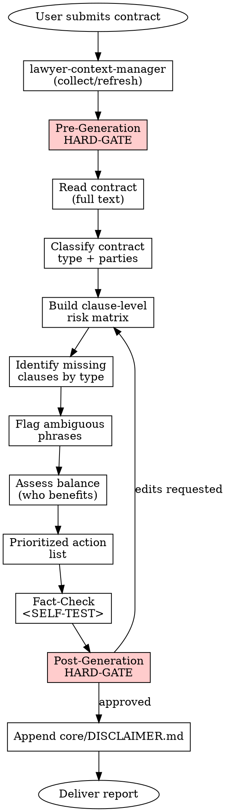

# Contract Review (Sözleşme İnceleme)

## Overview

Produces a structured risk-analysis report on an EXISTING contract: clause-by-clause risk matrix, missing-clause list, ambiguous-language list, balance assessment, and a prioritized action plan. This skill never drafts a new contract from scratch — it critiques an input document.

## When to Use

Trigger this skill when:

- The user pastes or attaches an existing contract and asks for review / analysis / risk assessment
- Phrases: "bu sözleşmeyi inceler misin", "sözleşme analizi", "contract review", "risk taraması", "bu maddeyi değerlendir"
- Before signing — during due diligence or negotiation prep
- During ongoing negotiation, to compare counterparty's latest redline

Do NOT use when:

- The user wants a contract DRAFTED from scratch (different skill, not yet in library)
- The user wants only a specific clause TRANSLATED (out of scope)
- The user asks general legal advice without a document attached — request the document first

## Jurisdiction Configuration

- Default: `tr`
- Supported: `tr`
- Jurisdiction file: `skills/contract-review/jurisdictions/tr.md`
- If the contract's chosen law is non-Turkish but the user requests a Turkish-law review, WARN the user that the analysis will apply Turkish conflict-of-laws rules (5718 s. MÖHUK) and that foreign-law clauses may be analyzed only from a Turkish-public-policy perspective.

## Context Requirements

```
MANDATORY: client.legal_name (or client.full_name),
           party_representation (which party the client is: A, B, or third)

STRONGLY RECOMMENDED: preferences.default_court,
                     client.industry (sector-specific analysis),
                     contract_stage (negotiation | pre-signature | post-signature)

OPTIONAL: firm.attorney_name, contract_type (if obvious from document, derived; else user-supplied)
```

If MANDATORY fields are missing, the agent MUST invoke **REQUIRED SUB-SKILL:** `skills/lawyer-context-manager/SKILL.md`. The pre-generation HARD-GATE below also re-asks critical stance questions even when context exists.

## Process Flow



## Output Specification

Report structure (Turkish, since default_language = Türkçe):

```
SÖZLEŞME İNCELEME RAPORU

1. GENEL BİLGİLER
   - Sözleşme türü (satış / hizmet / kira / distribütörlük / ...)
   - Taraflar ve konumları (A = müvekkil, B = karşı taraf)
   - Sözleşme tarihi, süresi, uygulanacak hukuk, yetkili mahkeme
   - İnceleme aşaması (müzakere / imza öncesi / imza sonrası)

2. RİSK MATRİSİ
   Her maddenin 🟢 🟡 🔴 etiketiyle değerlendirmesi.

   | Madde No | Konu | Risk | Bulgu | Hukuki Dayanak | Öneri |
   |----------|------|------|-------|----------------|-------|
   | Md. 5    | Cezai şart | 🔴 | Fahiş; TBK m.182/3 indirim riski | TBK m.179, m.182/3 | Tutar %X'e çekilsin veya "kısmi indirim müvekkili etkilemeyecek" ibaresi eklensin |
   | Md. 8    | Fesih | 🟡 | Karşı tarafa tek taraflı sınırsız hak | TBK m.126 | Haklı sebep / süre eklensin |
   | ...      | ...  | ... | ...   | ...            | ...   |

3. EKSİK MADDELER
   Sözleşme türüne göre standart olması gereken maddeler:
   - [ ] Mücbir sebep tanımı eksik
   - [ ] KVKK uyumu eki yok (veri işleme varsa)
   - [ ] Devir yasağı yok
   - ...

4. MUĞLAK İFADELER
   - "mümkün olan en kısa sürede" (Md. 3) → öneri: "sipariş tarihinden itibaren 7 iş günü"
   - "makul ölçüde" (Md. 11) → öneri: ölçü kriteri tanımlansın

5. TARAFLAR ARASI DENGE ANALİZİ
   - Hangi tarafın lehine ağırlık var? (somut gerekçe ile)
   - Müvekkil açısından net zayıf pozisyon sahaları
   - Pazarlık kaldıracı sunan karşılık maddeler

6. ÖNCELİKLİ AKSİYONLAR
   Üç kategoride sıralı liste:
   - 🔴 HEMEN DEĞİŞTİRİN (imzalamadan önce zorunlu)
   - 🟡 MÜZAKERE EDİN (risk azaltıcı, imkân varsa)
   - 🟢 KABUL EDİLEBİLİR (not: izlenmesi yeterli)

7. GERÇEKLEŞMEYEN / ŞÜPHELİ REFERANSLAR
   - Yürürlükten kalkmış bir kanuna atıf yapılmış mı?
   - Sözleşmede anılan bir ek / taahhüt eksik mi?

---
[DISCLAIMER hook: Append core/DISCLAIMER.md here verbatim]
```

**Disclaimer hook:** `core/DISCLAIMER.md` is appended at the very end of the report. `[Date]` → rapor üretim tarihi (GG.AA.YYYY).

## Risk Zones

- 🟢 General info section (parties, type, date), missing-clause checklist shell, terminology definitions
- 🟡 Missing-clause identification (depends on correct contract-type classification), ambiguous-phrase flagging, balance narrative
- 🔴 Risk matrix legal-basis mapping (wrong TBK/TTK article citation is critical), prioritized action recommendations (direct impact on negotiation), any conclusion that a specific clause is enforceable / unenforceable

## Agentic Verification Gate

This skill is 🔴 High Risk. BOTH a pre-generation and a post-generation HARD-GATE are mandatory. All four steps of `core/AGENTIC-VERIFICATION.md` apply.

**Pre-Generation HARD-GATE (🔴 High Risk ONLY):**

```
<HARD-GATE phase="pre-generation">
Before reading / analyzing the contract, the agent MUST stop and ask:

1. "Bu sözleşmede hangi tarafı temsil ediyorsunuz?"
   (Taraf A mı, Taraf B mi, üçüncü taraf mı? Analiz bu tarafın
    lehine/aleyhine yönelecek.)

2. "Sözleşme hangi aşamada?" (müzakere / imza öncesi / imza sonrası)
   İmza sonrası ise aksiyonlar kısıtlı olur.

3. "Özellikle endişe duyduğunuz madde(ler) var mı?"

4. "Uygulanacak hukuk Türk Hukuku mu? Yetkili mahkeme / tahkim
   şartı var mı? (Sözleşmede yazılıysa teyit edelim.)"

5. "Sözleşme tipik sektörünüze özgü mü?"
   (Örn. ticari satış / distribütörlük / hizmet / iş sözleşmesi)

Do NOT start analysis until all five are answered.
Fabricating the answers or inferring from the document alone is FORBIDDEN.
</HARD-GATE>
```

**Post-Generation HARD-GATE:**

```
<HARD-GATE phase="post-generation">
After producing the report the agent MUST stop and ask:

"Bu sözleşmede aşağıdaki maddeler en yüksek riskli kısımlardır:

1. [En riskli madde 1] — Risk: [kısa açıklama] → 💡 Alternatif: [metin]
2. [En riskli madde 2] — Risk: [kısa açıklama] → 💡 Alternatif: [metin]
3. [En riskli madde 3] — Risk: [kısa açıklama] → 💡 Alternatif: [metin]

Öncelikli aksiyonlardan hangilerini detaylandırmamı istersiniz?
Karşı tarafa sunulacak redline taslağını hazırlayayım mı?
Tespit ettiğim eksik maddeler için alternatif metin önerisi ister misiniz?"

The report is NOT complete until the user confirms the findings
or requests iteration. Delivery before approval is FORBIDDEN.
</HARD-GATE>
```

## Red Flags — STOP and Ask the User

The agent MUST stop BEFORE finalizing the report if any of the following is present:

- Hangi tarafın temsil edildiği belirsiz (pre-gen HARD-GATE eksik)
- Sözleşmenin tipini belirleyememe (distribütörlük mü, franchise mi, satış mı?)
- Uygulanacak hukukun yabancı olması ve Türk hukuku referansları istenmesi (MÖHUK m.2, m.24)
- Sözleşmede okunamayan ek / ilave referansı (ek-1, protokol vb. metinde yok)
- Yürürlükten kalkmış mevzuata atıf — tespit edildi ama karşı tarafla teyit edilmedi
- Cezai şart tutarının sözleşme bedeline oranı belirlenemedi (fahiş mi değil mi?)
- Bir tarafın tüketici (TKHK m.3) olup olmadığı belirsiz — farklı koruma rejimi tetikler
- KVKK kapsamında veri işleme var ama sözleşmede veri eki yok — ayrı uyarı gerekir
- İş sözleşmesi incelemesinde iş güvencesi kapsamı (İK m.18: 30 işçi + 6 ay kıdem) teyit edilmedi

## Anti-Patterns (Legal AI Slop)

- ❌ Sözleşmenin tamamını okumadan genel yorum yapmak
- ❌ "Bu sözleşme iyidir / kötüdür" gibi kesin yargı — analiz madde madde, gerekçeli
- ❌ Tarafların lehine/aleyhine değerlendirme yapmadan özetle yetinmek
- ❌ Eksik madde tespit etmeden raporu kapatmak
- ❌ US-law terimleri (indemnification, hold harmless, warranty) Türk hukuku karşılıkları olmadan kopyalamak
- ❌ Cezai şart için hakim indirim yetkisini (TBK m.182/3) unutarak "sabit tutar" tavsiye etmek
- ❌ Tüketici sözleşmesinde TKHK emredici hükümlerine aykırı maddeleri "risk: düşük" etiketlemek
- ❌ Yürürlükten kalkmış 818 s. BK veya 6762 s. TTK'ya atıf
- ❌ Tahkim şartını yazılı şekil zorunluluğu (6100 s.K. m.412) kontrol etmeden geçerli saymak
- ❌ Emredici hukuka aykırılık (TBK m.27) testini atlayıp sadece "dengesiz" yorumuyla yetinmek

## Fact-Check Protocol

```
<SELF-TEST>
Before delivering the report the agent MUST confirm:

- [ ] All cited TBK / TTK / TMK / TKHK article numbers match jurisdictions/tr.md
- [ ] No reference to 818 sayılı BK or 6762 sayılı TTK (abrogated)
- [ ] Risk matrix covers EVERY numbered clause of the contract (no gaps)
- [ ] Each 🔴 risk has a concrete legal basis + alternative text
- [ ] Missing-clause list is contract-type-specific (not generic)
- [ ] Ambiguous phrases list contains specific replacement wording
- [ ] Balance analysis names which party benefits and why (not neutral summary)
- [ ] Consumer-contract check: if party A or B is a tüketici, TKHK emredici hükümleri applied
- [ ] Cezai şart clauses analyzed with TBK m.182/3 (hakim indirimi) note
- [ ] Sorumluluk sınırlandırma clauses checked against TBK m.115 (kasıt/ağır kusurdan kaçınılamaz)
- [ ] Rekabet yasağı clauses checked against TBK m.444-447 (yer/süre/konu sınırı)
- [ ] KVKK trigger: if the contract involves personal data, data-processing addendum recommendation is made
- [ ] Tacirler arası sözleşme ise TTK m.18/3 bildirim şekli teyit edildi
- [ ] Action items grouped 🔴/🟡/🟢 with concrete steps, not generic advice
- [ ] core/DISCLAIMER.md is appended with correct [Date]
</SELF-TEST>
```

## Legal References

- **6098 sayılı Türk Borçlar Kanunu (TBK)** — RG 04.02.2011, Sayı 27836
  - m.1, m.12, m.19-20, m.25-27, m.29-30, m.36-38, m.112-118, m.117-126, m.136-138, m.146-147, m.179-182, m.444-447, m.115
- **6102 sayılı Türk Ticaret Kanunu (TTK)** — RG 14.02.2011, Sayı 27846
  - m.18/3, m.54-63, m.122
- **4721 sayılı Türk Medeni Kanunu (TMK)** — RG 08.12.2001, Sayı 24607
  - m.2 (dürüstlük kuralı), m.9-16 (ehliyet)
- **6502 sayılı Tüketicinin Korunması Hakkında Kanun (TKHK)** — RG 28.11.2013, Sayı 28835
- **4857 sayılı İş Kanunu** — RG 10.06.2003, Sayı 25134
- **6100 sayılı Hukuk Muhakemeleri Kanunu (HMK)** — RG 04.02.2011, Sayı 27836
  - m.412 (tahkim şartı — yazılı şekil)
- **5718 sayılı Milletlerarası Özel Hukuk ve Usul Hukuku Hakkında Kanun (MÖHUK)** — yabancı hukuk seçimi
- Yargıtay içtihatları ([karararama.yargitay.gov.tr](https://karararama.yargitay.gov.tr))

All references verifiable on [mevzuat.gov.tr](https://mevzuat.gov.tr). Fabricated articles PROHIBITED.

---

**Related:**
- `core/SKILL-ANATOMY.md` — structure standard
- `core/RISK-FRAMEWORK.md` — 🔴 High Risk definition
- `core/AGENTIC-VERIFICATION.md` — all 4 steps + pre-generation HARD-GATE mandatory
- `core/DISCLAIMER.md` — appended at end of report
- **REQUIRED SUB-SKILL:** `skills/lawyer-context-manager/SKILL.md` — run first if context is missing
