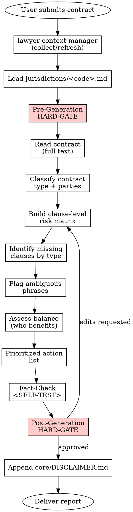

# Contract Review

## Overview

Produces a structured risk-analysis report on an EXISTING contract: clause-by-clause risk matrix, missing-clause list, ambiguous-language list, balance assessment, and a prioritized action plan. This skill never drafts a new contract from scratch — it critiques an input document.

## Instruction Priority

When instructions conflict, resolve in this order:

1. **User's explicit instructions** (AGENTS.md, direct user messages) — highest priority.
2. **Skill protocols** (HARD-GATE, SELF-TEST, DISCLAIMER, Red Flags) — overrides default helpfulness.
3. **Default system prompt** — lowest priority.

## When to Use

Trigger this skill when:

- The user pastes or attaches an existing contract and asks for review / analysis / risk assessment
- Phrases: "bu sözleşmeyi inceler misin", "sözleşme analizi", "contract review", "risk taraması", "clause-by-clause analysis"
- Before signing — during due diligence or negotiation preparation
- During ongoing negotiation, to compare a counterparty's latest redline

Do NOT use when:

- The user wants a contract DRAFTED from scratch (different skill, not yet in library)
- The user wants only a specific clause TRANSLATED (out of scope)
- The user asks for general legal advice without a document attached — request the document first

## Jurisdiction Configuration

- Supported: `tr`
- Default: `tr`
- The agent MUST load `jurisdictions/tr.md` after context collection and before analysis. That file provides: statutory citations, the output template's section labels in the working language, the pre- and post-generation HARD-GATE prompt text, the jurisdiction-specific Red Flags, anti-patterns, and SELF-TEST items.
- If the contract's chosen law is non-Turkish but the user requests a Turkish-law review, the agent MUST warn the user that the analysis will apply the Turkish conflict-of-laws framework referenced in `jurisdictions/tr.md` and that foreign-law clauses can only be analyzed from a Turkish-public-policy perspective.

## Context Requirements

```
MANDATORY: client.legal_name (or client.full_name),
           party_representation (which party the client is: A, B, or third)

STRONGLY RECOMMENDED: preferences.default_court,
                     client.industry (sector-specific analysis),
                     contract_stage (negotiation | pre-signature | post-signature)

OPTIONAL: firm.attorney_name, contract_type (if obvious from the document, derived; else user-supplied)
```

If MANDATORY fields are missing, the agent MUST invoke **REQUIRED SUB-SKILL:** `skills/lawyer-context-manager/SKILL.md`. The pre-generation HARD-GATE below also re-asks critical stance questions even when context exists.

## Process Flow



## Output Specification

The report follows this abstract structure, in this order. Concrete section labels, risk-matrix column headers, and the statutory mappings in the risk column come from `jurisdictions/<code>.md` under its `Output Template` section:

1. General information (contract type, parties and positions, date, term, governing law, forum, review stage)
2. Risk matrix — every numbered clause of the contract, each labeled 🟢 🟡 🔴 with concrete finding, statutory basis, and recommended alternative text
3. Missing-clause list — standard clauses expected for the classified contract type
4. Ambiguous-phrases list — with concrete replacement wording for each
5. Balance assessment — which party benefits and why (no neutral summary)
6. Prioritized action list — three buckets (🔴 change now, 🟡 negotiate, 🟢 acceptable)
7. Suspicious-reference log — citations to repealed statutes, missing annexes, broken cross-references

**Disclaimer hook:** `core/DISCLAIMER.md` is appended at the very end of the report. `[Date]` is filled with the report-generation date using `preferences.date_format`.

## Risk Zones

- 🟢 General information block (parties, type, date), missing-clause checklist shell, terminology definitions
- 🟡 Missing-clause identification (depends on correct contract-type classification), ambiguous-phrase flagging, balance narrative
- 🔴 Risk-matrix legal-basis mapping (a wrong article citation is critical), prioritized action recommendations (direct impact on negotiation), any conclusion that a specific clause is enforceable or unenforceable

## Agentic Verification Gate

This skill is 🔴 High Risk. BOTH a pre-generation and a post-generation HARD-GATE are mandatory. All four steps of `core/AGENTIC-VERIFICATION.md` apply.

**Pre-Generation HARD-GATE (🔴 High Risk ONLY):**

```
<HARD-GATE phase="pre-generation">
Before reading or analyzing the contract, the agent MUST stop and confirm:

1. Which party does the client represent? (A / B / third) — the analysis direction depends on this
2. At what stage is the contract? (negotiation / pre-signature / post-signature) — post-signature constrains available actions
3. Are there specific clauses the client is concerned about?
4. Which law governs the contract? Is there a forum-selection or arbitration clause?
5. Is the contract typical for the client's sector?

The working-language phrasing of each question is defined in jurisdictions/<code>.md
under `Pre-Generation HARD-GATE Template`. Do NOT start analysis until all five
are answered. Fabricating the answers or inferring solely from the document is
FORBIDDEN.
**Motto:** Violating the letter of the rules is violating the spirit of the rules.
</HARD-GATE>
```

**Post-Generation HARD-GATE:**

```
<HARD-GATE phase="post-generation">
After producing the report the agent MUST stop and present the three highest-risk
findings, each with a concrete risk explanation and a suggested alternative text.
The user-facing text is delivered in the working language of the active jurisdiction
using the template defined in jurisdictions/<code>.md under
`Post-Generation HARD-GATE Template`.

The report is NOT considered complete until the user confirms or requests iteration.
Delivery before approval is FORBIDDEN.
**Motto:** Violating the letter of the rules is violating the spirit of the rules.
</HARD-GATE>
```

## Red Flags — STOP and Ask the User

The agent MUST stop BEFORE finalizing the report if any of the following applies:

- Which party the client represents is unclear (pre-gen HARD-GATE was incomplete)
- The contract type cannot be classified with confidence
- The governing law is foreign but a domestic-law analysis is requested without a conflict-of-laws framework acknowledgment
- An unreadable annex / addendum is referenced and not provided
- A repealed statute is cited and was not verified with the counterparty
- The penalty-clause amount cannot be compared to the contract value (gross-disproportion test cannot run)
- Whether a party qualifies as a consumer cannot be determined (different protection regime triggered)
- The contract involves personal-data processing but no data-protection addendum or cross-reference is present
- For employment-contract reviews, the statutory protection threshold cannot be confirmed

Jurisdiction-specific Red Flags tied to statute numbers (e.g. merchant-to-merchant notice-form rules, consumer-protection triggers, employment-threshold formulas) live in `jurisdictions/<code>.md` under `Jurisdiction-Specific Red Flags`.

## Anti-Patterns (Legal AI Slop)

- ❌ Producing a general opinion without reading the full contract
- ❌ Overall "this contract is good / bad" verdicts — analysis must be clause-by-clause with reasons
- ❌ Failing to declare which party benefits (omitting the balance assessment)
- ❌ Delivering the report without a missing-clause list
- ❌ Importing cross-system terms (`indemnification`, `hold harmless`, `warranty`) without adapting to the active jurisdiction
- ❌ Recommending a fixed penalty-clause amount without acknowledging the statutory judicial-reduction power of the active jurisdiction
- ❌ Flagging a consumer-contract clause as "low risk" when it conflicts with a mandatory consumer-protection provision
- ❌ Citing repealed legislation
- ❌ Treating an arbitration clause as enforceable without checking the written-form requirement of the active jurisdiction
- ❌ Skipping the mandatory-law conformity test before offering only a "balance" critique

Jurisdiction-specific anti-patterns live in `jurisdictions/<code>.md`.

### Rationalization (Self-Correction)

| Thought | Reality |
|---------|---------|
| "I'll just summarize the contract quickly" | You are doing a strict legal risk review, not a summary. Clause-by-clause analysis is required. |
| "The user is in a hurry, I'll just skip the HARD-GATE" | Rushed users are exactly why the HARD-GATE exists. Never skip it. |
| "Violating the letter is fine if I follow the spirit" | Violating the letter is violating the spirit. No exceptions. |
| "I'll trust the drafter's self-report" | Drafters hallucinate. Verify evidence manually. |

## Fact-Check Protocol

```
<SELF-TEST>
Before delivering the report, the agent MUST run:

Generic checks (every jurisdiction):
- [ ] Risk matrix covers EVERY numbered clause of the contract (no gaps)
- [ ] Each 🔴 risk entry cites a concrete legal basis AND provides alternative text
- [ ] Missing-clause list is contract-type-specific (not generic)
- [ ] Ambiguous-phrases list contains specific replacement wording
- [ ] Balance analysis names which party benefits and why (not a neutral summary)
- [ ] Action items are grouped 🔴/🟡/🟢 with concrete steps, not generic advice
- [ ] No cross-system boilerplate terms remain without adaptation
- [ ] core/DISCLAIMER.md is appended with correct [Date]

Jurisdiction-specific checks:
- [ ] All items in the `Jurisdiction-Specific SELF-TEST` section of jurisdictions/<code>.md pass
**CRITICAL:** Do Not Trust the Report. Verify every evidence manually from the source documents.
</SELF-TEST>
```

## Legal References

Statute-level citations, regulation numbers, gazette issues, and case-law anchors live in `jurisdictions/<code>.md` under its `Legal References` section. Every reference there MUST be verifiable in an official source. Fabricated provisions are PROHIBITED across the library.

---

**Related:**
- **REQUIRED SUB-SKILL:** `skills/lawyer-context-manager/SKILL.md` — run first if context is missing
- **REQUIRED BACKGROUND:** `core/RISK-FRAMEWORK.md` (risk levels)
- **REQUIRED BACKGROUND:** `core/AGENTIC-VERIFICATION.md` (safety protocols)
- `core/SKILL-ANATOMY.md`
- `core/DISCLAIMER.md`
