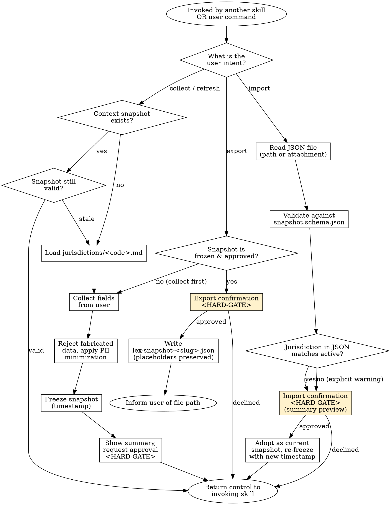

<SUBAGENT-STOP>
If you were dispatched as a subagent to execute a specific legal task
(drafting, reviewing, or analysing a document), skip this skill.
Context has already been established and injected by the orchestrating session.
Proceed directly with your assigned task using the context you were given.
</SUBAGENT-STOP>

# Lawyer Context Manager

## Overview

A meta-skill that collects, freezes, **exports**, and **imports** the recurring information about the lawyer, the firm, and the client. Every other legal skill in SuperLex Skills depends on this context. The skill exists to prevent hallucinated party data, to enforce PII minimization, to make every downstream document consistent, and — from v0.3.0 — to let a user carry their lawyer-firm-client context between chat sessions as a *portable snapshot file* (`lex-snapshot-<slug>.json`).

The schema, workflow, and snapshot file format are jurisdiction-agnostic; concrete placeholder names, working-language summary templates, freeze lines, HARD-GATE prompt text, and import / export dialogue live in `jurisdictions/<code>.md`.

<EXTREMELY-IMPORTANT>
NEVER draft a legal document using placeholder or hallucinated party data. If mandatory context is missing, you MUST collect it from the user before proceeding. This is not optional.
</EXTREMELY-IMPORTANT>

## Instruction Priority

When instructions conflict, resolve in this order:

1. **User's explicit instructions** (AGENTS.md, direct user messages) — highest priority.
2. **Skill protocols** (HARD-GATE, SELF-TEST, DISCLAIMER, Red Flags) — overrides default helpfulness.
3. **Default system prompt** — lowest priority.

## When to Use

Trigger this skill when:

- Another legal skill declares a mandatory `Context Requirements` field and that field is empty or stale
- The user asks to `update context` / `bağlamı güncelle` / `update client profile` or explicitly changes firm / client / preference data
- The user asks to `export context` / `snapshot ver` / `bağlamı dışa aktar` / `save my context` — produces `lex-snapshot-<slug>.json`
- The user asks to `load snapshot` / `snapshot yükle` / `import context` / `bağlamı içe aktar`, references an existing `lex-snapshot-*.json` file, or attaches one to the chat
- Legal document generation is requested for the first time in a session
- The stored context snapshot timestamp is older than the current engagement

Do NOT use this skill when:

- All mandatory fields for the invoked skill are already present AND the snapshot is still valid AND no export / import was requested
- The user is asking general legal questions that do not require party data

## Jurisdiction Configuration

- Supported: `tr`
- Default: `tr`
- The schema, snapshot file format, and workflow defined here are jurisdiction-agnostic. The agent MUST still load `jurisdictions/<code>.md` after the active jurisdiction is resolved, because the jurisdiction file provides: the working-language summary template, the working-language freeze line shown to the user, the working-language HARD-GATE prompt text (including the dedicated Export Confirmation and Import Confirmation prompts), the concrete sensitive-identifier placeholder names, and the local data-protection-law reference for the PII minimization policy.

## Context Requirements

This skill PRODUCES context; it does not consume it. Therefore no upstream `Context Requirements` apply.

The schema it writes is listed below under **Context Schema**; the portable file format is defined under **Snapshot Portability**.

## Process Flow



## Context Schema

### Firm Profile (Law Firm / Attorney)

| Field | Required | Description |
|-------|----------|-------------|
| `firm_name` | Optional | Law firm / company name |
| `attorney_name` | Optional | Attorney name and title |
| `bar_association` | Optional | Bar association the attorney is registered with |
| `contact` | Optional | Address, phone, e-mail |
| `preferred_jurisdiction` | Optional | Preferred competent court |
| `preferred_arbitration` | Optional | Preferred arbitration forum |
| `signature_style` | Optional | Signature block format |

### Client Profile

| Field | Condition | Description |
|-------|-----------|-------------|
| `client_type` | MANDATORY | `individual` or `corporate` |

**IF `client_type == "individual"`:**

| Field | Required | Description |
|-------|----------|-------------|
| `full_name` | MANDATORY | Full legal name of the individual |
| `id_placeholder` | MANDATORY | Always stored as the jurisdiction's national-ID placeholder (see `jurisdictions/<code>.md`) — the raw identifier must NOT be collected |
| `residential_address` | MANDATORY | Residential address |
| `occupation` | Optional | Occupation |

**IF `client_type == "corporate"`:**

| Field | Required | Description |
|-------|----------|-------------|
| `legal_name` | MANDATORY | Registered trade name |
| `registered_address` | MANDATORY | Registered seat address |
| `trade_registry` | Optional | Trade registry number |
| `tax_id` | Optional | Tax identification number |
| `company_registry_id` | Optional | Jurisdiction-specific company registry ID (mapped by `jurisdictions/<code>.md`) |
| `authorized_signatory` | Optional | Authorized signatory name and title |
| `industry` | Optional | Industry / line of business (critical for privacy-policy and terms-of-use) |

### Preferences

| Field | Description |
|-------|-------------|
| `default_governing_law` | Governing law (defaults to the active jurisdiction) |
| `default_court` | Default competent court |
| `default_language` | Document working language |
| `date_format` | Date format |
| `currency` | Currency code |
| `formality_level` | Tone of voice (`formal` / `neutral`) |

Concrete default values for the active jurisdiction are defined in `jurisdictions/<code>.md` under its `Preference Defaults` section.

## PII Minimization Policy

Highly sensitive identifiers are NEVER stored in the context snapshot — not in memory, not in the summary shown to the user, and not in the exported JSON file. The agent stores a placeholder; the lawyer fills in the real value manually in the final document.

The concrete placeholder tokens for the active jurisdiction (for example: `[TCKN_PLACEHOLDER]`, `[PASAPORT_PLACEHOLDER]`, `[HESAP_NO_PLACEHOLDER]`, `[VERGI_NO_PLACEHOLDER]` in `tr`) are defined in `jurisdictions/<code>.md` under `Sensitive-Identifier Placeholders`.

Basis: the active jurisdiction's data-protection-law data-minimization principle (cited by article number in `jurisdictions/<code>.md`). This rule applies to the exported JSON file **without exception**: if the in-memory snapshot uses a placeholder, the JSON must use the same placeholder.

## Context Snapshot (Freeze Mechanism)

Once collected, the context is timestamped and locked. The agent CANNOT mutate snapshot fields on its own initiative. To change a field, the user must issue an explicit "update context" command.

The snapshot summary shown to the user MUST end with a fixed freeze line stating:
- the freeze timestamp (using `preferences.date_format`)
- the exact working-language command the user must type to mutate a field
- the exact working-language command the user must type to export the snapshot to a portable file

The working-language wording of that line is defined in `jurisdictions/<code>.md` under `Freeze Line`.

## Snapshot Portability — Export / Import

This section specifies the *portable snapshot file*: a single JSON document that carries the complete context between chat sessions, machines, or devices. The file is the user's property; the agent only reads and writes it at the user's explicit request.

### File Naming Convention

The exported file MUST be named:

```
lex-snapshot-<slug>.json
```

where `<slug>` is the lowercase, diacritics-stripped, hyphen-separated form of the client's `legal_name` (for corporate) or `full_name` (for individual), truncated to at most 48 characters.

Examples:
- corporate client `"Acme Teknoloji A.Ş."` → `lex-snapshot-acme-teknoloji-as.json`
- individual client `"Ayşe Yılmaz"` → `lex-snapshot-ayse-yilmaz.json`

If the user has already approved a snapshot for the same client in the current session, the agent appends a timestamp to avoid overwriting: `lex-snapshot-<slug>-<YYYYMMDD-HHMM>.json`. The agent MUST NOT silently overwrite a pre-existing file with the canonical name without an explicit overwrite confirmation.

### File Schema

The portable snapshot is a JSON document that conforms to the JSON Schema at `skills/lawyer-context-manager/snapshot.schema.json`. The top-level structure is:

```
{
  "kind": "lex-snapshot",
  "schema_version": "1.0",
  "superlex_skills_version": "0.3.0",
  "frozen_at": "<ISO-8601 timestamp with timezone>",
  "jurisdiction": "<ISO-style jurisdiction code — e.g. tr>",
  "preferences": { ...Preferences schema... },
  "firm":        { ...Firm Profile schema... },
  "client":      { ...Client Profile schema, client_type-dependent... },
  "meta": {
    "generated_by":  "lawyer-context-manager",
    "source_session": "<opaque session id or `manual`>",
    "notes":         "<optional free text from the user>"
  }
}
```

Three invariants apply to the file:

1. **PII preservation.** Any field that was a placeholder in memory (e.g. `[TCKN_PLACEHOLDER]`) MUST remain a placeholder in the file.
2. **No repository bleed.** The file is written to the user's chosen working directory, typically the current project root. The agent MUST NOT commit, push, or upload the file; the file is ignored by default via `.gitignore` (`lex-snapshot-*.json`).
3. **No hidden transforms.** The JSON reflects exactly what was in memory at the time of freeze. The agent does not summarize, normalize, or redact any field during export beyond what the in-memory snapshot already did.

A reference example file lives at `skills/lawyer-context-manager/examples/lex-snapshot-example.json`.

### Export Flow

1. The user issues an export command (see `jurisdictions/<code>.md` → `Export Command Phrases`).
2. The agent verifies a frozen, user-approved snapshot exists; if not, it runs the collection flow first.
3. The agent stops at an **Export HARD-GATE** (see *Agentic Verification Gate*) that lists every field about to be written and asks for explicit approval.
4. On approval, the agent serialises the snapshot to JSON using the schema above and writes the file at the user-specified (or default) path.
5. The agent reports the absolute file path, the byte count, and a reminder that the file is the user's property and should be stored at the same confidentiality level as any client file.

### Import Flow

1. The user references an existing `lex-snapshot-*.json` file (by path or by attaching it) and issues an import command.
2. The agent reads the file and validates it against `snapshot.schema.json`. Any schema violation aborts the import with a diagnostic message.
3. The agent checks that `jurisdiction` in the file matches the active jurisdiction for this chat session. A mismatch does NOT auto-reject but DOES trigger an explicit cross-jurisdiction warning inside the Import HARD-GATE.
4. The agent renders the imported summary in the working language of the active jurisdiction and stops at an **Import HARD-GATE** asking the user to confirm that this snapshot is still accurate.
5. On approval, the imported snapshot is adopted as the current session's context, **re-frozen with a new timestamp**, and control returns to the invoking skill. The imported `frozen_at` from the file is preserved in the `meta` block as `meta.imported_from_frozen_at`.

### Safety Rules

- The agent MUST NOT import a snapshot silently. The Import HARD-GATE is mandatory regardless of the skill's overall risk level.
- The agent MUST NOT mix imported fields with collected fields in the same turn — either the whole snapshot is adopted, or the user is asked to resume the collection flow from scratch.
- The agent MUST NOT export a snapshot that has not yet been user-approved.
- The agent MUST refuse to write the file to a path outside the current working directory unless the user provides an explicit absolute path.
- The agent MUST NOT send the snapshot content to any external service, logging endpoint, or analytics pipeline.

## Output Specification

The skill produces one of three user-visible artefacts depending on the intent branch:

1. **Collect / refresh branch** — a confirmed context summary in the working language of the active jurisdiction, ending with the Freeze Line. The summary MUST contain, in this order: (1) client type, (2) client name or legal name, (3) client address, (4) industry (if supplied), (5) default court, (6) default governing law, (7) default language, (8) attorney / firm (if supplied), (9) freeze line.
2. **Export branch** — the confirmed summary from branch 1 plus a short post-write confirmation reporting the absolute file path, byte count, and confidentiality reminder. The JSON file itself conforms to `snapshot.schema.json`.
3. **Import branch** — a rendered summary of the imported snapshot (identical format to branch 1) followed by the Import HARD-GATE question.

The concrete labels, formatting, and language of each summary are defined in `jurisdictions/<code>.md` under `Summary Template`, `Export Confirmation`, and `Import Confirmation` respectively.

**Disclaimer hook:** This skill does NOT emit a legal document, therefore `core/DISCLAIMER.md` is NOT appended here. The downstream skill is responsible for appending the disclaimer to its final output.

## Risk Zones

- 🟢 Firm profile fields (firm_name, attorney_name, contact)
- 🟢 Preferences (language, date format, currency)
- 🟡 Client profile collection — PII minimization rules MUST be enforced; fabrication of missing fields is forbidden
- 🟡 **Snapshot export / import** — a file that leaves the session is a higher-exposure artefact than an in-memory summary; the HARD-GATE is mandatory in BOTH directions and the PII-placeholder invariant is non-negotiable

## Agentic Verification Gate

This skill is 🟢 Low Risk for the collection flow; only Step 1 (Fact-Check Protocol) of `core/AGENTIC-VERIFICATION.md` is mandatory there. The export / import flows are 🟡 and require an additional HARD-GATE per flow.

**Post-Generation HARD-GATE — collection (mandatory):**

```
<HARD-GATE phase="post-generation">
After producing the context summary, the agent MUST stop and ask the user, in the
active working language, whether the shown context is correct and whether any field
should be changed or added (e.g. attorney name, competent court).

The snapshot is NOT considered frozen until the user explicitly approves.

The working-language prompt text is defined in jurisdictions/<code>.md under
`Post-Generation HARD-GATE Template`.
**Motto:** Violating the letter of the rules is violating the spirit of the rules.
</HARD-GATE>
```

**Export HARD-GATE (mandatory before writing the JSON file):**

```
<HARD-GATE phase="post-generation" flow="export">
Before writing lex-snapshot-<slug>.json, the agent MUST stop and present:

1. The full, non-redacted list of fields about to be written (placeholders included)
2. The target file path
3. A warning that the file will contain client identifying information (even with
   placeholders for sensitive IDs) and must be stored under the same confidentiality
   regime as any client file
4. A reminder that the file is NOT committed to the repository and is excluded from
   git by default

No file is written without explicit user approval. The user-facing prompt lives in
jurisdictions/<code>.md under `Export Confirmation`.
**Motto:** Violating the letter of the rules is violating the spirit of the rules.
</HARD-GATE>
```

**Import HARD-GATE (mandatory before adopting an imported snapshot):**

```
<HARD-GATE phase="pre-generation" flow="import">
Before adopting an imported snapshot as the session context, the agent MUST stop
and present:

1. The file's `frozen_at` timestamp and its age relative to the current date
2. The file's `jurisdiction` and an explicit warning if it differs from the active
   jurisdiction for this chat
3. The rendered summary (same format as the collect-branch summary)
4. A reminder that the user is responsible for confirming the snapshot is still
   accurate for the current engagement

Adoption only occurs on explicit user approval. The user-facing prompt lives in
jurisdictions/<code>.md under `Import Confirmation`.
**Motto:** Violating the letter of the rules is violating the spirit of the rules.
</HARD-GATE>
```

## Anti-Patterns

- ❌ Collecting all fields from scratch on every skill invocation (snapshot must be reused when valid)
- ❌ Fabricating missing client / firm data instead of asking
- ❌ Storing raw national-ID / passport / IBAN / other sensitive identifiers in the snapshot — placeholders must be used
- ❌ **Exporting a snapshot that contains raw sensitive identifiers** — the file must carry the same placeholders as the in-memory snapshot
- ❌ **Silently overwriting an existing `lex-snapshot-*.json`** without the overwrite confirmation
- ❌ **Silently importing a snapshot** without running the Import HARD-GATE
- ❌ **Mixing imported fields with newly collected fields** in the same turn (all-or-nothing adoption)
- ❌ **Adopting a snapshot whose `jurisdiction` differs from the active one** without an explicit cross-jurisdiction warning and explicit user approval
- ❌ **Committing, pushing, or uploading a `lex-snapshot-*.json` file** — the file is client data, not repository content
- ❌ **Editing the JSON by hand and re-importing** without re-running the Import HARD-GATE on the modified file
- ❌ Generating a new document without refreshing a stale snapshot when the user asks to change context
- ❌ Agent silently mutating snapshot fields between skill runs
- ❌ Asking for optional sensitive fields when the downstream skill does not require them (violates the data-minimization principle)
- ❌ Returning control to the invoking skill without the user's explicit approval of the summary

Jurisdiction-specific anti-patterns (named statute references) live in `jurisdictions/<code>.md`.

### Rationalization (Self-Correction)

| Thought | Reality |
|---------|---------|
| "The user is in a hurry, I'll just use a blank context or skip the collection" | Missing context creates massive legal risk. The downstream document will be useless. Never skip collection. |
| "Violating the letter is fine if I follow the spirit" | Violating the letter is violating the spirit. No exceptions. |
| "I'll trust the provided snapshot without verification" | Do Not Trust the Report. Verify manually. |
| "I'll guess the missing party data to save time" | Hallucinated data invalidates legal documents and creates liability. |

## Fact-Check Protocol

```
<SELF-TEST>
Generic checks (every jurisdiction, every branch):
- [ ] Every non-optional field was supplied by the user (no fabrication)
- [ ] No raw sensitive identifiers stored; jurisdiction-specific placeholders used instead
- [ ] `client_type` is exactly `individual` or `corporate` (no other value)
- [ ] Snapshot timestamp uses preferences.date_format
- [ ] User approval captured after the summary was shown
- [ ] Summary is in the working language of the active jurisdiction
- [ ] Freeze line is present with the exact working-language update AND export commands

Export-branch checks:
- [ ] The snapshot was approved before the Export HARD-GATE was presented
- [ ] The file name matches `lex-snapshot-<slug>.json` (ASCII-slugged, no diacritics)
- [ ] The file is written only to the working directory or to an explicit absolute path
- [ ] Every placeholder token in memory is identical to the one written to JSON (no accidental materialization)
- [ ] The Export HARD-GATE was shown and explicitly approved
- [ ] The agent reports the absolute path, byte count, and confidentiality reminder
- [ ] The JSON validates against `skills/lawyer-context-manager/snapshot.schema.json`

Import-branch checks:
- [ ] The file was validated against `snapshot.schema.json` BEFORE any adoption
- [ ] `kind == "lex-snapshot"` and `schema_version` is recognised
- [ ] `jurisdiction` in the file was compared to the active jurisdiction; any mismatch was surfaced in the Import HARD-GATE
- [ ] The Import HARD-GATE was shown and explicitly approved
- [ ] On adoption, the snapshot was re-frozen with a new timestamp; the original `frozen_at` is preserved in `meta.imported_from_frozen_at`
- [ ] No field from the imported snapshot was merged with a field collected earlier in the same turn

Jurisdiction-specific checks:
- [ ] All items in the `Jurisdiction-Specific SELF-TEST` section of jurisdictions/<code>.md pass
**CRITICAL:** Do Not Trust the Report. Verify every evidence manually from the source documents.
</SELF-TEST>
```

## Legal References

This meta-skill does not itself cite statutes in its user-facing output. The PII-minimization, data-collection, and export-handling rules above are grounded in the active jurisdiction's data-protection law; the concrete statute / article number citations live in `jurisdictions/<code>.md` under its `Legal References` section. Downstream skills apply further statutes.

---

**Related:**
- `core/SKILL-ANATOMY.md` — structure template
- `core/RISK-FRAMEWORK.md` — 🟢 Low Risk (collection) / 🟡 Medium Risk (export / import)
- `core/AGENTIC-VERIFICATION.md` — Step 1 mandatory for 🟢 skills; Export / Import HARD-GATEs mandatory for the corresponding flows
- `core/DISCLAIMER.md` — not applied here; downstream skills own the disclaimer
- `skills/lawyer-context-manager/snapshot.schema.json` — JSON Schema for the portable snapshot file
- `skills/lawyer-context-manager/examples/lex-snapshot-example.json` — reference example
