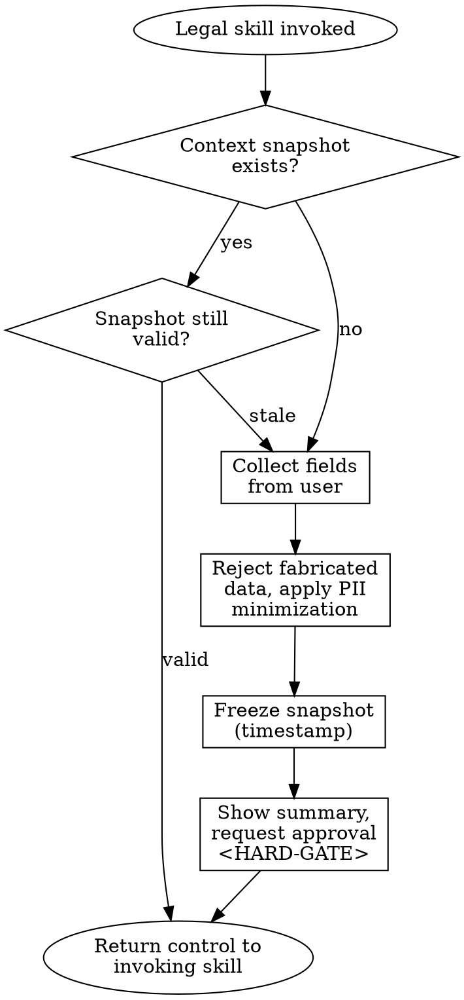

# Lawyer Context Manager

## Overview

A meta-skill that collects and freezes the recurring information about the lawyer, the firm, and the client. All other legal skills in Lex-Skill depend on this context. The skill exists to prevent hallucinated party data, to enforce PII minimization, and to make every downstream document consistent.

## When to Use

Trigger this skill when:

- Another legal skill declares a mandatory `Context Requirements` field and that field is empty or stale
- The user types `update context` or explicitly asks to change firm/client/preference data
- Legal document generation is requested for the first time in a session
- The stored context snapshot timestamp is older than the current engagement

Do NOT use this skill when:

- All mandatory fields for the invoked skill are already present AND the snapshot is still valid
- The user is asking general legal questions that do not require party data

## Jurisdiction Configuration

- Default: `tr` (Türk Hukuku)
- This meta-skill is jurisdiction-agnostic by design — the schema it collects is valid across jurisdictions; only the `preferences.default_governing_law` value changes per user
- No `jurisdictions/*.md` sub-file is loaded for this skill

## Context Requirements

This skill PRODUCES context; it does not consume it. Therefore no upstream `Context Requirements` apply.

The schema it writes is listed below under **Context Schema**.

## Process Flow



## Context Schema

### Firm Profile (Law Firm / Attorney)

| Field | Required | Description |
|-------|----------|-------------|
| `firm_name` | Optional | Büro / şirket adı |
| `attorney_name` | Optional | Avukatın adı ve unvanı |
| `bar_association` | Optional | Bağlı olunan baro |
| `contact` | Optional | Adres, telefon, e-posta |
| `preferred_jurisdiction` | Optional | Varsayılan yetkili mahkeme |
| `preferred_arbitration` | Optional | Tercih edilen tahkim merkezi |
| `signature_style` | Optional | İmza bloğu formatı |

### Client Profile

| Field | Condition | Description |
|-------|-----------|-------------|
| `client_type` | MANDATORY | `individual` (Gerçek Kişi) or `corporate` (Tüzel Kişi) |

**IF `client_type == "individual"`:**

| Field | Required | Description |
|-------|----------|-------------|
| `full_name` | MANDATORY | Ad Soyad |
| `id_placeholder` | MANDATORY | Always store as `[TCKN_PLACEHOLDER]` — raw TCKN must NOT be collected |
| `residential_address` | MANDATORY | İkametgah adresi |
| `occupation` | Optional | Meslek |

**IF `client_type == "corporate"`:**

| Field | Required | Description |
|-------|----------|-------------|
| `legal_name` | MANDATORY | Ticaret unvanı |
| `registered_address` | MANDATORY | Kayıtlı merkez adresi |
| `trade_registry` | Optional | Ticaret sicil numarası |
| `tax_id` | Optional | Vergi kimlik numarası |
| `mersis_no` | Optional | MERSİS numarası |
| `authorized_signatory` | Optional | Temsile yetkili kişi adı ve unvanı |
| `industry` | Optional | Faaliyet sektörü (privacy-policy ve terms-of-use için kritik) |

### Preferences

| Field | Default | Description |
|-------|---------|-------------|
| `default_governing_law` | Türk Hukuku | Uygulanacak hukuk |
| `default_court` | — | Varsayılan yetkili mahkeme (örn. "İstanbul Anadolu Mahkemeleri ve İcra Daireleri") |
| `default_language` | Türkçe | Belge dili |
| `date_format` | GG.AA.YYYY | Tarih formatı |
| `currency` | TRY | Para birimi |
| `formality_level` | formal | Dil tonu (`formal` / `neutral`) |

## PII Minimization Policy

Highly sensitive identifiers are NEVER stored in the context snapshot. The agent stores a placeholder; the lawyer fills in the real value manually in the final document.

Mandatory placeholders:

- `[TCKN_PLACEHOLDER]` — T.C. Kimlik Numarası
- `[PASAPORT_PLACEHOLDER]` — Pasaport numarası
- `[HESAP_NO_PLACEHOLDER]` — Banka hesap / IBAN
- `[VERGI_NO_PLACEHOLDER]` — if used for authentication

Basis: KVKK m.4/1-ç (data minimization principle).

## Context Snapshot (Freeze Mechanism)

Once collected, the context is timestamped and locked. The agent CANNOT mutate snapshot fields on its own initiative. To change a field, the user must issue `update context`.

The snapshot text shown to the user MUST contain this fixed line:

```
Bu bilgiler [GG.AA.YYYY HH:MM] itibarıyla dondurulmuştur.
Değişiklik yapmak isterseniz 'update context' komutunu kullanın.
```

## Output Specification

The skill does not produce a legal document; it produces a confirmed context summary that the calling skill can consume.

**Summary format shown to the user (Turkish, since `default_language = Türkçe`):**

```
📋 BAĞLAM BİLGİLERİ (Context Snapshot)

Müvekkil Türü       : [individual | corporate]
Ad / Unvan          : [full_name | legal_name]
Adres               : [residential_address | registered_address]
Sektör              : [industry]  (varsa)
Yetkili Mahkeme     : [preferences.default_court]
Uygulanacak Hukuk   : [preferences.default_governing_law]
Belge Dili          : [preferences.default_language]
Avukat / Büro       : [attorney_name] / [firm_name]  (varsa)

Bu bilgiler [GG.AA.YYYY HH:MM] itibarıyla dondurulmuştur.
Değişiklik yapmak isterseniz 'update context' komutunu kullanın.
```

**Disclaimer hook:** This skill does NOT emit a legal document, therefore `core/DISCLAIMER.md` is NOT appended here. The downstream skill is responsible for appending the disclaimer to its final output.

## Risk Zones

- 🟢 Firm profile fields (firm_name, attorney_name, contact)
- 🟢 Preferences (language, date format, currency)
- 🟡 Client profile collection — PII minimization rules MUST be enforced; fabrication of missing fields is forbidden

## Agentic Verification Gate

This skill is 🟢 Low Risk; only Step 1 (Fact-Check Protocol) of `core/AGENTIC-VERIFICATION.md` is mandatory. Steps 2-4 are skipped because no legal document is produced.

**Post-Generation HARD-GATE (mandatory):**

```
<HARD-GATE phase="post-generation">
After producing the context summary, the agent MUST stop and ask:

"Yukarıdaki bağlam bilgileri doğru mu? Herhangi bir alanı değiştirmek
veya eksik alan (ör. avukat adı, yetkili mahkeme) eklemek ister misiniz?
Onaylıyorsanız, tetikleyen skill'e devam ediyorum."

The snapshot is NOT considered frozen until the user approves.
</HARD-GATE>
```

## Anti-Patterns

- ❌ Collecting all fields from scratch on every skill invocation (snapshot must be reused)
- ❌ Fabricating missing client/firm data instead of asking
- ❌ Storing raw TCKN, passport number, or IBAN in the snapshot (must be placeholders)
- ❌ Generating a new document without refreshing a stale snapshot when the user asks to change context
- ❌ Agent silently mutating snapshot fields between skill runs
- ❌ Asking for optional sensitive fields (MERSİS, tax_id) when the downstream skill does not require them — violates KVKK m.4/1-ç

## Fact-Check Protocol

```
<SELF-TEST>
Before declaring the snapshot ready, verify:
- [ ] Every non-optional field was supplied by the user (no fabrication)
- [ ] No raw TCKN / passport / IBAN stored; placeholders used instead
- [ ] `client_type` is exactly `individual` or `corporate` (no other value)
- [ ] Snapshot timestamp uses preferences.date_format
- [ ] User approval captured after the summary was shown
- [ ] Turkish-language summary output (unless user overrode default_language)
</SELF-TEST>
```

## Legal References

- **6698 sayılı Kişisel Verilerin Korunması Kanunu (KVKK)** — Resmî Gazete 07.04.2016, Sayı 29677
  - m.4/1-ç: Veri minimizasyonu ilkesi — işlendikleri amaçla bağlantılı, sınırlı ve ölçülü olma
  - m.5: Kişisel verilerin işlenme şartları (açık rıza veya hukuki sebep)

This meta-skill does not itself cite statutes in its output, but the PII minimization and data-collection rules above are grounded in KVKK. Downstream skills apply further statutes.

---

**Related:**
- `core/SKILL-ANATOMY.md` — structure template
- `core/RISK-FRAMEWORK.md` — 🟢 Low Risk definition
- `core/AGENTIC-VERIFICATION.md` — Step 1 mandatory for 🟢 skills
- `core/DISCLAIMER.md` — not applied here; downstream skills own the disclaimer
