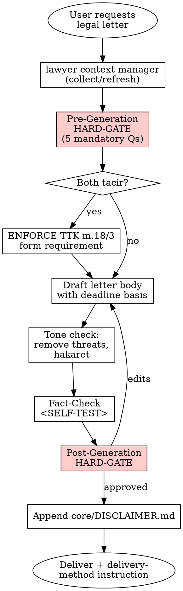

# Legal Letter (İhtarname / Bildirim / Fesih Mektubu)

## Overview

Produces a formal legal notice — ihtarname, temerrüt bildirimi, fesih bildirimi, ayıp ihbarı, or ödeme talep mektubu. This is the most dangerous skill in the library: mistakes start or miss statutory clocks, waive rights, or render a termination void (TTK m.18/3). A pre-generation HARD-GATE is MANDATORY before any drafting.

## When to Use

Trigger when:

- User asks for "ihtarname", "fesih ihtarı", "noter ihtarnamesi", "demand letter", "notice of default", "termination letter", "ayıp bildirimi"
- A statutory period must be started (temerrüt, dönme, fesih, cayma)
- A counterparty must be warned before legal action
- A commercial dispute must be escalated via the formal channel required by TTK m.18/3

Do NOT use when:

- A general informational email is sufficient (no statutory clock)
- A court petition / dilekçe is needed (different skill, different procedure)
- Arbitration notice is needed (HMK m.412 / MTK — different regime, additional formalities)
- A non-ihtar commercial communication is needed (use a regular business letter template)

## Jurisdiction Configuration

- Default: `tr`
- Supported: `tr`
- Jurisdiction file: `skills/legal-letter/jurisdictions/tr.md`

## Context Requirements

```
MANDATORY: client.client_type,
           client.legal_name (if corporate) OR client.full_name (if individual),
           client.registered_address OR client.residential_address,
           counterparty.identity (name or legal_name),
           counterparty.address  (verified — fabricating address is FORBIDDEN)

STRONGLY RECOMMENDED: firm.attorney_name + bar_association + firm.contact (if sent through an attorney),
                     client.mersis_no / tax_id (for corporate parties)

INTAKE QUESTIONS (asked via pre-generation HARD-GATE — MANDATORY):
- purpose: "temerrüt" | "fesih" | "dönme" | "ayıp_ihbarı" | "ödeme_talebi" | "bildirim_other"
- delivery_method: "noter" | "kep_uets" | "iadeli_taahhütlü" | "elden_imzaya_karşı" | "uncertain"
- deadline_days: integer (e.g. 7, 15, 30) — statutory or contractual basis must be named
- deadline_basis: "statutory" (cite TBK/TTK article) | "contractual" (cite clause) | "reasonable_discretionary"
- both_parties_are_tacir: true | false  (triggers TTK m.18/3 check)
- counterparty_has_kep_or_uets: true | false | unknown
- underlying_dispute_summary: free-text chronological facts
- prior_notices_sent: true | false; if true, copies attached?
```

Missing MANDATORY fields → invoke **REQUIRED SUB-SKILL:** `skills/lawyer-context-manager/SKILL.md`.

## Process Flow



## Pre-Generation HARD-GATE (🔴 MANDATORY)

```
<HARD-GATE phase="pre-generation">
Before ANY drafting, the agent MUST stop and get ALL five answers:

1. "Bu mektubun hukuki amacı nedir?"
   (Temerrüt bildirimi / fesih / dönme / ayıp ihbarı / ödeme
    talebi / başka — tek tek teyit edilmeli, çok amaçlı
    ihtarname yazmak çoğu zaman hata.)

2. "Karşı tarafın (muhatabın) kimlik ve adres bilgileri nedir?
   Adres hangi kaynaktan teyit edildi?" (ticaret sicili / MERSİS /
   nüfus / sözleşme / başka)
   Adres bilinmiyor veya şüpheli ise DUR — adres araştırması
   yapmadan ihtarname hazırlanamaz. Adres uydurmak YASAKTIR.

3. "Tebligat yöntemi ne olacak?"
   (Noter / KEP-UETS / İadeli taahhütlü / Elden-imzaya karşı)
   - Taraflardan en az biri tacir mi? → TTK m.18/3 devreye girer
     (sadece noter, KEP, taahhütlü veya telgraf geçerli)
   - Muhatabın KEP/UETS adresi var mı?
   - Sözleşmede tebligat yöntemi şart koşulmuş mu?
   Bu soruları sormadan tebligat yöntemi belirlenemez.

4. "Karşı tarafa verilecek süre kaç gün ve hangi dayanağa
   göre?" (yasal madde / sözleşme maddesi / makul süre takdiri)
   - Süresiz ihtar ("derhal ödeyiniz") genellikle hatalı —
     mehil tayini (TBK m.123) gerekir
   - Süre dayanağı net değilse hukukçu gerekçesi talep edilmeli

5. "Altta yatan uyuşmazlığın kronolojisi nedir? Daha önce
   yapılmış bir bildirim var mı? Elinizde belge (sözleşme,
   fatura, e-posta) var mı?"
   Olay örgüsü olmadan ihtarname yazılamaz. Boşluklar doldurmak
   veya varsaymak YASAKTIR — eksik bilgi varsa kullanıcıya sor.

Do NOT proceed to drafting until all five have concrete answers.
If ANY answer is uncertain, STOP and ask the user before continuing.
</HARD-GATE>
```

## Output Specification

Output language: Turkish. Format: notere sunulabilecek hazır taslak. Delivery-method-specific instructions appended after the letter but BEFORE the disclaimer.

```
İHTARNAMEDİR
(veya FESİH BİLDİRİMİDİR / TEMERRÜT İHTARNAMESİDİR — amaca göre)

KEŞİDECİ (İHTAR EDEN):
  Ad / Unvan   : [client.legal_name veya full_name]
  Adres        : [registered_address / residential_address]
  TCKN / MERSİS: [TCKN_PLACEHOLDER] veya [mersis_no]

VEKİLİ (varsa):
  Av. [attorney_name] — [bar_association] Barosu
  Adres: [firm.contact]

MUHATAP:
  Ad / Unvan   : [counterparty.identity]
  Adres        : [counterparty.address]

KONU: [bildirimin özeti — örn. "…tarihli sözleşmeden kaynaklı
  ödenmemiş fatura bedeline ilişkin temerrüt ve ifa ihtarı"]

AÇIKLAMALAR:
  1. [Kronolojik olay örgüsü, madde madde — tarihler, belge
     referansları, sözleşme madde numaraları]
  2. …
  3. …
  4. [Hukuki dayanak — örn. "Tarafımız arasında imzalanan …
     tarihli sözleşmenin … maddesi gereğince ve TBK m.117 vd.
     uyarınca taraflara temerrüt hükümleri uygulanır."]

NETİCE-İ TALEP:
  İşbu ihtarnamenin tarafınıza tebliğinden itibaren [deadline_days]
  (gün/iş günü olarak açıkça belirtilmeli) içinde:
  - [somut talep: ör. 125.000,-TL tutarındaki fatura bedelinin
    tarafımıza ödenmesi / edimin ifa edilmesi / sözleşmeye aykırılığın
    giderilmesi]
  Aksi hâlde:
  - [sonuç: ör. "sözleşmenin TBK m.125 uyarınca feshedileceğini /
    aleyhinize icra takibi ve dava yoluna başvurulacağını"]

HAK SAKLAMA:
  Fazlaya, gecikme faizine, yargılama giderlerine ve tüm yasal
  haklarımıza ilişkin talep haklarımız saklıdır.

TARİH: [GG.AA.YYYY]
KEŞİDECİ / VEKİLİ İMZASI: _____________________

---

TEBLİGAT YÖNTEMİ TALİMATI (Noter için hazırlık notu):
  Seçilen yöntem: [noter / KEP-UETS / iadeli taahhütlü / elden]
  Gerekçe:
    - Taraflardan biri tacir ise → TTK m.18/3 uyarınca yalnızca
      noter / KEP / taahhütlü / telgraf geçerlidir
    - Yüksek değerli uyuşmazlık → noter önerilir
    - Muhatapta KEP/UETS adresi varsa → UETS Yönetmeliği m.5, m.7
      zorunlu kullanım
  Uyarı: E-posta / WhatsApp / SMS tebligat yöntemi olarak
  YETERSİZDİR (en iyi ihtimalle HMK m.202 yazılı delil başlangıcı).

---
[DISCLAIMER hook: Append core/DISCLAIMER.md here verbatim]
```

**Disclaimer hook:** `core/DISCLAIMER.md` en sona eklenir. `[Date]` belge üretim tarihiyle doldurulur (GG.AA.YYYY).

## Risk Zones

- 🟢 Tarih / imza bloğu, hak saklama ibaresi, başlık kısmı
- 🟡 Olay örgüsü (Açıklamalar), kronoloji, konu başlığı
- 🔴 **Tebligat yönteminin TTK m.18/3 ile uyumu**, **sürelerin doğru hesabı + mehil tayini**, **fesih iradesinin açıkça beyan edilmesi**, **muhatap adresinin gerçek ve güncel olması**, **hukuki dayanak maddelerin geçerli olması** — Bu alanlarda hata = hak kaybı

## Red Flags — STOP and Ask the User

Herhangi biri varsa ihtarname üretimi DURDURULUR, kullanıcı ile netleştirilir:

- Muhatabın adresi bilinmiyor, şüpheli, veya başka bir kaynaktan teyit edilmemiş → adres uydurma YASAK
- Bildirim amacı belirsiz (birden fazla amaç birleştirilmek isteniyor — çoğu zaman hata)
- Süre için hukuki / sözleşmesel dayanak belirtilemiyor (salt "makul" söylemi)
- Tarafların tacir olup olmadığı netleştirilmemiş → TTK m.18/3 uygulaması belirsiz
- "Derhal" / "en kısa sürede" / "ivedilikle" gibi muğlak süre talebi
- Sözleşme metnine erişim yok ama sözleşme maddesine atıf gerekiyor
- Önceki bildirimlerin varlığı belirsiz (aynı konuda mükerrer ihtar sorunu)
- Muhatabın KEP/UETS adresi olup olmadığı bilinmiyor ama KEP/UETS gönderim düşünülüyor
- Talepte somut miktar/edim yok (belirsiz netice-i talep)
- Ayıp ihbarında yasal süre (TBK m.223 / TTK m.23 / TKHK m.12) dolmuş olabilir
- Karşı tarafa tehditkâr / küçültücü dil kullanılmak isteniyor (TCK m.106 / m.125 riski)
- Sözleşmede tebligat yöntemi özel olarak düzenlenmiş ama kullanıcı farklı bir yöntem istiyor

## Agentic Verification Gate

🔴 High Risk — BOTH a pre-generation HARD-GATE (yukarıda) AND a post-generation HARD-GATE zorunludur; `core/AGENTIC-VERIFICATION.md` dört adımı da uygulanır.

**Post-Generation HARD-GATE:**

```
<HARD-GATE phase="post-generation">
After drafting, agent MUST stop and present:

"Bu ihtarnamede aşağıdaki üç nokta en yüksek risklidir:

1. [Tebligat yöntemi: seçilen yöntem] — Risk:
   - Taraflardan biri tacir ise TTK m.18/3 uyarınca SADECE noter /
     KEP / taahhütlü / telgraf geçerlidir. Mevcut seçim: [X]
   - Muhatabın KEP/UETS adresi: [biliniyor / bilinmiyor]
   💡 Alternatif: [önerilen alternatif + gerekçe]

2. [Netice-i Talep süresi: [N] gün] — Risk:
   - Süre dayanağı: [statutory TBK m.X / sözleşme m.Y / makul]
   - Mehil tayini (TBK m.123) kuralı: fesih / dönme için süre
     verilmesi genellikle zorunludur; [N] gün bu nitelikte mi?
   💡 Alternatif: [dayanak netleştirme veya süre değişikliği]

3. [Fesih / talep iradesi ifadesi] — Risk:
   - Fesih iradesi 'gerekirse feshedebilirim' gibi muğlak DEĞİL
     (gerçekten öyleyse — netleştirdin mi?)
   - Beklenen hukuki sonuç açıkça yazılmış mı? ('aksi hâlde …
     feshedilmiş sayılacaktır')
   💡 Alternatif: [metin revizyonu]

Ayrıca uyarırım:
- Bu ihtarnameyi göndermeden ÖNCE noter / KEP operatörü
  aşamasında metnin son kontrolünü yaptırmanız gerekir.
- Tebligat tarihinden itibaren süre başlar; takvime not ediniz.
- Başlatılan süre geçerse, sözleşmeden dönme / fesih / dava hakkı
  [kazanılır / kaybedilir — somut duruma göre belirtilmeli].

Onaylıyor musunuz? Değişiklik isteğiniz var mı?"

No delivery without explicit user approval.
</HARD-GATE>
```

## Anti-Patterns (Legal AI Slop)

- ❌ Tacirler arası fesih için e-posta / WhatsApp / SMS önermek (TTK m.18/3 ihlali — geçersiz fesih)
- ❌ Muhatap adresini uydurmak veya doğrulamamak (tebliğ edilemez + hak kaybı)
- ❌ "Derhal", "ivedilikle", "en kısa sürede" gibi muğlak süre kullanımı
- ❌ Mehil tayinini (TBK m.123) atlayıp doğrudan fesih iradesi bildirmek
- ❌ Süresiz / belirsiz miktarlı ödeme talebi
- ❌ Yürürlükten kalkmış 818 s. BK / 6762 s. TTK'ya atıf
- ❌ Tehditkâr, küçültücü veya duygusal dil (TCK m.106 tehdit, m.125 hakaret)
- ❌ Birden fazla amacı (fesih + ödeme + haksız rekabet tazminatı) tek ihtarnamede birleştirerek muğlaklaştırma
- ❌ Noter önerilmesi gereken yüksek riskli uyuşmazlıkta iadeli taahhütlü önermek
- ❌ UETS adresi olan muhataba farklı yöntemle tebligat (Yönetmelik m.7 ihlali)
- ❌ Sözleşmede noter şart koşulmuşsa farklı yöntem önermek (sözleşme ihlali)
- ❌ Ayıp ihbarında muayene ve ihbar sürelerini (TBK m.223, TTK m.23/1-c 8 gün, TKHK m.12) kontrol etmeden yazma
- ❌ Hak saklama beyanını unutmak
- ❌ TCKN'yi açıkça yazmak ([TCKN_PLACEHOLDER] zorunlu)

## Fact-Check Protocol

```
<SELF-TEST>
Before delivery the agent MUST confirm:

- [ ] Pre-generation HARD-GATE'in tüm beş sorusu kullanıcı tarafından yanıtlandı (boş / varsayılmış değil)
- [ ] Başlık net ("İHTARNAMEDİR" / "FESİH BİLDİRİMİDİR" vb.); birden fazla amaç tek metinde birleşmedi
- [ ] Keşideci bilgileri eksiksiz; TCKN yerine [TCKN_PLACEHOLDER]
- [ ] Muhatap adresi kullanıcı tarafından verilmiş (uydurma yok)
- [ ] Taraflardan biri tacir ise tebligat yöntemi TTK m.18/3 listesinden (noter / KEP / taahhütlü / telgraf)
- [ ] Muhatapta UETS adresi varsa UETS Yönetmeliği m.7 gereği UETS zorunlu önerildi
- [ ] Sözleşmede tebligat yöntemi şart koşulmuşsa ona uyum sağlandı
- [ ] Olay örgüsü kronolojik, somut tarih ve belge referanslarıyla
- [ ] Hukuki dayanak maddeler geçerli (yürürlükten kalkmış kanuna atıf YOK)
- [ ] Netice-i talepte somut miktar / edim + sayısal süre var (muğlak ifade YOK)
- [ ] Mehil tayini kuralı (TBK m.123) fesih/dönme için gözetildi
- [ ] Ayıp ihbarı ise muayene ve ihbar süreleri (TBK m.223, TTK m.23/1-c, TKHK m.12) geçerli
- [ ] Hak saklama beyanı eklendi
- [ ] Fesih iradesi muğlak DEĞİL (fesih ise açıkça "feshedilmiştir/feshedilmiş sayılacaktır")
- [ ] Dil formal, nesnel; tehdit veya hakaret içermiyor
- [ ] Tarih eklendi (GG.AA.YYYY)
- [ ] İmza yeri boş bırakılmış (kullanıcı fiziksel imza atacak)
- [ ] Tebligat yöntemi talimatı notere/KEP operatörüne rehber olacak şekilde belirtildi
- [ ] core/DISCLAIMER.md ekli, [Date] doldurulmuş
</SELF-TEST>
```

## Legal References

- **7201 sayılı Tebligat Kanunu** — RG 19.02.1959, Sayı 10139
- **Tebligat Kanununun Uygulanmasına Dair Yönetmelik** — RG 25.01.2012, Sayı 28184
- **Elektronik Tebligat Yönetmeliği (UETS)** — RG 06.12.2018, Sayı 30617
- **6102 sayılı TTK** — RG 14.02.2011, Sayı 27846 — m.18/3 (tacirler arası tebligat şekli), m.23/1-c (ayıp muayene)
- **6098 sayılı TBK** — RG 04.02.2011, Sayı 27836 — m.117-126 (temerrüt, fesih, dönme, mehil tayini), m.223 (satışta ayıp ihbar süresi)
- **1512 sayılı Noterlik Kanunu** — noter ihtarnamesi usulü
- **6100 sayılı HMK** — m.92-93 (süre hesabı), m.202 (yazılı delil başlangıcı)
- **6502 sayılı TKHK** — m.12 (ayıplı mal zamanaşımı, 2 yıl)
- **5237 sayılı TCK** — m.106 (tehdit), m.125 (hakaret) — dil kontrolü için
- Yargıtay kararları: [karararama.yargitay.gov.tr](https://karararama.yargitay.gov.tr)

Tüm atıflar [mevzuat.gov.tr](https://mevzuat.gov.tr) üzerinden doğrulanmalı. Uydurma madde YASAKTIR.

---

**Related:**
- `core/SKILL-ANATOMY.md`
- `core/RISK-FRAMEWORK.md` — 🔴 High Risk
- `core/AGENTIC-VERIFICATION.md` — all 4 steps + pre-generation HARD-GATE mandatory
- `core/DISCLAIMER.md` — appended at end
- **REQUIRED SUB-SKILL:** `skills/lawyer-context-manager/SKILL.md`
