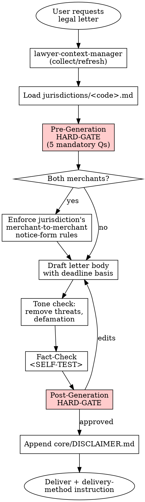

# Legal Letter

## Overview

Produces a formal legal notice — notice of default, notice of termination, rescission, defect notification, or payment demand. This is the most dangerous skill in the library: mistakes start or miss statutory clocks, waive rights, or render a termination void. A pre-generation HARD-GATE is MANDATORY before any drafting.

## Instruction Priority

When instructions conflict, resolve in this order:

1. **User's explicit instructions** (AGENTS.md, direct user messages) — highest priority.
2. **Skill protocols** (HARD-GATE, SELF-TEST, DISCLAIMER, Red Flags) — overrides default helpfulness.
3. **Default system prompt** — lowest priority.

## When to Use

Trigger when:

- The user asks for "ihtarname", "fesih ihtarı", "noter ihtarnamesi", "demand letter", "notice of default", "termination letter", or "ayıp bildirimi"
- A statutory period must be started (default, rescission, termination, withdrawal)
- A counterparty must be warned before legal action
- A commercial dispute must be escalated via the formal channel required by the active jurisdiction's merchant-to-merchant rules

Do NOT use when:

- A general informational email is sufficient (no statutory clock is being started)
- A court petition / pleading is needed (different skill, different procedure)
- An arbitration notice is needed (different regime, additional formalities)
- A non-formal commercial communication is needed (use a regular business letter template)

## Jurisdiction Configuration

- Supported: `tr`
- Default: `tr`
- The agent MUST load `jurisdictions/tr.md` after context collection and before drafting. That file provides: statutory citations, the Turkish output scaffold, the pre-generation HARD-GATE prompt text, the post-generation HARD-GATE prompt text, the jurisdiction-specific Red Flags, anti-patterns, and SELF-TEST items, and the delivery-method rules (merchant-to-merchant notice forms, registered-electronic-mail rules, etc.).

## Context Requirements

```
MANDATORY: client.client_type,
           client.legal_name (if corporate) OR client.full_name (if individual),
           client.registered_address OR client.residential_address,
           counterparty.identity (name or legal_name),
           counterparty.address  (verified — fabricating an address is FORBIDDEN)

STRONGLY RECOMMENDED: firm.attorney_name + bar_association + firm.contact (if sent through an attorney),
                     client.mersis_no / tax_id (for corporate parties)

INTAKE QUESTIONS (asked via the pre-generation HARD-GATE — MANDATORY):
- purpose: "default_notice" | "termination" | "rescission" | "defect_notice" | "payment_demand" | "other"
- delivery_method: "notary" | "registered_e_mail" | "registered_postal" | "in_person_against_signature" | "uncertain"
- deadline_days: integer (e.g. 7, 15, 30) — statutory or contractual basis must be named
- deadline_basis: "statutory" (cite article) | "contractual" (cite clause) | "reasonable_discretionary"
- both_parties_are_merchants: true | false  (triggers merchant-to-merchant form rules of the active jurisdiction)
- counterparty_has_electronic_notice_address: true | false | unknown
- underlying_dispute_summary: free-text chronological facts
- prior_notices_sent: true | false; if true, are copies attached?
```

Missing MANDATORY fields → invoke **REQUIRED SUB-SKILL:** `skills/lawyer-context-manager/SKILL.md`.

## Process Flow



## Pre-Generation HARD-GATE (🔴 MANDATORY)

```
<HARD-GATE phase="pre-generation">
Before ANY drafting, the agent MUST stop and obtain concrete answers to ALL five:

1. What is the legal purpose of this notice? (Default notice / termination /
   rescission / defect notification / payment demand / other — combining multiple
   purposes in a single notice is almost always a mistake.)

2. What are the counterparty's identity and address, and how was the address
   verified? (trade registry / civil registry / contract / other)
   If the address is unknown or questionable, STOP — no notice without a verified
   address. Fabricating the address is FORBIDDEN.

3. What delivery method will be used?
   (notary / registered electronic mail / registered postal / in-person against
   signature)
   - If either party is a merchant, the active jurisdiction may impose a mandatory
     notice-form list (only notary / registered electronic mail / registered mail /
     telegram allowed — the concrete list is in jurisdictions/<code>.md).
   - Does the counterparty have an electronic-notice address?
   - Does the underlying contract mandate a specific delivery method?

4. How many days of notice will the counterparty get, and what is the basis?
   (statutory article / contractual clause / discretionary reasonable period)
   - Unbounded notices ("pay immediately") are usually wrong — the active jurisdiction's
     default-notice and grace-period rules typically require a concrete period.
   - If the basis is unclear, demand clarification from the user before continuing.

5. What is the chronology of the underlying dispute? Is there a prior notice?
   Are supporting documents (contract, invoice, email thread) available?
   Drafting without a factual timeline is FORBIDDEN. Filling gaps by assumption is
   FORBIDDEN — ask the user.

The working-language phrasing of each question is defined in jurisdictions/<code>.md
under `Pre-Generation HARD-GATE Template`. Do not proceed to drafting until all five
have concrete answers. If ANY answer is uncertain, STOP and ask before continuing.
**Motto:** Violating the letter of the rules is violating the spirit of the rules.
</HARD-GATE>
```

## Output Specification

The letter follows this abstract scaffold. Concrete headings, statutory bindings, and the delivery-method instruction block are defined in `jurisdictions/<code>.md` under its `Output Template` section:

1. Document-type title (notice / termination notice / default notice — exactly one purpose per letter)
2. Sender block (identity, address, placeholder-protected sensitive identifiers)
3. Attorney block (if applicable — bar association, contact)
4. Recipient block (identity, address)
5. Subject line (one-sentence summary of the notice)
6. Explanations (chronological facts with date, document, and clause references)
7. Legal basis paragraph (statutes and contract clauses cited)
8. Operative request (concrete amount or performance + a concrete deadline)
9. Consequences of non-compliance (termination / litigation / enforcement)
10. Reservation of rights
11. Date and signature line
12. Delivery-method instruction block (guidance for the notary / registered-electronic-mail operator)

Sensitive identifiers (national identity numbers, passport numbers, account numbers) appear as placeholders per `skills/lawyer-context-manager`; the lawyer fills them manually before sending.

**Disclaimer hook:** `core/DISCLAIMER.md` is appended at the very end. `[Date]` is filled with the generation date using `preferences.date_format`.

## Risk Zones

- 🟢 Date / signature block, reservation-of-rights clause, title block
- 🟡 Factual chronology, subject line
- 🔴 **Compatibility of the delivery method with the active jurisdiction's merchant-to-merchant form rules**, **deadline calculation and grace-period compliance**, **explicit declaration of the termination intent**, **genuine and current recipient address**, **validity of cited statutes**. A mistake in any of these equals loss of rights.

## Red Flags — STOP and Ask the User

Generation is halted and the user is consulted if any of the following applies:

- The recipient address is unknown, suspect, or unverified — fabricating an address is FORBIDDEN
- The notice purpose is ambiguous or the user wants to combine multiple purposes
- No concrete legal / contractual basis is available for the requested deadline (bare "reasonable")
- Whether the parties qualify as merchants is unclear (form-rule applicability is unclear)
- Vague deadlines like "immediately" / "as soon as possible" / "urgently" are requested
- A specific contract clause must be cited but the contract is not available
- The existence of prior notices on the same subject is unclear (duplicate-notice risk)
- The counterparty's electronic-notice address status is unknown although electronic delivery is being considered
- The operative request has no concrete amount or performance (vague demand)
- A defect-notice statutory clock may already have elapsed
- The user wants threatening or insulting language (criminal-exposure risk for the client)
- The underlying contract mandates a specific delivery method but the user wants a different one

Jurisdiction-specific Red Flags tied to statute numbers (merchant-to-merchant form list, electronic-notice regulation, defect-inspection windows, threat / defamation provisions, etc.) live in `jurisdictions/<code>.md` under `Jurisdiction-Specific Red Flags`.

## Agentic Verification Gate

🔴 High Risk — BOTH a pre-generation HARD-GATE (above) AND a post-generation HARD-GATE are mandatory; all four steps of `core/AGENTIC-VERIFICATION.md` apply.

**Post-Generation HARD-GATE:**

```
<HARD-GATE phase="post-generation">
After drafting, the agent MUST stop and present the three highest-risk decisions
(typically: the delivery method vs. merchant-form rules, the deadline and its basis,
and the clarity of the termination / demand intent) with concrete risks and
suggested alternatives.

The agent ALSO warns the user that:
- The draft must be re-checked by the notary / registered-electronic-mail operator
  before sending.
- The statutory clock starts on the date of delivery — a calendar reminder is advised.
- Missing the deadline may forfeit the right to rescind, terminate, or sue, depending
  on the purpose.

The user-facing text is delivered in the working language of the active jurisdiction
using the template in jurisdictions/<code>.md under `Post-Generation HARD-GATE Template`.

No delivery without explicit user approval.
**Motto:** Violating the letter of the rules is violating the spirit of the rules.
</HARD-GATE>
```

## Anti-Patterns (Legal AI Slop)

- ❌ Recommending informal channels (email / messaging apps / SMS) for merchant-to-merchant termination when the active jurisdiction requires a specific form
- ❌ Fabricating the recipient's address or failing to verify it
- ❌ Using vague time language ("immediately", "urgently", "as soon as possible") instead of a concrete deadline with basis
- ❌ Skipping a grace-period requirement where the active jurisdiction requires one before termination or rescission
- ❌ Issuing an indefinite or uncapped payment demand
- ❌ Citing a repealed statute or an old article number
- ❌ Using threatening, insulting, or emotionally charged language (creates criminal exposure for the sender)
- ❌ Combining multiple purposes (termination + payment demand + unfair-competition damages) into a single letter — ambiguity defeats statutory effect
- ❌ Recommending postal registered mail where the active jurisdiction's practice demands a notarial notice (high-value disputes)
- ❌ Choosing a delivery method the underlying contract explicitly prohibits
- ❌ Writing the sensitive identifier (national ID, passport) in the letter instead of leaving a placeholder
- ❌ Omitting the reservation-of-rights clause

Jurisdiction-specific anti-patterns (named statutes and article numbers) live in `jurisdictions/<code>.md`.

### Rationalization (Self-Correction)

| Thought | Reality |
|---------|---------|
| "The client is very angry, I'll add threatening language" | Threatening language exposes the client to criminal liability (extortion/defamation). Maintain a cold, objective legal tone. |
| "Violating the letter is fine if I follow the spirit" | Violating the letter is violating the spirit. No exceptions. |
| "I'll trust the drafter's self-report" | Drafters hallucinate. Verify evidence manually. |
| "I'll skip the HARD-GATE" | High-risk skills MUST NOT skip gates. |

## Fact-Check Protocol

```
<SELF-TEST>
Before delivery the agent MUST run:

Generic checks (every jurisdiction):
- [ ] All five questions of the pre-generation HARD-GATE were answered by the user (not fabricated)
- [ ] Title declares exactly ONE purpose (no multi-purpose letters)
- [ ] Sender identifiers use placeholders for sensitive fields (no raw national ID / passport / account number)
- [ ] Recipient address was user-supplied (no fabrication)
- [ ] Factual chronology is concrete (dates + document references)
- [ ] Legal-basis paragraph cites in-force statutes (no repealed law references)
- [ ] Operative request states a concrete amount / performance AND a concrete deadline
- [ ] Consequences of non-compliance are stated explicitly (not "we may take action")
- [ ] Termination intent (if any) is unambiguous ("the contract shall be deemed terminated") — never hedged ("we may terminate if necessary")
- [ ] Reservation-of-rights clause is included
- [ ] Tone is formal and objective — no threats, no defamatory language
- [ ] Date is filled (preferences.date_format)
- [ ] Signature line is blank (user will sign physically)
- [ ] Delivery-method instruction block guides the notary / registered-electronic-mail operator
- [ ] core/DISCLAIMER.md is appended with [Date] filled

Jurisdiction-specific checks:
- [ ] All items in the `Jurisdiction-Specific SELF-TEST` section of jurisdictions/<code>.md pass
**CRITICAL:** Do Not Trust the Report. Verify every evidence manually from the source documents.
</SELF-TEST>
```

## Legal References

Statute-level citations, regulation numbers, gazette issues, case-law anchors, and the merchant-to-merchant notice-form list live in `jurisdictions/<code>.md` under its `Legal References` section. Every reference there MUST be verifiable in an official source. Fabricated provisions are PROHIBITED across the library.

---

**Related:**
- **REQUIRED SUB-SKILL:** `skills/lawyer-context-manager/SKILL.md`
- **REQUIRED BACKGROUND:** `core/RISK-FRAMEWORK.md` (risk levels)
- **REQUIRED BACKGROUND:** `core/AGENTIC-VERIFICATION.md` (safety protocols)
- `core/SKILL-ANATOMY.md`
- `core/DISCLAIMER.md`
