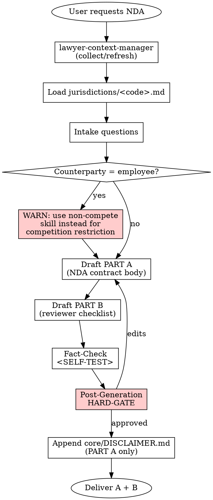

# NDA Generator

## Overview

Produces a two-part output: (A) a Non-Disclosure Agreement draft tailored as one-way or mutual, and (B) a reviewing lawyer's checklist that exposes the decisions embedded in the draft. The skill enforces proportionality on penalty clauses, separates contract term from survival period, and refuses to conflate confidentiality with a non-compete.

## Instruction Priority

When instructions conflict, resolve in this order:

1. **User's explicit instructions** (AGENTS.md, direct user messages) — highest priority.
2. **Skill protocols** (HARD-GATE, SELF-TEST, DISCLAIMER, Red Flags) — overrides default helpfulness.
3. **Default system prompt** — lowest priority.

## When to Use

Trigger when:

- The user asks for an "NDA", "Gizlilik Sözleşmesi", "Confidentiality Agreement", or "sır saklama sözleşmesi"
- Pre-transaction information exchange is planned (M&A due diligence, partnership talks, pitch deck sharing, RFP response)
- A commercial negotiation requires protection before sharing proposals or data
- A consultant / contractor needs to sign a confidentiality undertaking

Do NOT use when:

- The user wants a **non-compete** clause — that is a different regime in the active jurisdiction (different skill)
- The user wants a personal-data consent notice — different document
- The user wants a full commercial contract with confidentiality as one section — draft the full contract and embed confidentiality instead
- The user wants a Data Processing Agreement between controller and processor — different contract

## Jurisdiction Configuration

- Supported: `tr`
- Default: `tr`
- The agent MUST load `jurisdictions/tr.md` after context collection and before drafting. That file provides: statutory citations, the Turkish output scaffold (PART A draft + PART B checklist), the post-generation HARD-GATE prompt text, the jurisdiction-specific anti-patterns, and the SELF-TEST items.

## Context Requirements

```
MANDATORY: client.client_type,
           client.legal_name (if corporate) OR client.full_name (if individual),
           client.registered_address OR client.residential_address,
           preferences.default_court,
           preferences.default_governing_law

STRONGLY RECOMMENDED: counterparty.legal_name, counterparty.address
                     (an NDA needs two identified parties)

OPTIONAL: firm.attorney_name, client.authorized_signatory

INTAKE QUESTIONS (asked during skill run):
- one_way_or_mutual: "one-way" | "mutual"
- disclosing_party: "client" | "counterparty" | "both" (if mutual)
- purpose: free-text description of the exchange purpose
- contract_term_months: integer (default 12)
- survival_period_years: integer (default 3; "indefinite" only for trade secrets)
- penalty_clause: boolean + amount in the agreed currency if yes
- arbitration_or_court: "court" | "arbitration"
- counterparty_is_employee: boolean (triggers a non-compete-overlap warning)
```

Missing MANDATORY fields → invoke **REQUIRED SUB-SKILL:** `skills/lawyer-context-manager/SKILL.md`.

## Process Flow



## Output Specification

Two parts are delivered together. PART A is the contract body; PART B is an advisory reviewer's checklist that is NOT part of the contract. Concrete section labels, working-language wording, conditional clauses (penalty-clause text, arbitration-vs-court branch), and the signature-block format come from `jurisdictions/<code>.md` under its `Output Template` section.

### PART A — Contract Body (abstract structure)

1. Parties (identified with name, address, signing representative; mutual if both disclose)
2. Purpose (the specific project / negotiation — narrowly defined)
3. Definitions (confidential information: broad definition + example list + representatives)
4. Exclusions (the five standard exceptions — publicly available, independent development, third-party receipt, legal compulsion, prior consent)
5. Obligations of the parties (duty of care, need-to-know limitation, flow-down to representatives, notice before compelled disclosure)
6. Term and survival (contract term vs. post-termination survival — two DIFFERENT durations)
7. Return or destruction of materials
8. Intellectual property (NDA does NOT grant any licence, title, or right of use)
9. Penalty and damages (only if `penalty_clause == true`; must acknowledge the jurisdiction's judicial-reduction power if any)
10. Governing law
11. Dispute resolution (court XOR arbitration — never both; arbitration branch must satisfy the written-form requirement of the active jurisdiction)
12. Notices (method per the active jurisdiction's merchant-to-merchant rules if applicable)
13. Entire agreement and amendment (signed writing required)
14. Signature block

### PART B — Reviewer's Checklist

A bullet list that mirrors every decision in PART A and explains what a human lawyer must verify. The concrete list is in `jurisdictions/<code>.md`.

**Disclaimer hook:** `core/DISCLAIMER.md` is appended at the end of PART A ONLY (PART B is an advisory note, not a contract). `[Date]` is filled with the generation date using `preferences.date_format`.

## Risk Zones

- 🟢 Party identities, purpose, exclusions, return procedure (standard structure)
- 🟡 Definition of confidential information, representative chain, survival period, notice form
- 🔴 Penalty-clause amount (proportionality + jurisdictional judicial-reduction risk), one-way vs. mutual choice (wrong choice leaves the client exposed), overlap with non-compete regime, arbitration-clause form requirements

## Agentic Verification Gate

🟡 Medium Risk — all four steps of `core/AGENTIC-VERIFICATION.md` mandatory.

**Post-Generation HARD-GATE:**

```
<HARD-GATE phase="post-generation">
After producing PART A + PART B, the agent MUST stop and present the three highest-risk
decisions in the document (typically: penalty-clause amount, survival period, and the
one-way-vs-mutual choice) with concrete risks and suggested alternatives.

The agent ALSO asks the user to confirm they will walk through PART B before sending
PART A to the counterparty.

The user-facing text is delivered in the working language of the active jurisdiction
using the template defined in jurisdictions/<code>.md under
`Post-Generation HARD-GATE Template`.

No delivery without user approval / edits.
**Motto:** Violating the letter of the rules is violating the spirit of the rules.
</HARD-GATE>
```

## Anti-Patterns (Legal AI Slop)

- ❌ Providing a one-way template when the situation requires mutual protection (or vice versa)
- ❌ Defining "Confidential Information" so broadly that it invalidates the contract on mandatory-law grounds
- ❌ Collapsing contract term and survival period into a single duration (creates a coverage gap)
- ❌ Conflating confidentiality with non-compete (different regime, different validity tests)
- ❌ Writing "judicial reduction is waived" or equivalent when the active jurisdiction makes judicial reduction mandatory
- ❌ Including a penalty clause WITHOUT the companion "damages exceeding the penalty are reserved" language (penalties would then cap damages)
- ❌ Drafting an NDA for an employee-counterparty without the duty-of-loyalty / non-compete-interplay warning
- ❌ Declaring an arbitration clause enforceable without confirming the written-form requirement of the active jurisdiction
- ❌ Omitting the "no IP licence is granted" clause (the receiving party may later argue implied licence)
- ❌ Skipping the data-protection flag when the disclosure includes personal data (a separate transparency notice / consent / DPA may be required)

Jurisdiction-specific anti-patterns (named statutes and article numbers) live in `jurisdictions/<code>.md`.

### Rationalization (Self-Correction)

| Thought | Reality |
|---------|---------|
| "The user is rushed, I'll just give them a standard mutual NDA" | Giving a mutual NDA when only one party discloses exposes the client to unnecessary risk. Verify the scenario. |
| "Violating the letter is fine if I follow the spirit" | Violating the letter is violating the spirit. No exceptions. |
| "I'll trust my own draft" | AI drafts hallucinate. Verify evidence from source documents manually. |
| "The subagent said it's complete" | Do Not Trust the Report. Verify manually. |

## Fact-Check Protocol

```
<SELF-TEST>
Before delivery the agent MUST run:

Generic checks (every jurisdiction):
- [ ] One-way vs. mutual matches the user's stated scenario
- [ ] Definition of confidential information has general formulation + example list + exclusions
- [ ] Five standard exclusions are complete (public / independently developed / third-party / compelled / consent)
- [ ] Purpose clause is narrow (specific project / negotiation, not open-ended)
- [ ] Flow-down to representatives is conditional on need-to-know + equivalent obligations
- [ ] Contract term AND survival period are stated separately, each as a concrete duration
- [ ] Penalty clause, if present, names a concrete amount AND preserves damages exceeding the penalty
- [ ] No-IP-licence clause is present
- [ ] If counterparty is an employee: the non-compete overlap warning was issued
- [ ] Dispute resolution is court XOR arbitration (never both); arbitration branch meets the jurisdiction's written-form rule
- [ ] If personal data is involved: data-protection flag issued to the user
- [ ] Signature block matches authorized_signatory from context
- [ ] PART B is clearly marked as NOT part of the contract
- [ ] core/DISCLAIMER.md is appended to PART A ONLY with [Date] filled

Jurisdiction-specific checks:
- [ ] All items in the `Jurisdiction-Specific SELF-TEST` section of jurisdictions/<code>.md pass
**CRITICAL:** Do Not Trust the Report. Verify every evidence manually from the source documents.
</SELF-TEST>
```

## Legal References

Statute-level citations, regulation numbers, gazette issues, and case-law anchors live in `jurisdictions/<code>.md` under its `Legal References` section. Fabricated provisions are PROHIBITED across the library.

---

**Related:**
- **REQUIRED SUB-SKILL:** `skills/lawyer-context-manager/SKILL.md`
- **REQUIRED BACKGROUND:** `core/RISK-FRAMEWORK.md` (risk levels)
- **REQUIRED BACKGROUND:** `core/AGENTIC-VERIFICATION.md` (safety protocols)
- `core/SKILL-ANATOMY.md`
- `core/DISCLAIMER.md`
