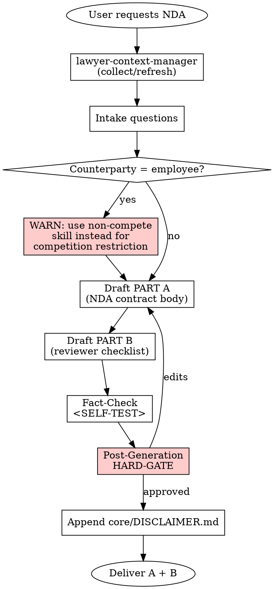

# NDA Generator (Gizlilik Sözleşmesi)

## Overview

Produces a two-part output: (A) a Gizlilik Sözleşmesi (NDA) draft tailored as one-way or mutual, and (B) a reviewing lawyer's checklist that exposes the decisions embedded in the draft. The skill enforces the TBK m.179-182 orantılılık rule on penalty clauses, separates contract term from survival period, and refuses to conflate confidentiality with a non-compete (TBK m.444-447).

## When to Use

Trigger when:

- The user asks for an "NDA", "Gizlilik Sözleşmesi", "Confidentiality Agreement", "sır saklama sözleşmesi"
- Pre-transaction information exchange is planned (M&A due diligence, partnership talks, pitch deck sharing, RFP response)
- A commercial negotiation requires protection before sharing proposals or data
- A consultant / contractor needs to sign a confidentiality undertaking

Do NOT use when:

- The user wants a **non-compete (rekabet yasağı)** clause — that is TBK m.444-447, different regime
- The user wants **Aydınlatma Metni / Rıza Beyanı** for KVKK consent — different document
- The user wants a full **commercial contract** with confidentiality as one section (write the full contract instead and embed)
- The user wants a **Data Processing Agreement (DPA)** between controller and processor — different contract

## Jurisdiction Configuration

- Default: `tr`
- Supported: `tr`
- Jurisdiction file: `skills/nda-generator/jurisdictions/tr.md`

## Context Requirements

```
MANDATORY: client.client_type,
           client.legal_name (if corporate) OR client.full_name (if individual),
           client.registered_address OR client.residential_address,
           preferences.default_court,
           preferences.default_governing_law

STRONGLY RECOMMENDED: counterparty.legal_name, counterparty.address
                     (NDA needs two identified parties)

OPTIONAL: firm.attorney_name, client.authorized_signatory

INTAKE QUESTIONS (asked during skill run):
- one_way_or_mutual: "one-way" | "mutual"
- disclosing_party: "client" | "counterparty" | "both" (if mutual)
- purpose: free-text description of the exchange purpose
- contract_term_months: integer (default 12)
- survival_period_years: integer (default 3; "indefinite" only for trade secrets)
- penalty_clause: boolean + amount in TRY if yes
- arbitration_or_court: "court" | "arbitration"
- counterparty_is_employee: boolean (triggers additional TBK m.444-447 check)
```

Missing MANDATORY fields → invoke **REQUIRED SUB-SKILL:** `skills/lawyer-context-manager/SKILL.md`.

## Process Flow



## Output Specification

Output language: Turkish. Two parts delivered together; disclaimer appears at the end of PART A's contract body (the output document itself), PART B is an advisory attachment.

```
BÖLÜM A: GİZLİLİK SÖZLEŞMESİ

[Başlık: Gizlilik Sözleşmesi — Tek Taraflı / Karşılıklı (seçime göre)]

1. TARAFLAR
   - Açıklayan Taraf: [legal_name veya full_name], adres, temsilci
   - Alan Taraf: [counterparty.legal_name veya full_name], adres, temsilci
   (Karşılıklı ise her iki taraf da her iki rolde)

2. AMAÇ
   - Sözleşmenin amacı (belirli proje / görüşme)

3. TANIMLAR
   - Gizli Bilgi: geniş tanım + örnek liste
   - Alan Taraf / Açıklayan Taraf
   - Temsilci: alt danışman, avukat, çalışan kategorisi

4. GİZLİ BİLGİ SAYILMAYAN HÂLLER
   (Beş standart istisna — jurisdictions/tr.md)

5. TARAFLARIN YÜKÜMLÜLÜKLERİ
   - Gizliliği koruma standardı (en az kendi benzer nitelikteki
     bilgilerine gösterdiği özen, her hâlükârda makul özen)
   - Sadece Amaç için kullanma
   - Temsilcilere aktarımın şartları (need-to-know + aynı gizlilik
     yükümlülüğüne tabi)
   - Adli/idari merci kararı ile ifşa halinde önceden bildirim

6. SÖZLEŞMENİN SÜRESİ VE SONRASI YÜKÜMLÜLÜK
   - Sözleşme süresi: [contract_term_months] ay
   - Gizlilik yükümlülüğü süresi: [survival_period_years] yıl
     (ticari sırlar için: TTK m.54 vd. kapsamında devam eder)

7. BİLGİLERİN İADE VEYA İMHASI
   - Açıklayan Taraf'ın yazılı talebi üzerine / sözleşme sonunda
   - [N] gün içinde iade veya imha + imha tutanağı

8. FİKRİ MÜLKİYET
   - Sözleşme, Gizli Bilgi üzerinde hiçbir mülkiyet, lisans veya
     kullanım hakkı tahsis etmez

9. CEZAİ ŞART VE TAZMİNAT  (penalty_clause == true ise)
   - Her ihlal için [amount] TL cezai şart
   - Cezai şartı aşan zararın tazmini hakkı saklıdır (ayrı fıkra)
   - TBK m.182/3'e atfen: "Hakim indirim yetkisi saklıdır" (maddi
     doğruluk; bertaraf edilemez)

10. UYGULANACAK HUKUK
    - Türk Hukuku (TBK, TTK)

11. UYUŞMAZLIK ÇÖZÜMÜ
    - [Yetkili Mahkeme: preferences.default_court]
      VEYA
    - Tahkim (HMK m.412 / MTK) — yazılı şekil sağlanmış olmalı
    - (Ticari davalarda 7155 s.K. dava şartı arabuluculuk notu)

12. TEBLİGAT
    - TTK m.18/3 tacirler arası ise: noter, KEP veya iadeli
      taahhütlü posta

13. TAM ANLAŞMA VE DEĞİŞİKLİK
    - Yazılı + imzalı değişiklik zorunlu

14. İMZA BLOĞU
    - Tarih, yer, taraf imzaları, tanık/temsilci

---
[DISCLAIMER hook: Append core/DISCLAIMER.md here verbatim]


BÖLÜM B: HUKUKÇU KONTROL LİSTESİ
(Bu bölüm sözleşme metninin PARÇASI değildir — inceleme notudur.
Sözleşmeyi karşı tarafa sunmadan önce hukukçu kontrolünden geçirin.)

- [ ] Tek taraflı / karşılıklı seçimi müvekkilin gerçek ihtiyacına
      uygun mu? (tek taraflıysa: sadece açıklayan taraf lehine mi?)
- [ ] Gizli bilgi tanımı ne çok dar ne çok geniş; örnek listesi
      müvekkilin iş konusuna uygun mu?
- [ ] Beş standart istisna eksiksiz mi? (kamuya açık, bağımsız
      geliştirme, üçüncü taraftan alma, zorunlu ifşa, rıza)
- [ ] Amaç maddesi belirsiz değil mi? Alan Taraf bunu kullanım
      yetkisi olarak yorumlayabilir mi?
- [ ] Temsilci (avukat, alt danışman) zinciri geri kapanma
      (flow-down) ile kontrol altında mı?
- [ ] Sözleşme süresi ile survival süresi AYRI tanımlı mı?
- [ ] Survival süresi yeterince uzun mu? (ticari sır niteliğinde
      bilgiler için süresiz / uzun süreli düşünüldü mü?)
- [ ] Bilgilerin iade/imha süresi uygulanabilir mi? (e-posta
      arşivi, yedekler için istisna / en iyi çaba)
- [ ] Cezai şart tutarı orantılı mı? Fahiş sayılma riski
      değerlendirildi mi? (TBK m.182/3)
- [ ] "Cezai şartı aşan zarar saklıdır" ibaresi VAR mı?
- [ ] Fikri mülkiyet tahsis etmeme ibaresi VAR mı?
- [ ] Karşı taraf çalışansa: rekabet yasağı (TBK m.444-447) ile
      karışmadığı kontrol edildi mi?
- [ ] Uyuşmazlık çözümü tutarlı mı? (hem mahkeme hem tahkim YAZILMADI)
- [ ] Tahkim varsa HMK m.412 yazılı şekil sağlandı mı?
- [ ] Tebligat usulü (TTK m.18/3 tacirler arası) net mi?
- [ ] KVKK kapsamında kişisel veri ifşası olacaksa ayrı aydınlatma
      / rıza / DPA gereksinimi değerlendirildi mi?
- [ ] İmza bloğundaki yetkili temsilci unvanı imza sirküleri ile
      uyumlu mu?
```

**Disclaimer hook:** `core/DISCLAIMER.md` sadece PART A'nın sonuna eklenir. PART B (checklist) disclaimer almaz — o bir inceleme notudur, sözleşme değildir. `[Date]` → belge üretim tarihi (GG.AA.YYYY).

## Risk Zones

- 🟢 Taraf kimlikleri, amaç, istisnalar, iade prosedürü (standart yapı)
- 🟡 Gizli bilgi tanımı, temsilci zinciri, survival süresi, tebligat usulü
- 🔴 Cezai şart tutarı (fahişlik + TBK m.182/3 indirim riski), tek taraflı vs. karşılıklı seçimi (yanlış seçim müvekkili korumasız bırakır), rekabet yasağı karışması (TBK m.444-447), tahkim şartının şekli (HMK m.412)

## Agentic Verification Gate

🟡 Medium Risk — all four steps of `core/AGENTIC-VERIFICATION.md` mandatory.

**Post-Generation HARD-GATE:**

```
<HARD-GATE phase="post-generation">
After producing PART A + PART B, agent MUST stop and present:

"Bu NDA'da aşağıdaki maddeler en yüksek riskli kısımlardır:

1. [Cezai Şart (Md. 9)] — Risk: Tutar [amount] TL; TBK m.182/3
   uyarınca hakim indirim yetkisi vardır, fahişse indirilebilir.
   Ayrıca 'cezai şartı aşan zarar saklıdır' ibaresi eklendi —
   bu koruma mı yeterli, yoksa cezai şart + tazminat birlikte
   mi tercih edilsin?
   💡 Alternatif: ifa + ceza (m.179/2) formülü

2. [Survival Süresi (Md. 6)] — Risk: [survival_period_years] yıl
   ticari sırlar için yetersiz olabilir. Ticari sır TTK m.54 vd.
   ile süresiz korunur ancak sözleşmesel süre darsa kanıt yükü
   zorlaşır.
   💡 Alternatif: 'Ticari sır niteliğindeki bilgiler süresiz
   gizlidir' ibaresi

3. [Tek Taraflı / Karşılıklı Seçim] — Risk: [mevcut seçim]; eğer
   müvekkil hem açıklayacak hem alacaksa karşılıklı olmalı; aksi
   halde müvekkilin açıkladığı bilgiler korunur ama aldığı
   bilgiler için kendi yükümlülüğü belirsiz kalır.
   💡 Alternatif: [seçimin tersine dönüştürülmesi]

Ayrıca BÖLÜM B kontrol listesindeki maddeleri ayrı ayrı teyit
etmenizi öneririm. Hangi maddeyi detaylandırayım?"

No delivery without user approval / edits.
</HARD-GATE>
```

## Anti-Patterns (Legal AI Slop)

- ❌ Karşılıklı olması gereken durumda tek taraflı şablon vermek
- ❌ Gizli bilgi tanımını sözleşmenin geçerliliğini tartışmalı hale getirecek kadar geniş tutmak (TBK m.27 hükümsüzlük riski)
- ❌ Sözleşme süresi ile survival süresini birleştirmek (koruma boşluğu)
- ❌ Rekabet yasağı ile gizliliği karıştırmak (TBK m.444-447 çerçevesi gerekir)
- ❌ "Hakim indirim yapamaz" veya benzeri TBK m.182/3'ü bertaraf eden madde
- ❌ Cezai şart varken "cezai şartı aşan zarar saklıdır" ibaresini unutmak (cezai şart zararı sınırlar)
- ❌ Çalışan olan karşı taraf için NDA yazarken 4857 s.K. + TBK m.396 sadakat borcu çerçevesini görmezden gelmek
- ❌ Tahkim şartında HMK m.412 yazılı şekli kontrol etmeden geçerlilik varsaymak
- ❌ Fikri mülkiyet lisansı vermeme ibaresinin eksik bırakılması (alan taraf ima lisans iddiası geliştirebilir)
- ❌ KVKK trigger'ı olan ifşalarda (kişisel veri paylaşımı) ayrı aydınlatma / rıza / DPA ihtiyacını atlamak

## Fact-Check Protocol

```
<SELF-TEST>
Before delivery the agent MUST confirm:

- [ ] Tek taraflı / karşılıklı format kullanıcı tercihiyle uyumlu
- [ ] Gizli bilgi tanımı genel + örnek + istisnalar içeriyor
- [ ] Beş standart istisna eksiksiz
- [ ] Amaç maddesi belirli bir proje / görüşme için
- [ ] Temsilci aktarımında need-to-know + flow-down
- [ ] Sözleşme süresi VE survival süresi ayrı, sayısal
- [ ] Cezai şart varsa: tutar belirli + "m.182/3 hakim indirimi saklı" bilinciyle yazılmış + "cezai şartı aşan zarar saklıdır" ibaresi eklenmiş
- [ ] Fikri mülkiyet lisansı vermeme ibaresi var
- [ ] Karşı taraf çalışansa: kullanıcıya non-compete uyarısı verildi (yine NDA üretilse dahi)
- [ ] Uyuşmazlık çözümü: mahkeme VEYA tahkim (ikisi birden değil); tahkim ise HMK m.412 yazılı şekil var
- [ ] Tacirler arası ise tebligat TTK m.18/3 formatında
- [ ] KVKK check: kişisel veri ifşa söz konusuysa kullanıcıya ayrı aydınlatma/rıza gereksinimi hatırlatıldı
- [ ] İmza bloğu yetkililerle uyumlu (authorized_signatory)
- [ ] BÖLÜM A'nın sonuna core/DISCLAIMER.md eklendi, [Date] dolduruldu
- [ ] BÖLÜM B (kontrol listesi) sözleşmenin parçası değil, ayrı ve belirgin
</SELF-TEST>
```

## Legal References

- **6098 sayılı TBK** — RG 04.02.2011, Sayı 27836
  - m.179-182 (cezai şart, m.182/3 hakim indirimi)
  - m.396 (işçinin sadakat borcu, taraf çalışansa)
  - m.444-447 (rekabet yasağı — karışmaması gereken kurum)
- **6102 sayılı TTK** — RG 14.02.2011, Sayı 27846
  - m.18/3 (tacirler arası tebligat şekli)
  - m.54-63 (haksız rekabet — ticari sır koruması)
- **4857 sayılı İş Kanunu** — m.25/II-e (sadakate aykırılık)
- **6100 sayılı HMK** — m.412 (tahkim şartı yazılı şekil)
- **4686 sayılı MTK** (Milletlerarası Tahkim Kanunu) — uluslararası tarafla NDA
- **7155 sayılı Kanun** — ticari davalarda dava şartı arabuluculuk (01.01.2019)
- **6698 sayılı KVKK** — kişisel veri ifşasında çapraz referans

All verifiable on [mevzuat.gov.tr](https://mevzuat.gov.tr). Fabricated articles PROHIBITED.

---

**Related:**
- `core/SKILL-ANATOMY.md`
- `core/RISK-FRAMEWORK.md` — 🟡 Medium Risk
- `core/AGENTIC-VERIFICATION.md`
- `core/DISCLAIMER.md`
- **REQUIRED SUB-SKILL:** `skills/lawyer-context-manager/SKILL.md`
