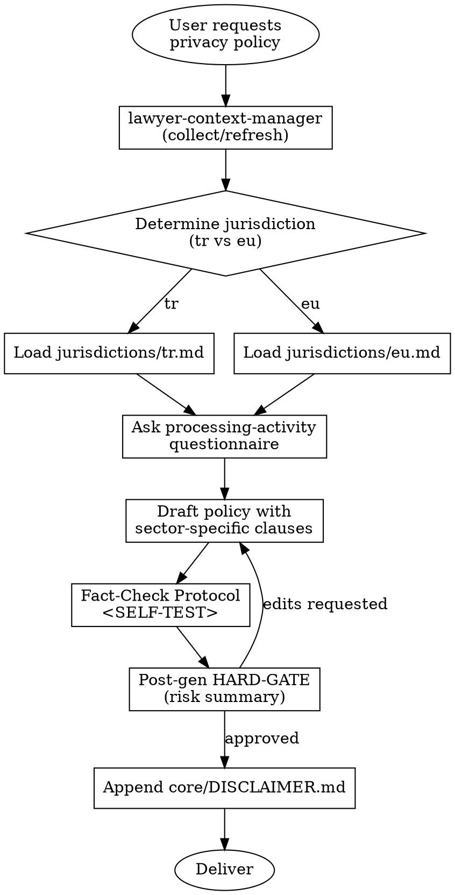

# Privacy Policy

## Overview

Generates a full-length Privacy / Personal Data Protection Policy for Turkish (KVKK) or European Union (GDPR) jurisdictions. The skill binds the document to the client's sector and processing activities so that clauses are concrete, not generic "privacy theater."

## When to Use

Trigger this skill when:

- The user asks for a "privacy policy", "gizlilik politikası", "kişisel verilerin korunması politikası", "aydınlatma metni + politika", or similar
- A website / mobile app / SaaS product needs a data-protection document
- KVKK or GDPR compliance documentation is requested
- An existing policy must be regenerated because the processing activity set has changed

Do NOT use when:

- A **cookie policy** is requested (separate document — cookies are governed by e-Privacy / KVKK m.10 aydınlatma, not the full policy)
- A one-page **aydınlatma metni** (Art. 10 KVKK notice) is requested (that is a lighter document, different template)
- The user wants a Data Processing Agreement (DPA) between controller and processor (different contract)

## Jurisdiction Configuration

- Default: `tr` (KVKK) when `preferences.default_governing_law == "Türk Hukuku"` (default)
- Supported: `tr`, `eu`
- Jurisdiction file loading:
  - TR → `skills/privacy-policy/jurisdictions/tr.md`
  - EU → `skills/privacy-policy/jurisdictions/eu.md`
- If the client operates in BOTH TR and EU markets, the agent MUST ask the user which legal regime is primary before generation. Mixing KVKK and GDPR in a single document is an anti-pattern (see below).

## Context Requirements

```
MANDATORY: client.client_type,
           client.legal_name (if corporate) OR client.full_name (if individual),
           client.registered_address (if corporate) OR client.residential_address (if individual),
           preferences.default_language

STRONGLY RECOMMENDED: client.industry, client.contact (email for data subject requests)

OPTIONAL: firm.attorney_name, client.mersis_no, client.tax_id
```

If any MANDATORY field is missing, the agent MUST use **REQUIRED SUB-SKILL:** `skills/lawyer-context-manager/SKILL.md` to collect it, then return to this skill. Generation on missing context is PROHIBITED.

## Process Flow



### Processing-Activity Questionnaire (Intake)

Before drafting, ask the user:

1. Which data subject categories are processed? (customers, employees, visitors, suppliers, minors)
2. Which personal data categories? (identity, contact, financial, marketing, location, health, biometric)
3. Are any **special-category / sensitive** data processed? (KVKK m.6 / GDPR Art. 9)
4. What are the processing purposes?
5. Where is data transferred? (within Turkey / within EEA / outside — and to which countries)
6. What is the retention period per category?
7. Is there automated decision-making / profiling?
8. (TR) Is the company VERBİS-registered? Sicil number?
9. (EU) Is a DPO appointed? Contact details?

## Output Specification

Generated document is in **Turkish** (when `jurisdiction == tr`) or **English** (when `jurisdiction == eu`), matching the jurisdiction's working language.

### TR Jurisdiction — Mandatory Output Structure

```
KİŞİSEL VERİLERİN KORUNMASI VE İŞLENMESİ POLİTİKASI

1. VERİ SORUMLUSUNUN KİMLİĞİ
   - Unvan, adres, MERSİS/vergi no, iletişim

2. POLİTİKANIN AMACI VE KAPSAMI

3. TANIMLAR
   - KVKK m.3 tanımları (ilgili kişi, veri sorumlusu, veri işleyen, açık rıza vb.)

4. İŞLENEN KİŞİSEL VERİ KATEGORİLERİ
   - Kimlik, iletişim, müşteri işlem, finans, ... (sektöre göre)

5. KİŞİSEL VERİLERİN İŞLENME AMAÇLARI

6. KİŞİSEL VERİLERİN İŞLENMESİNİN HUKUKİ SEBEPLERİ
   - KVKK m.5 dayanakları tek tek
   - Özel nitelikli veri varsa KVKK m.6 dayanakları

7. KİŞİSEL VERİLERİN TOPLANMA YÖNTEMİ

8. KİŞİSEL VERİLERİN AKTARILMASI
   - Yurt içi (KVKK m.8)
   - Yurt dışı (KVKK m.9) — alıcı ülkeler, dayanak

9. KİŞİSEL VERİLERİN SAKLANMA SÜRESİ

10. KİŞİSEL VERİ GÜVENLİĞİ TEDBİRLERİ
    - KVKK m.12, teknik ve idari tedbirler

11. VERBİS KAYDI BİLGİSİ
    - Sicil numarası veya muafiyet gerekçesi

12. İLGİLİ KİŞİNİN HAKLARI
    - KVKK m.11'deki 9 hak EKSİKSİZ

13. BAŞVURU YÖNTEMLERİ
    - KVKK m.13 + Veri Sorumlusuna Başvuru Usul ve Esasları Tebliği

14. POLİTİKANIN YÜRÜRLÜĞÜ VE GÜNCELLENMESİ

---
[DISCLAIMER hook: Append core/DISCLAIMER.md here verbatim]
```

### EU Jurisdiction — Mandatory Output Structure

```
PRIVACY POLICY

1. IDENTITY OF THE CONTROLLER
   - Name, address, registration, contact, DPO contact (if any)

2. SCOPE OF THIS POLICY

3. DEFINITIONS (per GDPR Art. 4)

4. CATEGORIES OF PERSONAL DATA PROCESSED

5. PURPOSES AND LEGAL BASES (Art. 6, Art. 9 where applicable)

6. SOURCES OF PERSONAL DATA

7. RECIPIENTS / CATEGORIES OF RECIPIENTS

8. INTERNATIONAL TRANSFERS (Art. 44-49 safeguards)

9. RETENTION PERIODS

10. SECURITY MEASURES (Art. 32)

11. DATA SUBJECT RIGHTS (Arts. 15-22)
    - Right of access, rectification, erasure, restriction,
      portability, objection, automated decision-making

12. RIGHT TO WITHDRAW CONSENT (where applicable)

13. RIGHT TO LODGE A COMPLAINT (Art. 77)

14. AUTOMATED DECISION-MAKING / PROFILING

15. POLICY CHANGES

---
[DISCLAIMER hook: Append core/DISCLAIMER.md here verbatim]
```

**Disclaimer hook:** `core/DISCLAIMER.md` template is appended at the end, after section 14 (TR) or section 15 (EU). The `[Date]` placeholder is filled with generation date in `GG.AA.YYYY` (TR) or `DD.MM.YYYY` (EU) format.

## Risk Zones

- 🟢 Controller identity block, definitions, policy scope, contact & application methods
- 🟡 Purposes of processing, retention periods, recipients, international transfer list, VERBİS / DPO block
- 🔴 Legal basis selection (KVKK m.5 / m.6 or GDPR Art. 6 / Art. 9), special-category data handling, international transfer safeguards

The 🔴 blocks are where most legal AI slop happens — the agent MUST justify every legal basis with a mapped purpose, not copy-paste a generic list.

## Agentic Verification Gate

This skill is 🟡 Medium Risk; all four steps of `core/AGENTIC-VERIFICATION.md` are mandatory. Pre-generation HARD-GATE is NOT required.

**Post-Generation HARD-GATE:**

```
<HARD-GATE phase="post-generation">
After generation the agent MUST stop and present the risk summary
before delivery. Use this structure (Turkish example):

"Bu politikada aşağıdaki maddeler en yüksek riskli kısımlardır:

1. [Hukuki sebep seçimi — KVKK m.5/2-... veya m.6/...] — Risk:
   seçilen dayanak her işleme amacını karşılamalıdır. Dayanak
   uymazsa işleme hukuka aykırı olur.
   💡 Alternatif: açık rızaya dayananlar ayrı bölümde listelensin.

2. [Yurt dışı aktarım bölümü] — Risk: Kurul kararı olmadan yurt
   dışı aktarım risklidir (KVKK m.9); son 7499 sayılı Kanun
   değişikliği gözden geçirilmeli.
   💡 Alternatif: aktarım varsa standart sözleşme / açık rıza
   mekanizması detaylandırılsın.

3. [Saklama süreleri] — Risk: 'Gerekli olduğu sürece' gibi muğlak
   ifade KVKK m.4'e aykırıdır; kategori bazında süre belirtilmeli.
   💡 Alternatif: her veri kategorisi için maksimum süre tablosu.

Bu kısımları özel durumunuza göre incelediniz mi?
Alternatif önerileri uygulamak ister misiniz?"

The document is NOT considered complete until the user approves or
provides edits. No delivery before approval.
</HARD-GATE>
```

## Anti-Patterns (Legal AI Slop)

- ❌ Mixing KVKK and GDPR clauses into a single document (they are distinct regimes; produce ONE per jurisdiction)
- ❌ Generic "verileriniz güvendedir" / "we take your privacy seriously" statements with no legal content
- ❌ Embedding cookie consent mechanics inside the privacy policy (separate document)
- ❌ Listing KVKK m.11 rights as fewer than 9 items
- ❌ Stating "consent is the legal basis" without confirming processing can actually rely on consent (Art. 6(1)(a) / m.5/1)
- ❌ Copy-pasting a vague "data may be transferred abroad when necessary" clause with no country, no safeguard, and no mechanism
- ❌ Using `[liability]`, `[indemnification]`, or other US-law boilerplate
- ❌ Citing superseded legislation (Directive 95/46/EC, eski KVKK m.9 metni post-7499 değişiklik)

## Fact-Check Protocol

```
<SELF-TEST>
Before handing over the document, the agent MUST confirm:

- [ ] All cited KVKK / GDPR article numbers match the jurisdictions/*.md file
- [ ] KVKK m.11 is listed with ALL 9 rights (not 7, not 8)
- [ ] Every declared processing purpose is tied to a concrete legal basis (m.5/m.6 or Art. 6/9)
- [ ] Controller / processor distinction is correct (veri sorumlusu vs. veri işleyen)
- [ ] VERBİS registration status is stated (TR) or DPO appointment is stated (EU)
- [ ] International transfer section names target countries AND safeguards (not a generic clause)
- [ ] Retention periods are concrete per category (not "gerekli süre kadar")
- [ ] Document is in a single jurisdiction's language (no TR/EN drift)
- [ ] Sector-specific data categories reflect client.industry (not copy-pasted from e-commerce template if client is healthcare)
- [ ] core/DISCLAIMER.md is appended at the end with [Date] filled
</SELF-TEST>
```

## Legal References

### TR

- **6698 sayılı Kişisel Verilerin Korunması Kanunu** — RG 07.04.2016, Sayı 29677
  - m.3 (tanımlar), m.4 (genel ilkeler), m.5 (işleme şartları), m.6 (özel nitelikli), m.7 (silme/yok etme/anonimleştirme), m.8 (yurt içi aktarım), m.9 (yurt dışı aktarım — 7499 s.K. ile değişik), m.10 (aydınlatma), m.11 (haklar), m.12 (veri güvenliği), m.13 (başvuru), m.14 (şikayet), m.18 (kabahatler)
- **VERBİS Yönetmeliği** — RG 30.12.2017, Sayı 30286
- **Aydınlatma Yükümlülüğü Tebliği** — RG 10.03.2018, Sayı 30356
- **Silme, Yok Etme, Anonimleştirme Yönetmeliği** — RG 28.10.2017, Sayı 30224
- Kişisel Verileri Koruma Kurulu kararları (31.01.2018 t. 2018/10 özel nitelikli veriler; 02.05.2019 t. 2019/125 yurt dışı aktarım)

### EU

- **Regulation (EU) 2016/679 (GDPR)** — OJ L 119, 04.05.2016
  - Arts. 4 (definitions), 5 (principles), 6 (lawfulness), 9 (special categories), 12-22 (data subject rights), 24-32 (controller obligations, security), 33-34 (breach), 37-39 (DPO), 44-49 (transfers), 77 (complaints), 83 (fines)
- **Directive 2002/58/EC** (e-Privacy) — as amended by 2009/136/EC
- **Commission Implementing Decision (EU) 2021/914** — Standard Contractual Clauses
- EDPB Guidelines (edpb.europa.eu) — current version must be checked at policy generation time

Every reference above is **verifiable** on [mevzuat.gov.tr](https://mevzuat.gov.tr) or [eur-lex.europa.eu](https://eur-lex.europa.eu). Fabricated article numbers are PROHIBITED.

---

**Related:**
- `core/SKILL-ANATOMY.md` — structure standard
- `core/RISK-FRAMEWORK.md` — 🟡 Medium Risk definition
- `core/AGENTIC-VERIFICATION.md` — all 4 steps mandatory
- `core/DISCLAIMER.md` — appended at the end of the generated document
- **REQUIRED SUB-SKILL:** `skills/lawyer-context-manager/SKILL.md` — run first if context is missing
