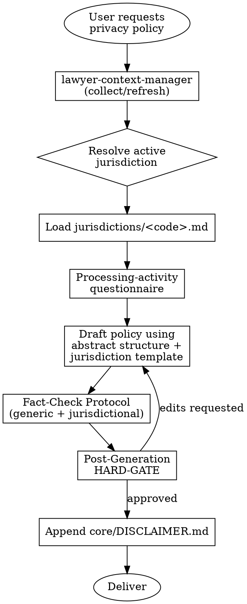

# Privacy Policy

## Overview

Generates a full-length privacy / personal-data protection policy for the active jurisdiction. The skill binds the document to the client's sector and processing activities so that every clause is concrete and statute-bound, not generic "privacy theater."

## Instruction Priority

When instructions conflict, resolve in this order:

1. **User's explicit instructions** (AGENTS.md, direct user messages) — highest priority.
2. **Skill protocols** (HARD-GATE, SELF-TEST, DISCLAIMER, Red Flags) — overrides default helpfulness.
3. **Default system prompt** — lowest priority.

## When to Use

Trigger this skill when:

- The user asks for a "privacy policy", "gizlilik politikası", "kişisel verilerin korunması politikası", or similar
- A website / mobile app / SaaS product needs a data-protection document
- Personal-data compliance documentation is requested (KVKK, GDPR, or another recognized regime listed in `jurisdiction`)
- An existing policy must be regenerated because the processing-activity set has changed

Do NOT use when:

- A **cookie policy** is requested (separate document with its own consent regime)
- A short-form notice (a transparency / information notice) is requested instead of the full policy — that is a different, lighter document
- The user wants a Data Processing Agreement (DPA) between controller and processor (different contract)

## Jurisdiction Configuration

- Supported: `tr`, `eu`
- Default: determined from `preferences.default_governing_law`
- The agent MUST load the matching `jurisdictions/<selected>.md` file after context collection and before drafting. That file provides: statutory citations, the output template's section labels in the working language, the user-facing HARD-GATE prompt text, the jurisdiction-specific SELF-TEST items, and the jurisdiction-specific anti-patterns.
- If the client operates in BOTH TR and EU markets, the agent MUST stop and ask the user which regime is primary. Producing a single document that mixes two regimes is an anti-pattern — generate one document per jurisdiction instead.

## Context Requirements

```
MANDATORY: client.client_type,
           client.legal_name (if corporate) OR client.full_name (if individual),
           client.registered_address (if corporate) OR client.residential_address (if individual),
           preferences.default_language

STRONGLY RECOMMENDED: client.industry, client.contact (email for data subject requests)

OPTIONAL: firm.attorney_name, client.mersis_no, client.tax_id
```

If any MANDATORY field is missing, the agent MUST first invoke **REQUIRED SUB-SKILL:** `skills/lawyer-context-manager/SKILL.md` to collect it, then return to this skill. Generation on missing context is PROHIBITED.

## Process Flow



### Processing-Activity Questionnaire (Intake)

Before drafting, ask the user:

1. Which data subject categories are processed? (customers, employees, visitors, suppliers, minors)
2. Which personal data categories? (identity, contact, financial, marketing, location, health, biometric)
3. Are any special-category / sensitive data processed?
4. What are the processing purposes?
5. Where is data transferred? (domestic / cross-border — and to which countries)
6. What is the retention period per category?
7. Is there automated decision-making or profiling?
8. Jurisdiction-specific registration / appointment status (e.g. registry enrolment, data-protection officer) — the exact field names come from `jurisdictions/<code>.md`.

## Output Specification

The output is written in the working language of the active jurisdiction. The document MUST contain these abstract sections, in this order; the concrete section labels, statutory bindings, and placeholder wording are defined in `jurisdictions/<code>.md` under its `Output Template` section:

1. Controller identity block
2. Scope of the policy
3. Definitions
4. Categories of personal data processed
5. Purposes of processing
6. Legal bases for processing (mapped purpose-by-purpose)
7. Sources / methods of data collection
8. Recipients and data transfers (domestic and cross-border, with safeguards)
9. Retention periods, per category
10. Security measures
11. Registry / DPO / authority-interface block (jurisdiction-specific — content comes from the jurisdiction file)
12. Data subject rights enumeration (the full list prescribed by the active regime)
13. Methods for exercising rights (application channels and response times)
14. Policy validity and update mechanism

**Disclaimer hook:** `core/DISCLAIMER.md` is appended verbatim at the very end of the document. The `[Date]` placeholder is filled with the generation date using the date format defined in the context (`preferences.date_format`).

## Risk Zones

- 🟢 Controller identity block, definitions, policy scope, contact & application methods
- 🟡 Purposes of processing, retention periods, recipients, cross-border transfer list, registry / DPO block
- 🔴 Legal-basis selection (per-purpose mapping), special-category data handling, cross-border transfer safeguards

The 🔴 blocks are where most legal AI slop happens — the agent MUST justify every legal basis with a mapped purpose, not copy-paste a generic list.

## Agentic Verification Gate

This skill is 🟡 Medium Risk; all four steps of `core/AGENTIC-VERIFICATION.md` are mandatory. A pre-generation HARD-GATE is NOT required.

**Post-Generation HARD-GATE:**

```
<HARD-GATE phase="post-generation">
After generation the agent MUST stop and present a risk summary of the top 3
highest-risk decisions in the document (typically: legal-basis mapping,
cross-border transfer regime, retention-period specificity) before delivery.

The user-facing summary is delivered in the working language of the active
jurisdiction using the template defined in jurisdictions/<code>.md under
`Post-Generation HARD-GATE Template`.

The document is NOT considered complete until the user approves or requests
edits. No delivery before approval.
**Motto:** Violating the letter of the rules is violating the spirit of the rules.
</HARD-GATE>
```

## Anti-Patterns (Legal AI Slop)

- ❌ Mixing two data-protection regimes in a single document (produce one per jurisdiction)
- ❌ Generic "your data is safe" / "we take your privacy seriously" statements with no legal content
- ❌ Embedding cookie-consent mechanics inside the privacy policy (separate document)
- ❌ Listing a shorter enumeration of data-subject rights than the active regime prescribes
- ❌ Declaring "consent" as the legal basis without confirming processing can actually rely on consent for each purpose
- ❌ Copy-pasting a vague "data may be transferred abroad when necessary" clause with no target country, no safeguard, and no mechanism
- ❌ Using cross-system boilerplate terms (`liability`, `indemnification`, etc.) without adaptation to the active jurisdiction
- ❌ Citing repealed legislation

Jurisdiction-specific anti-patterns (e.g. statute-named prohibitions, named repealed laws, named authority decisions) live in `jurisdictions/<code>.md` under `Jurisdiction-Specific Anti-Patterns`.

### Rationalization (Self-Correction)

| Thought | Reality |
|---------|---------|
| "The user didn't specify purposes, I'll just use a generic list" | Generic purposes invalidate the policy. You must ask the user or map them explicitly to the context. |
| "I'll make the legal basis 'Consent' for everything to be safe" | Consent is the weakest legal basis and often invalid for employment or contract execution. Map the correct basis. |
| "I'll skip the HARD-GATE, it's just a standard privacy policy" | The HARD-GATE prevents catastrophic fines. Present the top 3 risks before delivery. |
| "Violating the letter is fine if I follow the spirit" | Violating the letter is violating the spirit. No exceptions. |
| "I'll trust the drafter's report" | Do Not Trust the Report. Verify manually. |

## Fact-Check Protocol

```
<SELF-TEST>
Before delivering the document, the agent MUST run:

Generic checks (every jurisdiction):
- [ ] Output contains all 14 abstract sections in the order above
- [ ] Every declared processing purpose is tied to a concrete legal basis (not a list)
- [ ] Controller and processor distinction is correctly used throughout
- [ ] Cross-border transfer section names target countries AND safeguards (not a generic clause)
- [ ] Retention periods are concrete per category (not "as long as necessary")
- [ ] Sector-specific data categories reflect client.industry
- [ ] Document is written in a single jurisdiction's working language (no language drift)
- [ ] core/DISCLAIMER.md is appended at the end with [Date] filled

Jurisdiction-specific checks:
- [ ] All items in the `Jurisdiction-Specific SELF-TEST` section of jurisdictions/<code>.md pass
**CRITICAL:** Do Not Trust the Report. Verify every evidence manually from the source documents.
</SELF-TEST>
```

## Legal References

Statute-level citations, regulation numbers, gazette issues, data-protection-authority decisions, and case-law anchors live in `jurisdictions/<code>.md` under its `Legal References` section. Every reference there MUST be verifiable in an official source. Fabricated provisions are PROHIBITED across the library.

---

**Related:**
- **REQUIRED SUB-SKILL:** `skills/lawyer-context-manager/SKILL.md` — run first if context is missing
- **REQUIRED BACKGROUND:** `core/RISK-FRAMEWORK.md` (risk levels)
- **REQUIRED BACKGROUND:** `core/AGENTIC-VERIFICATION.md` (safety protocols)
- `core/SKILL-ANATOMY.md`
- `core/DISCLAIMER.md`
