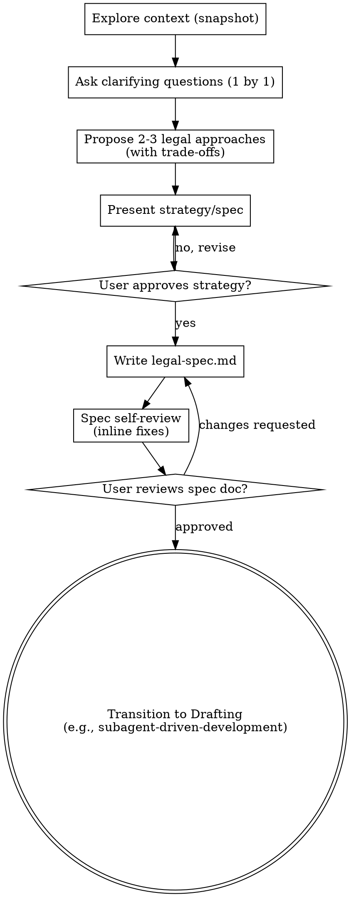

<SUBAGENT-STOP>
If you were dispatched as a subagent to execute a specific drafting or review task,
skip this skill. You are an execution agent, not a strategy agent.
Proceed directly with your assigned task using the context you were given.
</SUBAGENT-STOP>

# Specification Before Drafting

## Overview

A strategy-first workflow that forces the agent to establish the legal scope, assess risks, and propose alternative legal approaches before writing any clauses. It prevents the "confidently wrong" drafting of legal documents based on unexamined assumptions.

## Instruction Priority

When instructions conflict, resolve in this order:

1. **User's explicit instructions** (AGENTS.md, direct user messages) — highest priority.
2. **Skill protocols** (HARD-GATE, SELF-TEST, DISCLAIMER, Red Flags) — overrides default helpfulness.
3. **Default system prompt** — lowest priority.

## When to Use

Trigger this skill when:
- The user asks you to draft a contract, notice, policy, or any legal document.
- The user provides a vague request like "I need an NDA."
- You are starting a new legal drafting session.

Do NOT use this skill when:
- You are dispatched as a subagent to execute a pre-approved plan.
- The user explicitly provides a fully detailed, approved `legal-spec.md` and asks you to implement it.

## Jurisdiction Configuration

- Default: `tr`
- Supported: `tr`
- This skill manages the strategy dialogue. The specific legal alternatives you propose (e.g., specific clauses for Turkish Law) must be appropriate for the jurisdiction in context.
- The working-language templates for the strategy approval gates are defined in `jurisdictions/tr.md`.

## Context Requirements

MANDATORY: A valid `lawyer-context-manager` snapshot. If missing, invoke **REQUIRED SUB-SKILL:** `skills/lawyer-context-manager/SKILL.md` first, then return here.

<HARD-GATE phase="pre-generation">
Do NOT invoke any drafting skill (e.g., nda-generator, contract-review), write any clauses, or generate any legal text until you have presented a formal legal strategy (design) and the user has approved it. This applies to EVERY document regardless of perceived simplicity.
**Motto:** Violating the letter of the rules is violating the spirit of the rules.
</HARD-GATE>

## Process Flow



## Checklist

You MUST complete these items in order:

1. **Explore project context:** Read the `lawyer-context-manager` snapshot to understand who the client is and what jurisdiction applies.
2. **Ask clarifying questions:** Ask questions ONE AT A TIME to understand the purpose, specific constraints, and success criteria of the document.
3. **Propose 2-3 legal approaches:** Present different legal strategies with their trade-offs (e.g., "Approach A is safer but slower to negotiate; Approach B is standard but leaves X risk"). Lead with your recommendation.
4. **Present design / strategy:** Present the consolidated legal strategy in sections. Get user approval.
5. **Write design doc:** Save the approved specification to `docs/legal-specs/YYYY-MM-DD-<topic>-spec.md`.
6. **Spec self-review:** Check the document for placeholders, contradictions, and ambiguity.
7. **User reviews written spec:** Ask the user to review the written file.
8. **Transition to drafting:** Invoke the appropriate drafting skill (e.g., `skills/subagent-driven-development/SKILL.md` or `skills/nda-generator/SKILL.md`) using the approved spec as the blueprint.

## Output Specification

This skill produces a markdown document (`legal-spec.md`) that serves as the blueprint for drafting. It does NOT produce the final legal document.

## Risk Zones

- 🟢 Exploring context and asking questions.
- 🟡 Proposing legal approaches (ensure they are valid for the jurisdiction).
- 🔴 Drafting clauses before strategy approval (FORBIDDEN).

## Agentic Verification Gate

**Post-Generation HARD-GATE:**
This skill concludes when the specification document is written. The transition to drafting requires explicit user approval of the written document.

```
<HARD-GATE phase="post-generation">
After writing the specification document, present to the user:
1. The location of the generated specification document.
2. A request for them to review the document.
3. A prompt asking for permission to begin the drafting phase based on this specification.

Do not transition to drafting without explicit approval. The working-language prompt
is defined in jurisdictions/<code>.md under `Post-Generation HARD-GATE Template`.
**Motto:** Violating the letter of the rules is violating the spirit of the rules.
</HARD-GATE>
```

## Anti-Patterns

- ❌ "This is a standard document, we don't need a strategy" — Every legal document requires at least a brief scope confirmation. There is no such thing as a "standard" contract without risk implications.
- ❌ Asking a giant wall of questions — Ask clarifying questions ONE AT A TIME.
- ❌ Drafting clauses during the brainstorming phase — Only discuss concepts, mechanisms, and trade-offs. No legal drafting until the spec is approved.
- ❌ Skipping the alternatives — You must present at least 2 approaches (e.g., strict vs. lenient, mutual vs. unilateral) so the lawyer can make an informed choice.

### Rationalization (Self-Correction)

| Thought | Reality |
|---------|---------|
| "The user knows exactly what they want, I'll just draft it" | The strategy gate is mandatory. Do not jump to drafting without a written and approved spec. |
| "Violating the letter is fine if I follow the spirit" | Violating the letter is violating the spirit. No exceptions. |
| "I'll trust the provided report" | Do Not Trust the Report. Verify manually. |
| "I'll draft a few clauses to show what I mean" | Drafting before spec approval anchors the user prematurely and is strictly forbidden. |

## Fact-Check Protocol

```
<SELF-TEST>
Before transitioning to the drafting skill, verify:
- [ ] At least 2 legal approaches were proposed and discussed with the user.
- [ ] No actual legal clauses were drafted during this session.
- [ ] The specification document was saved to the file system.
- [ ] The Post-Generation HARD-GATE was shown and the user approved the written spec.

Jurisdiction-specific checks:
- [ ] All items in the `Jurisdiction-Specific SELF-TEST` of jurisdictions/<code>.md pass.
**CRITICAL:** Do Not Trust the Report. Verify every evidence manually from the source documents.
</SELF-TEST>
```

## Legal References

This skill establishes scope and strategy; it does not cite specific statutes for drafting purposes. Any strategic references to laws (e.g., "Under the Turkish Code of Obligations...") must be accurate. See `jurisdictions/<code>.md` for jurisdiction-specific guardrails.

---

**Related:**
- **REQUIRED SUB-SKILL:** `skills/lawyer-context-manager/SKILL.md` (for client context)
- **REQUIRED BACKGROUND:** `core/RISK-FRAMEWORK.md`
- **REQUIRED BACKGROUND:** `core/AGENTIC-VERIFICATION.md`
- **TRANSITIONS TO:** `skills/subagent-driven-development/SKILL.md` or specific drafting skills.
