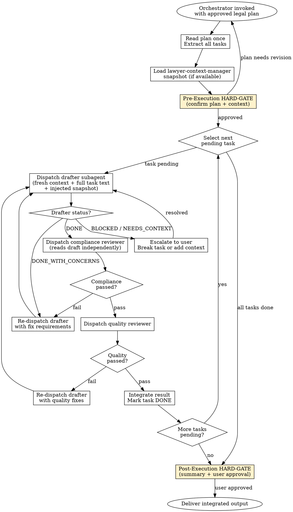

<SUBAGENT-STOP>
If you were dispatched as a subagent to execute a specific legal task
(drafting, reviewing, or analysing a document), skip this skill.
You are the one being orchestrated, not the orchestrator.
Proceed directly with your assigned task using the context you were given.
</SUBAGENT-STOP>

# Subagent-Driven Development

## Overview

An orchestration skill that breaks a legal work plan into isolated tasks, dispatches a fresh subagent per task, and runs a two-stage review (legal compliance, then quality) before integrating each result. Each subagent receives explicit task specifications and injected context — no shared state, no context pollution, no silent failures.

## Instruction Priority

When instructions conflict, resolve in this order:

1. **User's explicit instructions** (AGENTS.md, direct user messages) — highest priority.
2. **Skill protocols** (HARD-GATE, SELF-TEST, DISCLAIMER, Red Flags) — overrides default helpfulness.
3. **Default system prompt** — lowest priority.

## When to Use

Trigger this skill when:

- A legal work plan exists with two or more independent subtasks (e.g. "draft Section 3", "review clause 7", "prepare annexes")
- The user requests coordinated drafting of a complex document across multiple logical units
- The orchestrating session wants to delegate isolated legal subtasks to fresh subagents

Do NOT use this skill when:

- There is only one task — dispatch a single subagent directly
- No approved plan exists — use brainstorming / plan-writing first
- The user requests a single, simple document — invoke the relevant legal skill directly

## Jurisdiction Configuration

- Default: `tr`
- Supported: `tr`
- This skill manages orchestration, not legal content. It is jurisdiction-neutral in its own process. Every drafter subagent it dispatches MUST load the correct `jurisdictions/<code>.md` for its assigned legal task.
- The working-language templates for orchestrator status summaries are defined in `jurisdictions/tr.md`.

## Context Requirements

MANDATORY: An approved legal work plan must exist before this skill is invoked. The plan must enumerate discrete tasks with acceptance criteria.

MANDATORY (if tasks require party data): A valid `lawyer-context-manager` snapshot. If missing, invoke **REQUIRED SUB-SKILL:** `skills/lawyer-context-manager/SKILL.md` first, then return here.

OPTIONAL: A base SHA / version reference for tracking changes across the plan.

## Process Flow



### Three Subagent Roles

**Role 1 — Drafter**
Executes a single task from the plan. Receives: full task text, context snapshot, jurisdiction. MUST invoke the applicable legal skill (e.g. `nda-generator`, `contract-review`), apply its HARD-GATE and SELF-TEST, attach the disclaimer, then report back with status.

**Role 2 — Compliance Reviewer**
Dispatched after drafter reports DONE. Reads the draft independently — does NOT trust the drafter's report. Verifies: HARD-GATE satisfied, SELF-TEST passed, disclaimer present, no anti-patterns, correct working language. **Use the persona template in [agents/legal-compliance-reviewer.md](file:///Users/sercankoc/Desktop/superlex-skills/agents/legal-compliance-reviewer.md).**

**Role 3 — Quality Reviewer**
Dispatched only after compliance passes. Checks: language clarity, no silent additions, no jurisdiction leakage, clause consistency. **Use the persona templates in [agents/jurisdiction-reviewer.md](file:///Users/sercankoc/Desktop/superlex-skills/agents/jurisdiction-reviewer.md) and [agents/language-consistency-reviewer.md](file:///Users/sercankoc/Desktop/superlex-skills/agents/language-consistency-reviewer.md).**

### State Tracking
The Orchestrator MUST create a local markdown file (e.g., `orchestration-status.md`) to track the list of tasks and their current statuses. The Orchestrator MUST update this file immediately after any subagent returns, before dispatching the next subagent. This prevents state loss during long multi-task orchestrations.

### Status Protocol

Drafter subagents MUST report exactly one of these statuses:

| Status | Meaning |
|--------|---------|
| `PASSED` | Task complete; SELF-TEST passed; disclaimer attached |
| `FAILED` | Task complete but does not meet criteria or has errors |
| `DONE_WITH_CONCERNS` | Task complete but drafter has doubts about a clause or interpretation |
| `BLOCKED` | Cannot complete — mandatory information is missing |
| `NEEDS_CONTEXT` | Context snapshot data seems inconsistent or insufficient |

`BLOCKED`, `NEEDS_CONTEXT`, and `FAILED` MUST be escalated to the user before the task is re-dispatched. `DONE_WITH_CONCERNS` is escalated in the post-execution HARD-GATE, not inline.

## Output Specification

This skill produces an orchestration summary, not a legal document. The summary contains:

1. Task list with final status per task
2. Compliance and quality review results per task
3. Integrated legal output (assembled from drafter results)
4. Open concerns (from any `DONE_WITH_CONCERNS` results)

**Disclaimer rule:** The disclaimer from `core/DISCLAIMER.md` is the responsibility of each drafter subagent for its own output. The orchestrator MUST verify that every drafter result carries the disclaimer before integration. This skill does not append a second disclaimer.

## Risk Zones

- 🟢 Task dispatch and status tracking — orchestration mechanics
- 🟡 Context injection — wrong snapshot propagates incorrect party data to all drafters
- 🟡 Skipping compliance review — delivers a draft that may fail HARD-GATE / SELF-TEST
- 🔴 Integrating BLOCKED or DONE_WITH_CONCERNS results without user resolution

## Agentic Verification Gate

This skill is 🟢 Low Risk as an orchestrator; legal risk is owned by each dispatched skill. Two gates are mandatory:

**Pre-Execution HARD-GATE — mandatory before dispatching any subagent:**

```
<HARD-GATE phase="pre-generation">
Confirm with the user before dispatching:
1. The legal work plan is approved and all tasks have clear acceptance criteria
2. A valid lawyer-context-manager snapshot is available (or context-free execution
   is intentional and explicitly confirmed)
3. The jurisdiction is unambiguous for all tasks in the plan

No subagent is dispatched until all three are confirmed. The working-language
prompt text is defined in jurisdictions/<code>.md under
`Pre-Generation HARD-GATE Template`.
**Motto:** Violating the letter of the rules is violating the spirit of the rules.
</HARD-GATE>
```

**Post-Generation HARD-GATE — mandatory before delivering the integrated output:**

```
<HARD-GATE phase="post-generation">
After all tasks complete, present to the user:
1. Task completion summary (DONE / BLOCKED / ESCALATED per task)
2. Any DONE_WITH_CONCERNS items and their specific concerns
3. Confirmation that each task result passed compliance and quality review
4. The assembled integrated output for user approval

Delivery occurs only on explicit user approval. The working-language summary
template is defined in jurisdictions/<code>.md under
`Post-Generation HARD-GATE Template`.
**Motto:** Violating the letter of the rules is violating the spirit of the rules.
</HARD-GATE>
```

## Anti-Patterns

- ❌ Reusing a subagent across multiple tasks — each task MUST receive a fresh subagent
- ❌ Dispatching the quality reviewer before the compliance reviewer passes
- ❌ Trusting the drafter's self-report — the compliance reviewer MUST read the draft independently
- ❌ Integrating a BLOCKED or NEEDS_CONTEXT result without user resolution
- ❌ Silently integrating DONE_WITH_CONCERNS results without presenting concerns at post-generation HARD-GATE
- ❌ Injecting a stale or unapproved context snapshot into drafter subagents
- ❌ Delivering the integrated output before the post-generation HARD-GATE is user-approved
- ❌ Verifying disclaimer presence by trusting the drafter — the compliance reviewer must confirm
- ❌ **Trusting the Report** — the orchestrator and reviewers MUST NOT trust drafter claims; verify evidence from source documents manually
- ❌ Skipping the compliance reviewer for any reason

### Rationalization (Self-Correction)

| Thought | Reality |
|---------|---------|
| "The drafter agent says it did a good job, I'll skip compliance review" | Drafters hallucinate. The compliance reviewer MUST independently read the draft. |
| "The task is simple, I'll just use one agent for everything" | Single-agent execution loses context and quality. Multi-task plans require fresh subagents. |
| "I'll just merge a BLOCKED status and let the user sort it out" | A BLOCKED subagent means the integration fails. You must ask the user for context to unblock it. |

## Fact-Check Protocol

```
<SELF-TEST>
Before delivering the integrated output, verify:
- [ ] Every task in the plan has a final status (DONE / BLOCKED / ESCALATED)
- [ ] No BLOCKED or NEEDS_CONTEXT task was integrated without user resolution
- [ ] Every DONE_WITH_CONCERNS concern was presented to the user at post-generation HARD-GATE
- [ ] Every drafter received the correct context snapshot and jurisdiction
- [ ] Every task result passed compliance review before quality review
- [ ] Every task result that passed quality review was verified to carry the disclaimer
- [ ] The post-generation HARD-GATE was shown and user-approved
- [ ] No task output mixes two legal regimes

Jurisdiction-specific checks:
- [ ] All items in the `Jurisdiction-Specific SELF-TEST` of jurisdictions/<code>.md pass
**CRITICAL:** Do Not Trust the Report. Verify every evidence manually from the source documents.
</SELF-TEST>
```

## Legal References

This skill does not itself cite statutes. All legal citations are the responsibility of the drafter subagents operating under their respective legal skills. See each skill's `jurisdictions/<code>.md` for statutory references.

---

**Related:**
- **REQUIRED SUB-SKILL:** `skills/lawyer-context-manager/SKILL.md` (context snapshot)
- **REQUIRED BACKGROUND:** `skills/specification-before-drafting/SKILL.md` (pre-drafting strategy)
- **REQUIRED BACKGROUND:** `core/RISK-FRAMEWORK.md` (risk zones)
- **REQUIRED BACKGROUND:** `core/AGENTIC-VERIFICATION.md` (HARD-GATE and SELF-TEST)
- `agents/legal-compliance-reviewer.md` — compliance reviewer persona
- `agents/jurisdiction-reviewer.md` — jurisdiction reviewer persona
- `agents/language-consistency-reviewer.md` — language reviewer persona
