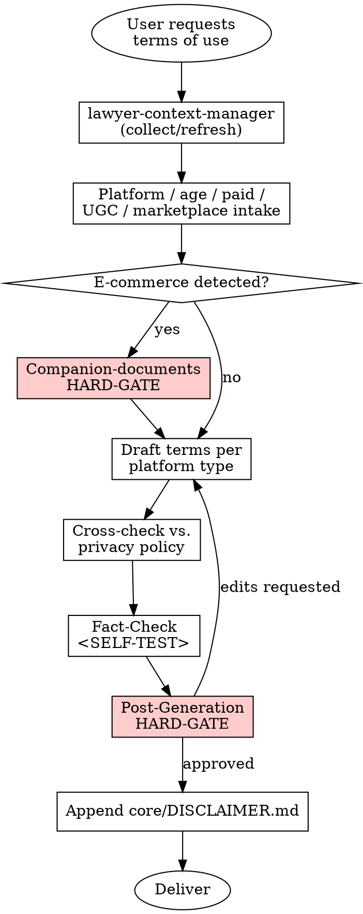

# Terms of Use (Kullanım Koşulları)

## Overview

Generates a Terms of Use / Kullanım Koşulları document tailored to the platform type (website, mobile app, SaaS, marketplace) and sector. The skill enforces consistency with the accompanying Privacy Policy, flags the need for companion documents in e-commerce scenarios, and applies TBK m.20-25 (GİK) and 6563 s.K. constraints.

## When to Use

Trigger this skill when:

- The user asks for "kullanım koşulları", "hizmet şartları", "terms of use", "terms of service", "kullanım sözleşmesi"
- A new digital platform / application / SaaS needs a user-facing agreement
- Existing terms of use need to be regenerated because the product scope, platform type, or sector has changed

Do NOT use when:

- A **privacy policy** is needed (separate skill: `skills/privacy-policy`)
- A **Mesafeli Satış Sözleşmesi** is needed (e-commerce distance-sales contract — different document)
- An **Ön Bilgilendirme Formu** (TKHK m.48 pre-contract info) is needed (different document)
- A **Data Processing Agreement** between controller and processor is needed

## Jurisdiction Configuration

- Default: `tr`
- Supported: `tr`
- Jurisdiction file: `skills/terms-of-use/jurisdictions/tr.md`

## Context Requirements

```
MANDATORY: client.legal_name, client.registered_address,
           client.industry (determines e-commerce / UGC / SaaS branching),
           preferences.default_court, preferences.default_language

STRONGLY RECOMMENDED: client.contact (user complaints address),
                     client.mersis_no (required by 6563 s.K. m.5)

OPTIONAL: client.tax_id, firm.attorney_name

INTAKE QUESTIONS (asked during skill run, not from snapshot):
- Platform type: website | mobile_app | saas | marketplace | hybrid
- Age restriction: yes (what age) | no
- Paid service: yes (subscription | one-time | freemium) | no
- User-generated content (UGC): yes | no
- Third-party seller marketplace: yes | no
```

If MANDATORY fields are missing, invoke **REQUIRED SUB-SKILL:** `skills/lawyer-context-manager/SKILL.md` first.

## Process Flow



## Companion-Documents HARD-GATE (E-Commerce Trigger)

```
<HARD-GATE phase="pre-generation">
IF client.industry == "e-commerce"
OR platform_type in {"marketplace", "hybrid"}
OR paid_service == true (with physical goods / distance contract):

Agent MUST warn the user:

"E-ticaret / mesafeli sözleşme faaliyeti tespit edildi. Türk hukukunda
Kullanım Koşulları TEK BAŞINA yeterli DEĞİLDİR. Aşağıdaki belgeler de
ZORUNLUDUR:

1. Ön Bilgilendirme Formu — 6502 sayılı TKHK m.48 + Mesafeli
   Sözleşmeler Yönetmeliği m.5
2. Mesafeli Satış Sözleşmesi — Mesafeli Sözleşmeler Yönetmeliği
3. (Aracı hizmet sağlayıcıysanız) 6563 s.K. 7416 değişiklikleri
   ile genişletilmiş bilgilendirme yükümlülükleri
4. (Ödeme alıyorsanız) PCI-DSS uyumu ve ödeme kuruluşu mevzuatı
   (6493 s.K.)
5. Çerez Politikası (ayrı belge — e-Privacy + KVKK m.10)
6. Privacy Policy (privacy-policy skill'i ile ayrı üretilmeli)

Devam ediyorum — ama bu ek belgeleri de hazırlamak ister misiniz?
(Evet dersiniz, ilgili skill'lere yönlendiririm.)"

Do NOT continue drafting until the user acknowledges the gap.
</HARD-GATE>
```

## Output Specification

Output language: Turkish (default).

```
KULLANIM KOŞULLARI

1. TARAFLAR VE KAPSAM
   - Hizmet Sağlayıcı kimliği (6563 s.K. m.3, m.5)
   - Kullanıcı tanımı

2. TANIMLAR

3. HİZMETİN KAPSAMI VE NİTELİĞİ
   - Platform türüne özgü detay

4. ÜYELİK / HESAP AÇMA KOŞULLARI
   - Yaş sınırı (varsa)
   - Hesap güvenliği ve bildirim yükümlülüğü
   - Kimlik doğrulama (varsa)

5. KULLANICI YÜKÜMLÜLÜKLERİ
   - Yasaklı davranış listesi (5651 s.K. m.8 yasadışı içerik)

6. ÖDEME VE ABONELİK KOŞULLARI (paid_service == true ise)
   - Ücret, fatura, yenileme, iptal
   - İade / cayma (TKHK m.48 varsa)

7. FİKRİ MÜLKİYET
   - Platform içeriği sahipliği (FSEK)
   - (UGC varsa) Kullanıcı içeriği için kullanıcıdan platforma lisans
   - Telif hakkı ihlali bildirim prosedürü (5651 s.K. m.9; FSEK m.71)

8. KİŞİSEL VERİLERİN KORUNMASI
   - Privacy Policy'ye referans (çelişki YASAK)

9. HİZMETİN KESİNTİSİ VE SÜRDÜRÜLEBİLİRLİĞİ
   - (SaaS ise) SLA, planlı bakım

10. SORUMLULUĞUN SINIRLANDIRILMASI
    - TBK m.115 emredici sınırına uygun
    - Tüketici ise TKHK m.5 haksız şart kontrolü gözetilmiş

11. FESİH KOŞULLARI
    - Haklı fesih (ihlal halinde)
    - Kullanıcının hesap kapatma hakkı
    - İade / veri taşınabilirliği (SaaS için kritik)

12. UYUŞMAZLIK ÇÖZÜMÜ
    - Tüketici ise TKHK m.68 Tüketici Hakem Heyeti / Mahkemesi
    - B2B ise yetkili mahkeme (preferences.default_court) / arabuluculuk

13. DEĞİŞİKLİK HAKKI VE BİLDİRİM
    - Tek taraflı sınırsız değişiklik YASAK (TBK m.24)
    - Esaslı değişiklikte ön bildirim süresi

14. UYGULANACAK HUKUK VE YÜRÜRLÜK
    - Türk Hukuku
    - Yürürlük tarihi

---
[DISCLAIMER hook: Append core/DISCLAIMER.md here verbatim]
```

**Platform-type conditional sections:**
- Marketplace/hybrid ⇒ add section "Aracı Hizmet Sağlayıcı Yükümlülükleri" (6563 s.K. 7416 değişiklikleri)
- SaaS ⇒ add "Hizmet Seviyesi Taahhüdü (SLA)" subsection in §9
- Mobile app ⇒ add "Uygulama Mağazası Kuralları ve Cihaz İzinleri"

**Disclaimer hook:** Appended after §14. `[Date]` → belge üretim tarihi (GG.AA.YYYY).

## Cross-Reference with privacy-policy

Before finalization the agent MUST cross-check Kullanım Koşulları §8 against the accompanying Privacy Policy:
- Veri işleme amaçları listesi tutarlı mı?
- Aktarım ifadeleri çelişkili değil mi?
- Saklama süreleri referansı aynı mı?

If no Privacy Policy exists yet, recommend invoking `skills/privacy-policy/SKILL.md` BEFORE finalizing the terms.

## Risk Zones

- 🟢 Tanımlar, hizmet kapsamı, iletişim, yürürlük tarihi
- 🟡 Üyelik koşulları, kullanıcı yükümlülükleri, fikri mülkiyet, değişiklik hakkı
- 🔴 Sorumluluk sınırlandırması (TBK m.115), fesih koşulları, tek taraflı değişiklik hakkı kapsamı, e-ticaret/marketplace ise aracı yükümlülükleri, tüketici haksız şart kontrolü (TKHK m.5)

## Agentic Verification Gate

🟡 Medium Risk — all four steps of `core/AGENTIC-VERIFICATION.md` are mandatory.

**Post-Generation HARD-GATE:**

```
<HARD-GATE phase="post-generation">
After drafting, agent MUST stop and present:

"Bu Kullanım Koşullarında aşağıdaki maddeler en yüksek riskli kısımlardır:

1. [§10 Sorumluluğun Sınırlandırılması] — Risk: TBK m.115 emredici
   hükmü sebebiyle ağır kusur/kasıt için mutlak feragat mümkün
   değil; tüketici ise TKHK m.5 haksız şart kontrolü tetiklenir.
   💡 Alternatif: [kusur derecesine göre kademeli sorumluluk metni]

2. [§13 Değişiklik Hakkı] — Risk: TBK m.24'e göre tek taraflı
   sınırsız değişiklik hükümsüz sayılabilir.
   💡 Alternatif: ön bildirim süresi (örn. 30 gün) + kullanıcıya
   fesih hakkı tanıyan metin.

3. [§12 Uyuşmazlık Çözümü] — Risk: Tüketici ise yetkili mahkeme
   seçimi TKHK m.68 karşısında etkisiz kalabilir.
   💡 Alternatif: Tüketici için ayrı fıkra, B2B için ayrı fıkra.

Ayrıca tespit ettim:
- Privacy Policy ile çapraz kontrol [yapıldı / yapılmadı — ayrı
  belge henüz yok].
- E-ticaret tespit edildi ve ek belge uyarısı [verildi / gerek yok].

Bu kısımları özel durumunuza göre incelediniz mi?
Alternatif metinleri uygulayayım mı?"

No delivery without user approval.
</HARD-GATE>
```

## Anti-Patterns (Legal AI Slop)

- ❌ Drafting a marketplace terms-of-use without the e-commerce HARD-GATE warning
- ❌ "Hiçbir durumda sorumlu değiliz" benzeri mutlak feragat (TBK m.115 ihlali)
- ❌ Privacy Policy ile çelişen veri işleme ifadeleri
- ❌ Yaş sınırı belirtmeden çocuklara yönelik hizmet
- ❌ Tek taraflı sınırsız değişiklik hakkı (TBK m.24 ihlali)
- ❌ Tüketici sözleşmesinde TKHK m.68'i bertaraf eden yetki şartı
- ❌ 5651 s.K. yasadışı içerik referansı olmadan UGC bölümü
- ❌ Aracı hizmet sağlayıcı (marketplace) için 7416 s.K. sonrası yükümlülüklerin atlanması
- ❌ Cayma hakkı / Ön Bilgilendirme Formunu Kullanım Koşullarına gömmek (ayrı belge zorunlu)
- ❌ Çerez politikasını Kullanım Koşullarına yedirmek (ayrı belge)

## Fact-Check Protocol

```
<SELF-TEST>
Before delivery the agent MUST confirm:

- [ ] Platform türü doğru belirlendi ve koşullu bölümler eklendi (SaaS → SLA; marketplace → aracı yükümlülükleri)
- [ ] Hizmet sağlayıcı kimlik bilgileri 6563 s.K. m.3, m.5'e uygun
- [ ] TBK m.115 sınırına uygun sorumluluk maddesi yazıldı (mutlak feragat YOK)
- [ ] TBK m.24 ihlali yok: tek taraflı sınırsız değişiklik hakkı YOK
- [ ] UGC varsa: telif bildirim prosedürü (5651 s.K. m.9, FSEK m.71)
- [ ] Yaş sınırı açıkça belirtildi (veya evrensel erişim için gerekçe var)
- [ ] Ödeme/abonelik varsa TKHK m.48 cayma hakkı bilgisi VAR (ayrı ön bilgilendirme formu uyarısıyla)
- [ ] E-ticaret tetiği: companion-documents HARD-GATE uygulandı
- [ ] Privacy Policy çapraz kontrolü yapıldı (veya Privacy Policy eksikliği kullanıcıya bildirildi)
- [ ] Çerez politikası içeri gömülmedi (ayrı belge referansı var)
- [ ] Uyuşmazlık çözümü: tüketici için TKHK m.68 referansı, B2B için yetkili mahkeme
- [ ] Uygulanacak hukuk = Türk Hukuku; yürürlük tarihi eklendi
- [ ] core/DISCLAIMER.md ekli, [Date] doldurulmuş
</SELF-TEST>
```

## Legal References

- **6098 sayılı TBK** — m.20-25 (GİK denetimi), m.115 (sorumluluk sınırlandırma)
- **6502 sayılı TKHK** — RG 28.11.2013, Sayı 28835 — m.5 (haksız şart), m.48 (mesafeli), m.68 (tüketici hakem heyeti / mahkeme parasal sınırları)
- **6563 sayılı Elektronik Ticaretin Düzenlenmesi Hakkında Kanun** — RG 05.11.2014, Sayı 29166 — m.3, m.5, m.6, m.7
  - 7416 s.K. (2022) ile aracı hizmet sağlayıcı yükümlülükleri genişletildi
- **Mesafeli Sözleşmeler Yönetmeliği** — RG 27.11.2014, Sayı 29188
- **Elektronik Ticarette Hizmet Sağlayıcı ve Aracı Hizmet Sağlayıcılar Hakkında Yönetmelik** — RG 26.08.2015
- **5651 sayılı İnternet Ortamında Yapılan Yayınların Düzenlenmesi Hakkında Kanun** — m.5, m.8, m.9
- **5846 sayılı FSEK** — m.1, m.14, m.71
- **6698 sayılı KVKK** — çapraz referans (Privacy Policy ile)
- **4721 sayılı TMK** — m.16 (sınırlı ehliyet / yaş)
- **6325 sayılı Arabuluculuk Kanunu** — RG 22.06.2012, Sayı 28331
- **6493 sayılı Ödeme ve Menkul Kıymet Mutabakat Sistemleri Kanunu** — ödeme alıyorsa

All verifiable at [mevzuat.gov.tr](https://mevzuat.gov.tr). Fabricated articles PROHIBITED.

---

**Related:**
- `core/SKILL-ANATOMY.md`
- `core/RISK-FRAMEWORK.md` — 🟡 Medium Risk
- `core/AGENTIC-VERIFICATION.md`
- `core/DISCLAIMER.md`
- **REQUIRED SUB-SKILL:** `skills/lawyer-context-manager/SKILL.md`
- **Related skill:** `skills/privacy-policy/SKILL.md` — should be generated in the same session to maintain cross-reference consistency
