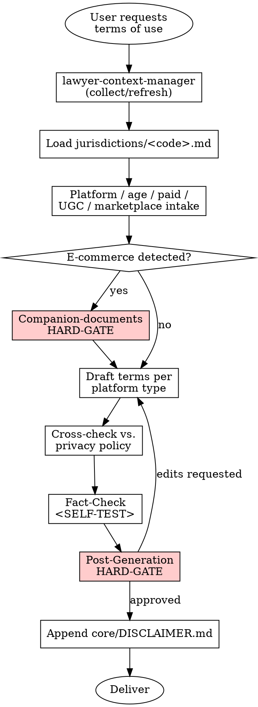

# Terms of Use

## Overview

Generates a Terms of Use document tailored to the platform type (website, mobile app, SaaS, marketplace) and sector. The skill enforces consistency with the accompanying privacy policy, flags the need for companion documents in e-commerce scenarios, and applies the active jurisdiction's general-terms-and-conditions regime.

## Instruction Priority

When instructions conflict, resolve in this order:

1. **User's explicit instructions** (AGENTS.md, direct user messages) — highest priority.
2. **Skill protocols** (HARD-GATE, SELF-TEST, DISCLAIMER, Red Flags) — overrides default helpfulness.
3. **Default system prompt** — lowest priority.

## When to Use

Trigger this skill when:

- The user asks for "kullanım koşulları", "hizmet şartları", "terms of use", "terms of service", or "kullanım sözleşmesi"
- A new digital platform / application / SaaS needs a user-facing agreement
- Existing terms of use must be regenerated because the product scope, platform type, or sector has changed

Do NOT use when:

- A **privacy policy** is needed (separate skill: `skills/privacy-policy`)
- A distance-sales contract is needed (different document under the active jurisdiction's consumer regime)
- A pre-contract information form / disclosure is needed (different document)
- A Data Processing Agreement between controller and processor is needed

## Jurisdiction Configuration

- Supported: `tr`
- Default: `tr`
- The agent MUST load `jurisdictions/tr.md` after context collection and before drafting. That file provides: statutory citations, the Turkish output scaffold, the companion-documents HARD-GATE text, the post-generation HARD-GATE prompt text, jurisdiction-specific anti-patterns, and the jurisdiction-specific SELF-TEST items.

## Context Requirements

```
MANDATORY: client.legal_name, client.registered_address,
           client.industry (determines e-commerce / UGC / SaaS branching),
           preferences.default_court, preferences.default_language

STRONGLY RECOMMENDED: client.contact (user complaints address),
                     client.mersis_no (trade registry identifier in TR)

OPTIONAL: client.tax_id, firm.attorney_name

INTAKE QUESTIONS (asked during skill run, not from snapshot):
- Platform type: website | mobile_app | saas | marketplace | hybrid
- Age restriction: yes (what age) | no
- Paid service: yes (subscription | one-time | freemium) | no
- User-generated content (UGC): yes | no
- Third-party seller marketplace: yes | no
```

If MANDATORY fields are missing, invoke **REQUIRED SUB-SKILL:** `skills/lawyer-context-manager/SKILL.md` first.

## Process Flow



## Companion-Documents HARD-GATE (E-Commerce Trigger)

```
<HARD-GATE phase="pre-generation">
IF client.industry == "e-commerce"
OR platform_type in {"marketplace", "hybrid"}
OR paid_service == true (with physical goods / distance contract):

The agent MUST stop and warn the user that Terms of Use ALONE are not sufficient
under the active jurisdiction's consumer / e-commerce regime. The warning enumerates
the companion documents required (pre-contract information form, distance-sales
contract, cookie policy, privacy policy, payment / intermediary-service obligations).

The working-language warning text and the concrete statute-bound checklist live in
jurisdictions/<code>.md under `Companion-Documents HARD-GATE Template`.

Do NOT continue drafting until the user acknowledges the gap and decides whether
to generate the companion documents as well.
**Motto:** Violating the letter of the rules is violating the spirit of the rules.
</HARD-GATE>
```

## Output Specification

The document follows this abstract structure. Concrete section labels, statutory bindings, and conditional sub-sections (SaaS SLA, marketplace intermediary duties, mobile-app store rules) come from `jurisdictions/<code>.md` under its `Output Template` section:

1. Parties and scope (service-provider identity + user definition)
2. Definitions
3. Service description and nature
4. Membership / account creation (age limit, account security)
5. User obligations (prohibited-conduct list)
6. Payment and subscription terms (only if `paid_service == true`)
7. Intellectual property (platform content + UGC licensing if applicable + takedown procedure)
8. Personal-data protection (reference to the privacy policy — consistency enforced)
9. Service continuity (SLA for SaaS, maintenance windows)
10. Limitation of liability (bounded by mandatory law of the active jurisdiction)
11. Termination conditions (just-cause termination, user's right to close account, SaaS data portability)
12. Dispute resolution (consumer forum vs. B2B forum/arbitration)
13. Unilateral-change right and notice mechanism (bounded by mandatory law)
14. Governing law and effective date

**Platform-type conditional sections:**
- Marketplace / hybrid ⇒ intermediary service-provider obligations section
- SaaS ⇒ Service Level Agreement sub-section in §9
- Mobile app ⇒ app-store rules and device permissions

**Disclaimer hook:** Appended after §14. `[Date]` is filled with the generation date using `preferences.date_format`.

## Cross-Reference with privacy-policy

Before finalization, the agent MUST cross-check §8 against the accompanying Privacy Policy:

- Are the processing purposes consistent?
- Are transfer statements non-contradictory?
- Do retention references agree?

If no Privacy Policy exists yet, the agent recommends invoking `skills/privacy-policy/SKILL.md` BEFORE finalizing the terms.

## Risk Zones

- 🟢 Definitions, service scope, contact, effective date
- 🟡 Membership conditions, user obligations, intellectual property, unilateral-change notice
- 🔴 Limitation of liability, termination conditions, the scope of the unilateral-change right, e-commerce / marketplace intermediary obligations, unfair-term control for consumer contracts

## Agentic Verification Gate

🟡 Medium Risk — all four steps of `core/AGENTIC-VERIFICATION.md` are mandatory.

**Post-Generation HARD-GATE:**

```
<HARD-GATE phase="post-generation">
After drafting, the agent MUST stop and present the three highest-risk sections
(typically: limitation of liability, unilateral-change right, and dispute resolution
for consumer-triggered flows) with concrete risks and suggested alternatives.

It ALSO reports:
- Whether the privacy-policy cross-check was performed (or flags that the privacy
  policy does not exist yet)
- Whether the e-commerce companion-documents warning was issued (if applicable)

The user-facing text is delivered in the working language of the active jurisdiction
using the template in jurisdictions/<code>.md under `Post-Generation HARD-GATE Template`.

No delivery without user approval.
**Motto:** Violating the letter of the rules is violating the spirit of the rules.
</HARD-GATE>
```

## Anti-Patterns (Legal AI Slop)

- ❌ Drafting marketplace or e-commerce terms without issuing the companion-documents HARD-GATE warning
- ❌ Absolute liability waivers (e.g. "we are never liable under any circumstances") that conflict with mandatory-liability floors
- ❌ Processing-purpose statements that contradict the accompanying privacy policy
- ❌ Serving minors without any age restriction
- ❌ Granting the provider an unlimited unilateral change right
- ❌ Burying consumer-protected dispute-resolution clauses under a generic forum-selection clause
- ❌ Embedding cookie-consent mechanics or distance-sales disclosures directly into the terms
- ❌ Skipping platform-type conditional sections (SaaS without SLA, marketplace without intermediary obligations, mobile without app-store acknowledgment)

Jurisdiction-specific anti-patterns (named statutes, named violations) live in `jurisdictions/<code>.md`.

### Rationalization (Self-Correction)

| Thought | Reality |
|---------|---------|
| "I'll add a complete liability waiver to protect the client" | Absolute waivers are void under consumer law and make the client look unprofessional. Follow the mandatory floor. |
| "They have an e-commerce site, but they just asked for terms of use" | E-commerce requires companion documents. The Companion-Documents HARD-GATE is non-negotiable. |
| "I'll skip checking the privacy policy, it's a separate document" | Contradictions between the terms and the privacy policy create massive liability. Cross-check them. |
| "Violating the letter is fine if I follow the spirit" | Violating the letter is violating the spirit. No exceptions. |
| "I'll trust the drafter's self-report" | Drafters hallucinate. Verify evidence manually. |
| "The subagent said it's complete" | Do Not Trust the Report. Verify manually. |

## Fact-Check Protocol

```
<SELF-TEST>
Before delivery the agent MUST run:

Generic checks (every jurisdiction):
- [ ] Platform type is correctly classified and conditional sections are present
- [ ] Service-provider identity block is complete per the active jurisdiction's requirements
- [ ] Limitation of liability does NOT cross the mandatory-law floor of the active jurisdiction
- [ ] Unilateral-change right is bounded (no unlimited modification power)
- [ ] UGC section, if present, references a takedown / notice-and-response procedure
- [ ] Age restriction is stated or universal access is justified
- [ ] Paid-service section references pre-contract disclosure obligations if consumer-facing
- [ ] E-commerce trigger processed: companion-documents HARD-GATE was raised when applicable
- [ ] Privacy-policy cross-check performed (or gap reported)
- [ ] Cookie consent is NOT embedded
- [ ] Dispute-resolution clause correctly distinguishes consumer vs. B2B paths
- [ ] Governing law and effective date present
- [ ] core/DISCLAIMER.md is appended with [Date] filled

Jurisdiction-specific checks:
- [ ] All items in the `Jurisdiction-Specific SELF-TEST` section of jurisdictions/<code>.md pass
**CRITICAL:** Do Not Trust the Report. Verify every evidence manually from the source documents.
</SELF-TEST>
```

## Legal References

Statute-level citations, regulation numbers, gazette issues, and ministry-level secondary legislation live in `jurisdictions/<code>.md` under its `Legal References` section. Every reference there MUST be verifiable in an official source. Fabricated provisions are PROHIBITED across the library.

---

**Related:**
- **REQUIRED SUB-SKILL:** `skills/lawyer-context-manager/SKILL.md`
- **REQUIRED BACKGROUND:** `core/RISK-FRAMEWORK.md` (risk levels)
- **REQUIRED BACKGROUND:** `core/AGENTIC-VERIFICATION.md` (safety protocols)
- `skills/privacy-policy/SKILL.md` — should be generated in the same session to maintain cross-reference consistency
- `core/SKILL-ANATOMY.md`
- `core/DISCLAIMER.md`
