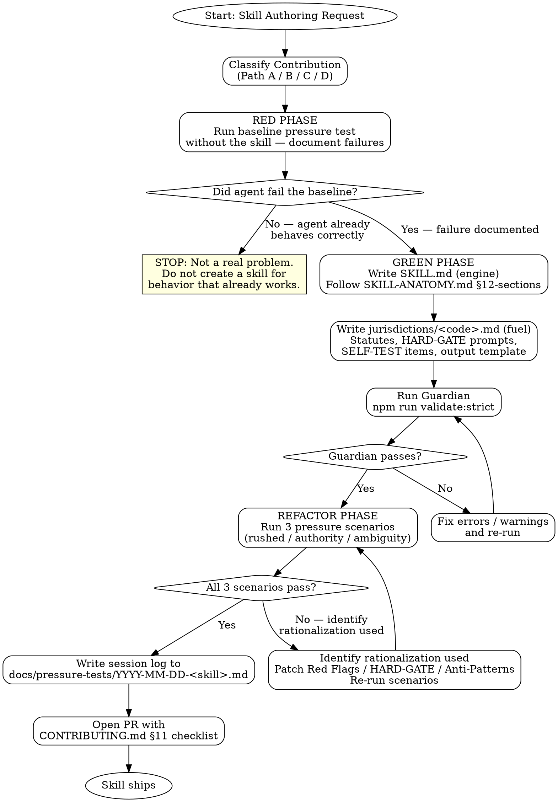

# Writing SuperLex Skills

## Overview

**Writing legal skills IS Test-Driven Development applied to legal process documentation.**

You write pressure scenarios (tests), watch the agent fail without the skill (baseline), write the skill (documentation), watch the tests pass (agent complies), and refactor by closing rationalization loopholes.

**Core principle:** If you didn't watch an agent fail without the skill, you don't know if the skill enforces the right thing.

This skill adapts the Superpowers `writing-skills` TDD methodology to the **legal domain**, where the stakes are higher: a poorly-written skill can cause a lawyer's client real legal harm.

**Before using this skill**, understand the repository's two-layer architecture:
- `SKILL.md` — the **engine** (jurisdiction-agnostic, English, abstract process)
- `jurisdictions/<code>.md` — the **fuel** (jurisdiction-specific, working language, statute-bound)

Read `core/SKILL-ANATOMY.md`, `core/JURISDICTION-ANATOMY.md`, and `CONTRIBUTING.md §1` before authoring anything.

## Instruction Priority

1. **User's explicit instructions** (direct user messages, `CONTRIBUTING.md` rules) — highest priority.
2. **Skill protocols** (this skill, Anatomy templates, Guardian checks) — override shortcuts.
3. **Default system prompt** — lowest priority.

## When to Use

Use this skill when:
- Authoring a brand-new legal skill (`skills/<name>/SKILL.md` + `jurisdictions/<code>.md`)
- Adding a new jurisdiction to an existing skill (`jurisdictions/<new-code>.md`)
- Refining a HARD-GATE prompt that isn't holding its line under pressure
- Adding pressure scenarios to `tests/pressure-tests/`
- Reviewing a PR that modifies skill content

Do **not** use this skill for:
- Generating legal documents (use `lawyer-context-manager` instead)
- One-off project-specific instructions (put in `CLAUDE.md`)
- Mechanical constraints that can be automated (extend `scripts/validate-skills.sh` instead)

## Jurisdiction Configuration

```yaml
jurisdiction: ["tr"]
```

This skill's jurisdiction file (`jurisdictions/tr.md`) provides the working-language
onboarding text and pressure-test prompt templates used during skill authoring sessions
in the Turkish legal context.

## Context Requirements

Before authoring a skill, establish:
- **Skill purpose:** What legal task does this skill address?
- **Contribution path:** New skill (Path B), new jurisdiction (Path A), or tuning (Path C)?
- **Risk level:** 🟢🟡🔴 — see `core/RISK-FRAMEWORK.md`. Bias upward.
- **Output type:** `document`, `analysis`, `draft-with-checklist`, or `context`
- **Target jurisdiction(s):** Which legal regimes will the first version support?
- **Known anti-patterns:** What failure modes have you observed in generic agents?

## Process Flow



## Output Specification

This skill produces no legal document — it produces a **new or improved skill**
and the evidence trail proving it works.

Artifacts produced by this skill:
1. `skills/<name>/SKILL.md` — the engine
2. `skills/<name>/jurisdictions/<code>.md` — at least one fuel file
3. `docs/pressure-tests/YYYY-MM-DD-<skill>.md` — the session log
4. A PR description that completes the `CONTRIBUTING.md §11` checklist

Disclaimer hook: not applicable — `output_type: context` produces no legal document.

## Risk Zones

| Risk | Zone | Why |
|------|------|-----|
| Writing jurisdiction-specific content into SKILL.md | 🔴 | Violates Motor/Fuel separation; blocks global extensibility |
| Skipping the baseline pressure test | 🔴 | You won't know if the skill actually changes behaviour |
| Skipping Guardian validation | 🟡 | Structural errors break agent skill loading |
| Tuning HARD-GATE wording without pressure-test evidence | 🟡 | Weakened gates are worse than no gates |
| Submitting a PR without the §11 checklist | 🟢 | Blocked at review; just slow |

## Agentic Verification Gate

<HARD-GATE phase="post-generation" tier="🟢">
Before opening a PR, verify:
- Guardian exits 0 (no errors, no warnings with --strict)
- All three pressure scenarios pass without rationalization
- No statute citations appear in SKILL.md body
- No English content appears in a Turkish jurisdiction file
- CONTRIBUTING.md §11 checklist is complete

**Spirit vs Letter:** Violating the letter of the rules is violating the spirit of the rules. Do not rationalize shortcuts. A skill that passes the Guardian but fails the pressure tests is not a complete skill.
</HARD-GATE>

<SELF-TEST>
Do Not Trust the Report. Before claiming this skill is ready, verify by inspection:

- [ ] `SKILL.md` has all 12 mandatory sections in order (checked by Guardian)
- [ ] `SKILL.md` has zero statute numbers, zero working-language labels
- [ ] `jurisdictions/<code>.md` has: Output Template, Post-Generation HARD-GATE Template, Jurisdiction-Specific Anti-Patterns, Jurisdiction-Specific SELF-TEST, Legal References
- [ ] Rationalization (Self-Correction) table is present under Anti-Patterns
- [ ] `spirit vs letter` motto appears in at least one HARD-GATE block
- [ ] `do not trust the report` appears in the SELF-TEST block
- [ ] All three pressure scenarios from `tests/pressure-tests/` ran and passed
- [ ] Session log exists in `docs/pressure-tests/`
- [ ] `npm run validate:strict` exits 0 on the skill directory
- [ ] CHANGELOG.md mentions the new skill
- [ ] README.md skills table includes the new skill
</SELF-TEST>

## Anti-Patterns

### Common Skill Authoring Failures

| Anti-Pattern | Why It Fails |
|---|---|
| ❌ Writing the skill before running a baseline test | You are solving a problem you haven't observed — the skill will be speculative |
| ❌ Adding statute numbers to SKILL.md | Motor/Fuel violation — blocks every future jurisdiction contributor |
| ❌ Writing HARD-GATE prompt text inside SKILL.md | That text must be in the jurisdiction file; the engine only defines the gate's intent |
| ❌ Adding `<SUBAGENT-STOP>` to a `document`/`analysis` skill | Reserved for `output_type: context` orchestrator skills only |
| ❌ Copying the full SKILL-ANATOMY template without deleting the scaffold | The Guardian won't distinguish scaffold text from real content |
| ❌ Citing a statute you're not certain is in force | Fabricated provisions are a merge-blocking defect |
| ❌ Skipping `npm run validate:strict` before the PR | Warnings in strict mode are errors |

### Rationalization (Self-Correction)

| Thought | Reality |
|---------|---------|
| "I know what this skill needs, I'll skip the baseline" | You cannot close loopholes you haven't observed. Run the baseline. |
| "The statute I'm citing is probably still in force" | Verify it in the official gazette. "Probably" fabricates law. |
| "The HARD-GATE is in SKILL.md, close enough" | Close enough breaks the Motor/Fuel contract. Move it to the jurisdiction file. |
| "The pressure tests are a formality, I've seen this work" | The pressure tests exist because observation alone is insufficient. Run them. |
| "I'll add the session log later" | "Later" is when it gets forgotten. Log before the PR. |

## Fact-Check Protocol

Every statute number in any jurisdiction file you author MUST be verified:

1. Open the official gazette (TR: resmigazete.gov.tr; EU: eur-lex.europa.eu).
2. Confirm the cited article number is in the currently-consolidated text.
3. Confirm the law has not been repealed or renumbered since last citation.
4. Paste the direct URL as the Legal Reference in the jurisdiction file.

If you cannot complete step 1-4 for any citation, write `[VERIFICATION REQUIRED: <description>]` as a placeholder and flag it in the PR.

## Legal References

- [`core/SKILL-ANATOMY.md`](../../core/SKILL-ANATOMY.md) — mandatory 12-section structure
- [`core/JURISDICTION-ANATOMY.md`](../../core/JURISDICTION-ANATOMY.md) — mandatory jurisdiction structure
- [`CONTRIBUTING.md`](../../CONTRIBUTING.md) — four contribution paths, worked example, pressure-test requirements
- [`scripts/validate-skills.sh`](../../scripts/validate-skills.sh) — Guardian validator (run before every PR)
- [`tests/pressure-tests/`](../../tests/pressure-tests/) — standard adversarial scenarios
- Superpowers `writing-skills` skill — TDD-for-documentation methodology (inspiration)
